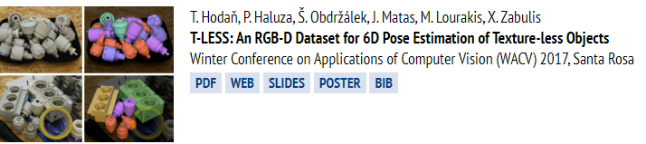

[linzehui-  厦大，每日论文阅读-干货内容](http://www.linzehui.me/archives/)

[AIHGF 专栏-语义分割-姿态估计-目标检测-图像分类。。。](https://me.csdn.net/blog/oJiMoDeYe12345)

[github_repository_collection](https://github.com/IIT-Lab/github_repository_collection) git库收集记录：论文 + 实现

[【资源】时尚 +AI 文献、资源大列表](http://bbs.cvmart.net/articles/432) Papers(

​	Synthesis
​			Classification] (#3)
​			Recommendation
​			Forecast

[TOMÁŠ HODAŇ **PhD student in computer vision**](http://cmp.felk.cvut.cz/~hodanto2/) 语义分割，6D姿态评估

