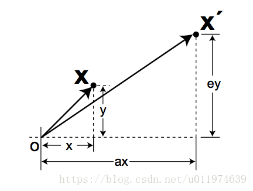
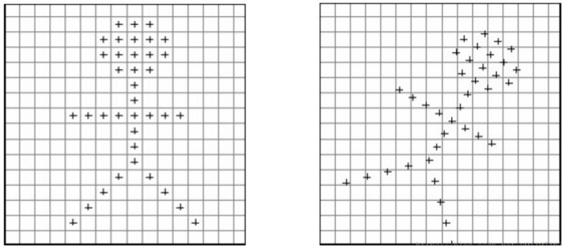
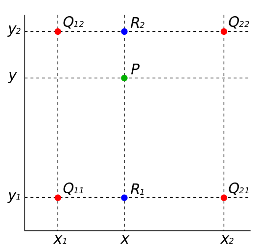

图片处理基础知识： 放射变换、双线性插值

### 线性变换

定义：

- 点$K$的坐标为$\begin{bmatrix} x \\ y \end{bmatrix}$ 代表一个 2x1的列向量
- 矩阵$M= \left[ \begin{matrix}  a&b \\ c&d \end{matrix} \right]$ 代表 shape(2x2)的矩阵

#### 恒等变换：

令 a=d=1, b=c=0, 即 $M=\begin{bmatrix}  1&0 \\ 0&1 \end{bmatrix}$ 则 
$$
K'=\begin{bmatrix}  1&0 \\   0&1 \end{bmatrix} \begin{bmatrix}  x \\     y \end{bmatrix}=\begin{bmatrix}  x \\       y \end{bmatrix}=K
$$
即此时$M$的值表示做恒等变换

#### 缩放：

令$b=c=0 $，即$M=\begin{bmatrix}  a&0 \\   0&d \end{bmatrix}$，则：
$$
K'=\begin{bmatrix}  a&0 \\
  0&b  \end{bmatrix}  \begin{bmatrix}  x \\
    y \end{bmatrix}=\begin{bmatrix}  ax \\
    by \end{bmatrix}
$$

#### 旋转：

#### shear：

总结一下，这里讲了3个基本的线性变换：

- 放缩
- shear
- 旋转

我们可将这三个变换矩阵表示为$H,S,R$，则变换可写成：
$$
K'=R[S(HK)]=MK
$$
其中 $M=RSH$ 用一个矩阵来表示各种线性变换

### 仿射变换(Affine Transformation)

对于M为2×2矩阵，可完成线性变换，将图形扭曲成其他形状。但这样的变换存在一个缺点：不能做**平移**，故需要进一调整。

可以看到是添加一个轴，再变换。对此将参数矩阵由2D换成3D：

点$K$变成了$(3×1)$的列向量$\begin{bmatrix}  x \\ y  \\ 1 \end{bmatrix}$
为了表示变换，添加了两个新参数，矩阵$M=\begin{bmatrix}  a&b&e \\   c&d&f  \\  0&0&1 \end{bmatrix}$变成了shape$(3×3)$的矩阵
注意到，我们需要2D的输出，可将M改为$2×3$卷积形式。

例如,做平移操作：
$$
K'=\begin{bmatrix}  1&0&\Delta \\ 0&1&\Delta \end{bmatrix}\begin{bmatrix}  x\\  y\\
    1 \end{bmatrix}=\begin{bmatrix}  x+\Delta \\
      y+\Delta \end{bmatrix}
使用这样一个技巧，可通过一个新的变换表示所有变换，这即是仿射变换，我们可以一般化结果，这4中变换使用放射矩阵表示：
M=[adbecf]
M=[abcdef]
总结来讲就是：仿射变换=线性变换+平移功能
$$

使用这样一个技巧，可通过一个新的变换表示所有变换，这即是仿射变换，我们可以一般化结果，这4中变换使用放射矩阵表示：
$$
M=\begin{bmatrix}  a&b&c \\
  d&e&f \end{bmatrix}
$$
总结来讲就是：仿射变换=线性变换+平移功能

### 双线性插值(Bilinear Interpolation)

考虑到当我们做仿射变换时：例如旋转或放缩，图片中的像素会移动到其他地方。这会暴露出一个问题，**输出中的像素位置可能没有对应的输入图片中的位置**。 下面的旋转示例，可以清晰的看到输出中有些点没有在对应棋盘网格中央，这意味着输入中没有对应的像素点：

为了支持这样输出是分数坐标点的，可使用双线性插值去寻找合适的颜色值。

#### 线性插值

要说双线性插值，先看看线性插值。 已知坐标$(x0,y0)$​和$(x1,y1)$，需要在$[x0,x1]$之间$x$插值，如下:

两点之间线性方程：
$$
y-y_0=(x-x_0)\frac{y_1-y_0}{x_1-x_0}
$$
变换：
$$
y=y_0\frac{x_1-x}{x_1-x_0}+y_1\frac{x-x_0}{x_1-x_0}
$$

#### 双线性插值

双线性插值是线性插值的拓展~

4个像素点坐标为 $Q11(x1,y1),Q12(x1,y2),Q21(x2,y1),Q22(x2,y2)$，像素值为$f(Q11),f(Q12),f(Q21),f(Q22)$：

先是线性插值获得$R_1(x, y_1),R_2(x, y_2)$:
$$
f(R_1)=f(Q_{11})\frac{x_2-x}{x_2-x_1}+f(Q_{21})\frac{x-x_1}{x_2-x_1} \tag 1
$$

$$
f(R_2)=f(Q_{12})\frac{x_2-x}{x_2-x_1}+f(Q_{22})\frac{x-x_1}{x_2-x_1} \tag 2
$$

再使用$R_1, R_2$纵向插值得到$P(x, y)$:
$$
f(P)=f(R_1)\frac{y_2-y}{y_2-y_1}+f(R_2)\frac{y-y_1}{y_2-y_1} \tag 3
$$
在像素计算中，通常是以4个相邻的像素点做插值，故所有分母项都为1，联立(1)(2)(3)(1)(2)(3)可得：

$$
f(P)=f(Q_{11})(x_2-x)(y_2-y)+f(Q_{21})(x-x_1)(y_2-y)+f(Q_{12})(x_2-x)(y-y_1)+f(Q_{22})(x-x_1)(y-y_1) \tag 4
$$

可以将公式化为：
$$
f(P)=[(x_2-x),(x-x_1)] \begin{bmatrix}
f(Q_{11})\ &f(Q_{12})\\
 f(Q_{21}) & f(Q_{22}) 
\end{bmatrix} [(y_2-y),(y-y_1)] \tag 5
$$
