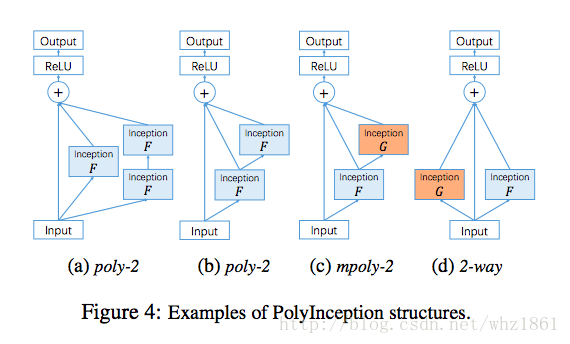
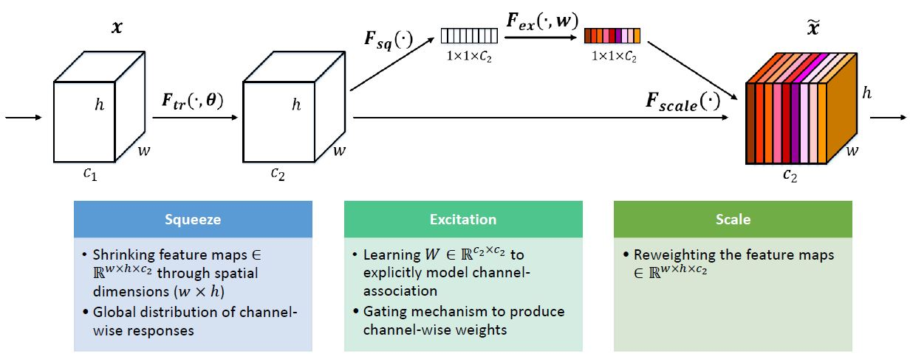
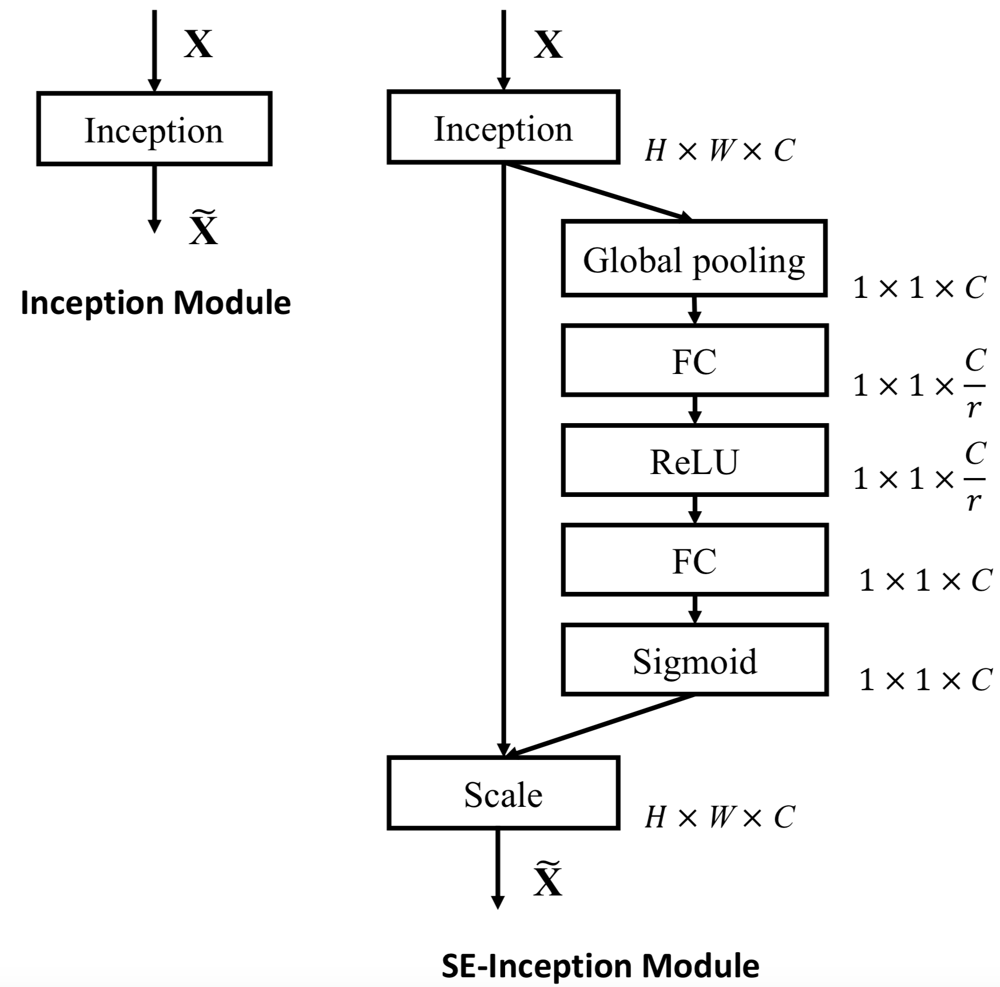
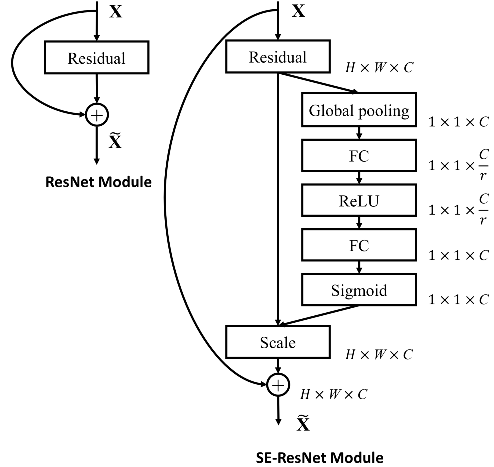

# Awesome - Image Classification

[github](https://github.com/weiaicunzai/awesome-image-classification)

| ConvNet                           | ImageNet top1 acc | ImageNet top5 acc | Published In                                                 |
| --------------------------------- | ----------------- | ----------------- | ------------------------------------------------------------ |
| Vgg                               | 76.3              | 93.2              | ICLR2015                                                     |
| GoogleNet                         | -                 | 93.33             | CVPR2015                                                     |
| PReLU-nets                        | -                 | 95.06             | ICCV2015                                                     |
| ResNet                            | -                 | 96.43             | CVPR2015                                                     |
| Inceptionv3                       | 82.8              | 96.42             | CVPR2016                                                     |
| Inceptionv4                       | 82.3              | 96.2              | AAAI2016                                                     |
| Inception-ResNet-v2               | 82.4              | 96.3              | AAAI2016                                                     |
| Inceptionv4 + Inception-ResNet-v2 | 83.5              | 96.92             | AAAI2016                                                     |
| ResNext                           | -                 | 96.97             | CVPR2017                                                     |
| PolyNet                           | 82.64             | 96.55             | CVPR2017                                                     |
| NasNet                            | 82.7              | 96.2              | CVPR2018                                                     |
| MobileNetV2                       | 74.7              | -                 | CVPR2018                                                     |
| PNasNet                           | 82.9              | 96.2              | ECCV2018                                                     |
| AmoebaNet                         | 83.9              | 96.6              | arXiv2018                                                    |
| SENet                             | -                 | 97.749            | CVPR2018                                                     |

<!-- more -->

## ResNet

**Deep Residual Learning for Image Recognition**
Kaiming He, Xiangyu Zhang, Shaoqing Ren, Jian Sun

- pdf: https://arxiv.org/abs/1512.03385
- code: [facebook-torch : https://github.com/facebook/fb.resnet.torch](https://github.com/facebook/fb.resnet.torch)
- code: [torchvision : https://github.com/pytorch/vision/blob/master/torchvision/models/resnet.py](https://github.com/pytorch/vision/blob/master/torchvision/models/resnet.py)
- code: [keras-applications : https://github.com/keras-team/keras-applications/blob/master/keras_applications/resnet.py](https://github.com/keras-team/keras-applications/blob/master/keras_applications/resnet.py)
- code: [unofficial-keras : https://github.com/raghakot/keras-resnet](https://github.com/raghakot/keras-resnet)
- code: [unofficial-tensorflow : https://github.com/ry/tensorflow-resnet](https://github.com/ry/tensorflow-resnet)

## Inceptionv3

**Rethinking the Inception Architecture for Computer Vision**
Christian Szegedy, Vincent Vanhoucke, Sergey Ioffe, Jonathon Shlens, Zbigniew Wojna

- pdf: https://arxiv.org/abs/1512.00567
- code: [torchvision : https://github.com/pytorch/vision/blob/master/torchvision/models/inception.py](https://github.com/pytorch/vision/blob/master/torchvision/models/inception.py)
- code: [keras-applications : https://github.com/keras-team/keras-applications/blob/master/keras_applications/inception_v3.py](https://github.com/keras-team/keras-applications/blob/master/keras_applications/inception_v3.py)

## Inceptionv4

## Inception-ResNet-v2

## Inceptionv4 + Inception-ResNet-v2

**Inception-v4, Inception-ResNet and the Impact of Residual Connections on Learning**
Christian Szegedy, Sergey Ioffe, Vincent Vanhoucke, Alex Alemi

- pdf: https://arxiv.org/abs/1602.07261
- code: [unofficial-keras : https://github.com/kentsommer/keras-inceptionV4](https://github.com/kentsommer/keras-inceptionV4)
- code: [unofficial-keras : https://github.com/titu1994/Inception-v4](https://github.com/titu1994/Inception-v4)
- code: [unofficial-keras : https://github.com/yuyang-huang/keras-inception-resnet-v2](https://github.com/yuyang-huang/keras-inception-resnet-v2)

## ResNext

**Aggregated Residual Transformations for Deep Neural Networks**
Saining Xie, Ross Girshick, Piotr Dollár, Zhuowen Tu, Kaiming He

- pdf: https://arxiv.org/abs/1611.05431
- code: [official : https://github.com/facebookresearch/ResNeXt](https://github.com/facebookresearch/ResNeXt)
- code: [keras-applications : https://github.com/keras-team/keras-applications/blob/master/keras_applications/resnext.py](https://github.com/keras-team/keras-applications/blob/master/keras_applications/resnext.py)
- code: [unofficial-pytorch : https://github.com/prlz77/ResNeXt.pytorch](https://github.com/prlz77/ResNeXt.pytorch)
- code: [unofficial-keras : https://github.com/titu1994/Keras-ResNeXt](https://github.com/titu1994/Keras-ResNeXt)
- code: [unofficial-tensorflow : https://github.com/taki0112/ResNeXt-Tensorflow](https://github.com/taki0112/ResNeXt-Tensorflow)
- code: [unofficial-tensorflow : https://github.com/wenxinxu/ResNeXt-in-tensorflow](https://github.com/wenxinxu/ResNeXt-in-tensorflow)

## PolyNet

**PolyNet: A Pursuit of Structural Diversity in Very Deep Networks**
Xingcheng Zhang, Zhizhong Li, Chen Change Loy, Dahua Lin

- pdf: https://arxiv.org/abs/1611.05725
- code: [official : https://github.com/open-mmlab/polynet](https://github.com/open-mmlab/polynet)

## NasNet

**Learning Transferable Architectures for Scalable Image Recognition**
Barret Zoph, Vijay Vasudevan, Jonathon Shlens, Quoc V. Le

- pdf: https://arxiv.org/abs/1707.07012
- code: [unofficial-keras : https://github.com/titu1994/Keras-NASNet](https://github.com/titu1994/Keras-NASNet)
- code: [keras-applications : https://github.com/keras-team/keras-applications/blob/master/keras_applications/nasnet.py](https://github.com/keras-team/keras-applications/blob/master/keras_applications/nasnet.py)
- code: [unofficial-pytorch : https://github.com/wandering007/nasnet-pytorch](https://github.com/wandering007/nasnet-pytorch)
- code: [unofficial-tensorflow : https://github.com/yeephycho/nasnet-tensorflow](https://github.com/yeephycho/nasnet-tensorflow)

## PNasNet

**Progressive Neural Architecture Search**
Chenxi Liu, Barret Zoph, Maxim Neumann, Jonathon Shlens, Wei Hua, Li-Jia Li, Li Fei-Fei, Alan Yuille, Jonathan Huang, Kevin Murphy

- pdf: https://arxiv.org/abs/1712.00559
- code: [tensorflow-slim : https://github.com/tensorflow/models/blob/master/research/slim/nets/nasnet/pnasnet.py](https://github.com/tensorflow/models/blob/master/research/slim/nets/nasnet/pnasnet.py)
- code: [unofficial-pytorch : https://github.com/chenxi116/PNASNet.pytorch](https://github.com/chenxi116/PNASNet.pytorch)
- code: [unofficial-tensorflow : https://github.com/chenxi116/PNASNet.TF](https://github.com/chenxi116/PNASNet.TF)

## AmoebaNet

**Regularized Evolution for Image Classifier Architecture Search**
Esteban Real, Alok Aggarwal, Yanping Huang, Quoc V Le

- pdf: https://arxiv.org/abs/1802.01548
- code: [tensorflow-tpu : https://github.com/tensorflow/tpu/tree/master/models/official/amoeba_net](https://github.com/tensorflow/tpu/tree/master/models/official/amoeba_net)

## SENet

**Squeeze-and-Excitation Networks**
Jie Hu, Li Shen, Samuel Albanie, Gang Sun, Enhua Wu

- pdf: https://arxiv.org/abs/1709.01507
- code: [official : https://github.com/hujie-frank/SENet](https://github.com/hujie-frank/SENet)
- code: [unofficial-pytorch : https://github.com/moskomule/senet.pytorch](https://github.com/moskomule/senet.pytorch)
- code: [unofficial-tensorflow : https://github.com/taki0112/SENet-Tensorflow](https://github.com/taki0112/SENet-Tensorflow)
- code: [unofficial-caffe : https://github.com/shicai/SENet-Caffe](https://github.com/shicai/SENet-Caffe)
- code: [unofficial-mxnet : https://github.com/bruinxiong/SENet.mxnet](https://github.com/bruinxiong/SENet.mxnet)

| SE-Incetion                             | SE-ResNet                            |
| --------------------------------------- | ------------------------------------ |
|  |  |

