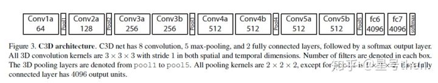
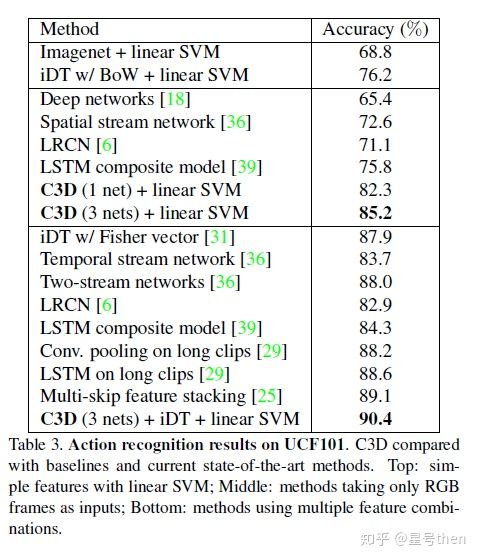
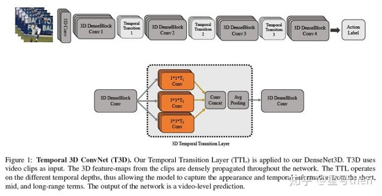
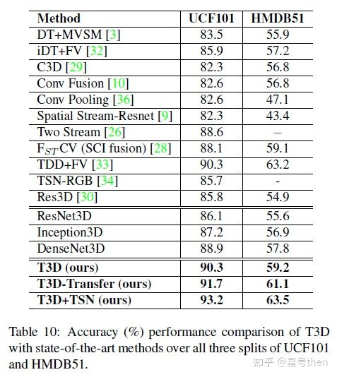
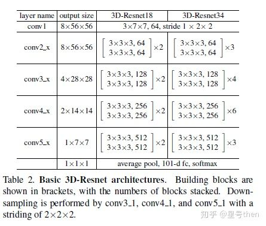
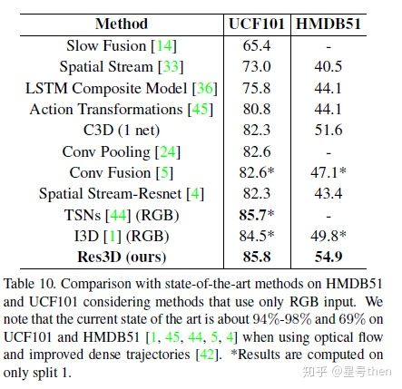
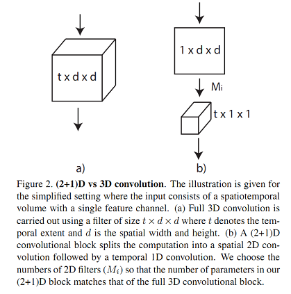
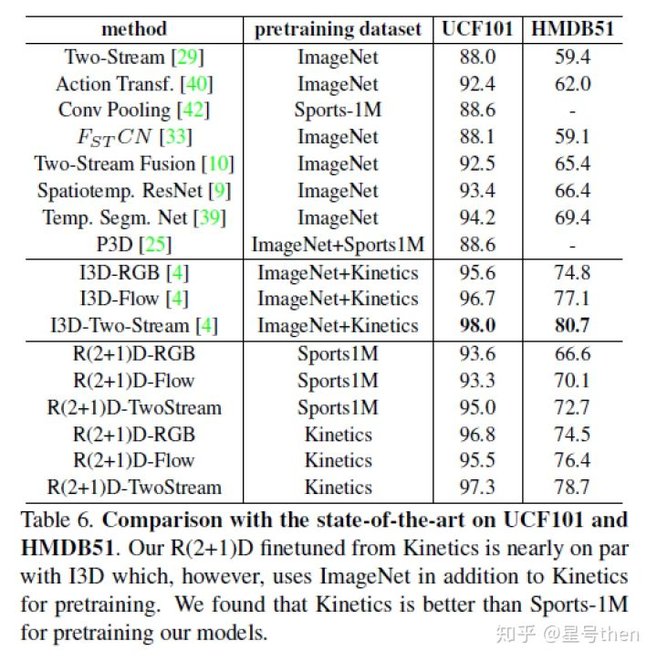
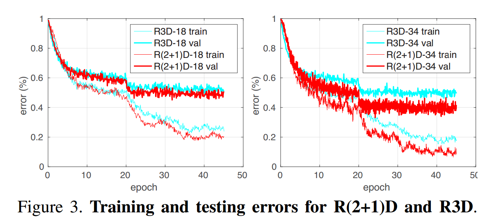

---

title: 3D-CNN
date: 2019-08-26 09:44:22
tags: 
- CNN 
- CNN3D
- DNN
---

##  3D-CNN 方法

|                      |      |          |
| -------------------- | ---- | -------- |
| iDT                  |      |          |
| LRCN                 |      | CVPR2015 |
| LSTM composite model |      |          |
| C3D                  |      |          |

<!-- more -->

### 2.3.1 C3D

[ github tensorflow ]https://github.com/hx173149/C3D-tensorflow

3x3x3 卷积核

### 2.3.2 P3D

### 2.3.3 T3D*[BEST]

### 2.3.4 R3D

### R3DCNN

[NVIDIA]https://research.nvidia.com/sites/default/files/publications/NVIDIA_R3DCNN_cvpr2016.pdf

[tensorflow ]https://github.com/breadbread1984/R3DCNN

[tensorflow ] https://github.com/kilsenp/R3DCNN-tensorflow

C3D + RNN

### Inception3D

### DenseNet3D

### TSN

### I3D

### 2.3.5 R(2+1)D

[offical pytoch](https://github.com/facebookresearch/VMZ)

手工特征提取方法(iDT)

​	R2+1D的错误率比R3D的更小（约0.2个百分点）

3D-Conv 的适用场景：视频识别，图像识别

UCF100

C3D-:  82.3% or 82-90%

P3D:

T3D: 90-93%

R3D-: 85.8%

R21D: 

model_blocktype = {
    'r2plus1d': '2.5d',
    'r3d': '3d',
    'ir-csn': '3d-sep',
    'ip-csn': '0.3d'
}

### reference

https://zhuanlan.zhihu.com/p/41659502

[1]. D. Tran, L. Bourdev, R. Fergus, L. Torresani, and M. Paluri. Learning spatiotemporal features with 3d convolutional networks. In ICCV, 2015. 1, 2, 3, 7

[2]. Z. Qiu, T. Yao, , and T. Mei. Learning spatio-temporal representation with pseudo-3d residual networks. In ICCV, 2017. 1, 2, 4, 7, 8

[3]. A. Diba, M. Fayyaz, V. Sharma, AH. Karami, MM Arzani. Temporal 3D ConvNets: New Architecture and Transfer Learning for Video Classification. arXiv:1711.08200v1, 22 Nov 2017

[4]. T. Du, J. Ray, S. Zheng, SF. Chang, M. Paluri. ConvNet Architecture Search for Spatiotemporal Feature Learning. arXiv:1708.05038v1 16 Aug 2017

[5]. T. Du, H. Wang, L. Torresani, J. Ray, Y.Lecun. A Closer Look at Spatiotemporal Convolutions for Action Recognition. arXiv:1711.11248v3 12 Apr 2018