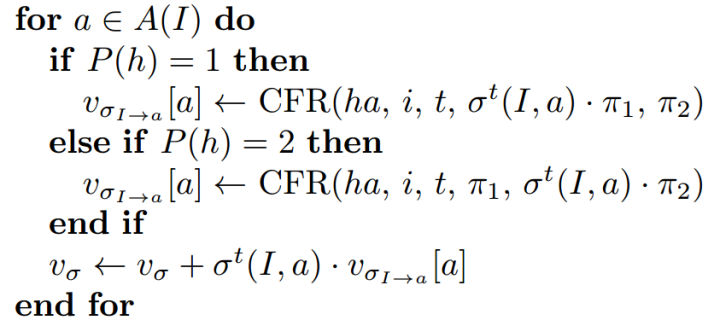
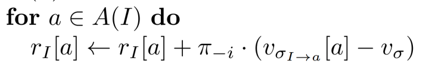
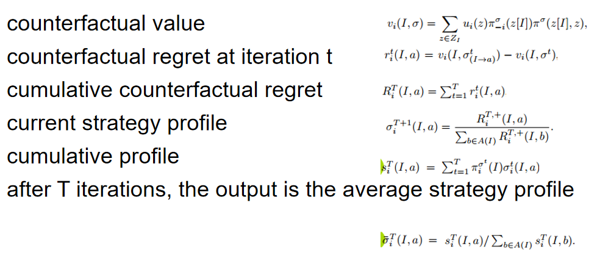

# CFR

类似强化学习的算法

遗憾值（regret）	: 在一局石头剪刀布中，对手出了布，玩家出了石头，结果是玩家输了-1。这时的遗憾值为{石头：0，布：1，剪刀：2}。也就意味着如果执行其他动作会比执行当前的动作有多少优势。

遗憾值匹配（regret matching)	: 遗憾匹配，通过计算出的遗憾值更新策略。最常用的是将遗憾动作值归一化为生成概率。这种方法可以通过自我对局来最小化预期的regret。

<!-- more -->

对于上面剪刀石头布的例子，根据上述遗憾值进行regret matching后得到的策略是：

{石头：0，布：1/3，剪刀：2/3}

整体流程：

1、对每个玩家，初始化所有的累积regret=0

2、迭代一定次数：

3、返回平均策略组合 比如（σ1+σ2+σ3+...）/n

​	策略组合σ是指在每个可能的情况下，执行各可行动作的概率

I 代表当前的状态，P(h)代表玩家

$U_(σI->a)[a]$ 代表 当前状态下执行动作a的收益

σ^t(I, a) 代表当前状态下，执行a的概率

v_σ 表示期望值，这个状态下，玩家的反事实遗憾值

Reference:

[zhihu-deepstack_CFR](https://zhuanlan.zhihu.com/p/28442291)

# MCTS_CFR

## Vanilla CFR

full game traverse

Reference

《Regret minimization in games and the development of champion multiplayer computer poker playing agents》(游戏中的遗憾最小化与多人计算机扑克游戏冠军的发展)