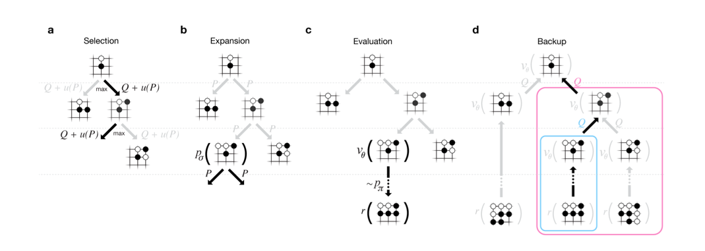

# MCTS_Lee

## apply:

1. GO	:	UCT (MCTS + UCB)
2. Pluribus :  MCTS-CFR
3. Dota2 :  MCTS
4. StarCraft2 : MCTS

## Vanilla MCTS

[参考资料-GeeksforGeeks ](https://www.geeksforgeeks.org/ml-monte-carlo-tree-search-mcts/)

**Advantages of Monte Carlo Tree Search:**

1. MCTS is a simple algorithm to implement.
2. Monte Carlo Tree Search is a heuristic algorithm. MCTS can operate effectively without any knowledge in the particular domain, apart from the rules and end conditions, and can can find its own moves and learn from them by playing random playouts.
3. The MCTS can be saved in any intermediate state and that state can be used in future use cases whenever required.
4. MCTS supports asymmetric expansion of the search tree based on the circumstances in which it is operating.

**Disadvantages of Monte Carlo Tree Search:**

1. As the tree growth becomes rapid after a few iterations, it requires a huge amount of memory.

2. There is a bit of a reliability issue with Monte Carlo Tree Search. In certain scenarios, there might be a single branch or path, that might lead to loss against the opposition when implemented for those turn-based games. This is mainly due to the vast amount of combinations and each of the nodes might not be visited enough number of times to understand its result or outcome in the long run.

3. MCTS algorithm needs a huge number of iterations to be able to effectively decide the most efficient path. So, there is a bit of a speed issue there.

   

**蒙特卡罗树搜索的优点：**

1. MCTS是一种简单的算法。
2. 蒙特卡罗树搜索是一种启发式算法。除了规则和结束条件之外，MCTS可以在没有任何特定领域知识的情况下有效地操作，并且可以通过播放随机播放来找到自己的动作并从中学习。
3. MCTS可以保存在任何中间状态，并且该状态可以在需要时用于将来的用例。
4. MCTS支持基于其运行环境的搜索树的非对称扩展。

**蒙特卡罗树搜索的缺点：**

1. 随着树的增长在几次迭代后变得迅速，它需要大量的内存。
2. 蒙特卡罗树搜索存在一些可靠性问题。在某些情况下，可能存在单个分支或路径，当针对那些回合制游戏实施时，可能导致针对异议者的损失。这主要是由于大量的组合，并且从长远来看，可能无法访问每个节点足够多次以了解其结果或结果。
3. MCTS算法需要大量迭代才能有效地确定最有效的路径。所以，那里有一点速度问题。

## UCB 

$$
UCB1=\bar{X}_j+\sqrt{\frac{2\ln n}{n_j}}
$$

## UCT (AlphaGO)

### MCTS Search

Each edge store an action value Q(s,a), visit count N(s,a), prior probability P(s, a).

#### 1.Select

​	maximize action value plus a bonus(奖金)
$$
a_t=\underset{a}{argmax}(Q(s_t,a)+u(s_t,a))
$$

$$
u(s,a) \propto \frac{P(s,a)}{1+N(s,a)}
$$
​	that is proportional to the prior probability but decays with repeated visits to encourage exploration.

​	这与先验概率成正比，但随着重复的访问而衰减以鼓励勘探。

#### 2.Simulate /expand leaf Node

​	the leaf position s_l is processed just once by the SL policy network Pσ

​	SL策略网络pσ只处理一次叶位置s_l。
$$
P(s, a )  = p_σ(a | s) 
$$

#### 3.Leaf Node Evaluated

​	1.value network $v_θ(s_L)$

​	2.outcome $z_L$

​	these evaluations are combined, using a mixing parameter λ, into a leaf evaluation $ V(s_L) $
$$
V(s_L) = (1-λ)v_θ(s_L) + λz_L
$$

#### 4.BackUp

$$
\begin{split}
N(s,a)=\sum_{i=1}^{n}\mathbb{1}(s,a,i) \\
Q(s,a)=\frac{1}{N(s,a)}\sum_{i=1}^{n}\mathbb{1}(s,a,i)V(s_L^i)
\end{split}
$$

​	where $ s_L^i $ is the leaf node from the ith simulation, and 1(s, a, i) indicates whether an edge (s, a) was traversed during the ith simulation. ($s_L^i $ leaf node from 第i次模拟,   1(s, a, i)  代表第i次模拟，边(s,a)是否被遍历)

## Alpha Go MCTS-UCT Detail Method

### Search

asynchronous policy and value MCTS algorithm (APV-MCTS) 

Each node s in the search tree contains edges (s, a) for all legal actions a∈A( ) s .
Each edge stores a set of statistics,
$$
\{ P(s,a),N_v(s,a),N_r(s,a),W_v(s,a),W_r(s,a),Q(s,a) \}
$$
P(s,a)是局面s下走a的先验概率。

$Wv(s,a)$是simulation时value network的打分，

$Wr(s,a)$是simulation时rollout的打分。

$Nv(s,a)$和$Nr(s,a)$ :black_nib:number 

$Wv(s, a)$ and $Wr(s, a)$ are Monte Carlo estimates of total action value, accumulated over $Nv(s, a)$ and $Nr(s, a) $leaf evaluations and rollout rewards,  

$Q(s,a)$是最终融合了value network打分和rollout打分的最终得分。

### Selection(a)

using a variant of the PUCT 
$$
% <![CDATA[
\begin{split}
a_t &= \underset{a}{argmax}(Q(s_t,a)+u(s_t,a)) \\
u(s,a) &= c_{puct}P(s,a)\frac{\sqrt{\sum_bN_r(s,b)}}{1+N_r(s,a)}
\end{split} %]]>
$$
this search control strategy initially prefers actions with high prior probability and low visit count, but asymptotically prefers actions with high action value

该搜索控制策略**最初优选具有高的先前概率和低访问计数的动作**，但是渐近地倾向于具有**高动作值**的动作，

### Expansion(b)

When the visit count exceeds a threshold, Nr(s, a)> N_thr, the successor state s′= f(s, a) is added to the search tree.  

初始化统计量：
$$
N_v(s’,a)=0, N_r(s’,a)=0, W_v(s’,a)=0, W_r(s’,a)=0, P(s’,a)=P(a \vert s’)
$$

$$
P(a \vert s’) = P_σ^β(a \vert s')
$$

the threshold nthr is adjusted dynamically to ensure that the rate at which positions are added to the policy queue matches the rate at which the gpus evaluate the policy network. (动态调整阈值nthr以确保将位置添加到策略队列的速率与GPU评估策略网络的速率相匹配。)

positions are evaluated by both the policy network and the value network using a mini-batch size of 1 to minimize end-to-end evaluation time. ( 策略网络和值网都使用最小批处理大小1来评估位置，以最大限度地缩短端到端评估时间。)

拓展选择的节点，当有一个子节点的visite次数超过阈值时，则把此节点加入tree，并对此节点进行SL Policy 计算Prior probabilities（下一个Select模块使用）。

### Evaluation(c)

叶子节点$s_L$被加到一个队列中等到value network计算得分（异步的），然后从$s_L$开始使用rollout policy模拟对局到游戏结束。

### Backup(d)

**rollout 统计信息更新**

virtual loss discourages other threads from simultaneously exploring the identical variation

vl阻止其他线程同时探索相同的变化。
$$
\begin{split}
N_r(s_t,a_t) \leftarrow N_r(s_t,a_t)+n_{vl} \\
W_r(s_t,a_t) \leftarrow W_r(s_t,a_t)-n_{vl}
\end{split}
$$
上面的给(s,a)增加virtual 的loss，那么根据上面选择的公式，就不太会选中它了。当模拟结束了，需要把这个virtual loss去掉，同时加上这次Simulation的得分。
$$
\begin{split}
N_r(s_t,a_t) \leftarrow N_r(s_t,a_t)-n_{vl}+1 \\
W_r(s_t,a_t) \leftarrow W_r(s_t,a_t)+n_{vl}+z_t
\end{split}
$$
the output of the value network vθ(sl) is used to update value statistics

**估值网络**vθ(Sl)的输出用于更新值统计信息。
$$
\begin{split}
N_v(s_t,a_t) \leftarrow N_v(s_t,a_t)+1 \\
W_v(s_t,a_t) \leftarrow W_v(s_t,a_t)+v_\theta(s_L)
\end{split}
$$
the overall evaluation of each state action is a weighted average of the monte carlo estimates,

对每个Stat action的总体评估是蒙特卡罗估计的**加权平均值**，
$$
\begin{equation}
Q(s,a)=(1-\lambda)\frac{W_v(s,a)}{N_v(s,a)}+\lambda\frac{W_r(s,a)}{N_r(s,a)}
\end{equation}
$$

### Search END

AlphaGo selects the action with maximum visit count，

AlphaGO resigns when 它的总体评价下降到10%以下的概率赢得比赛，也就是 max_a Q( s, a) < -0.8

## Policy network: classfication

todo

## Policy network: reinforcement learning

todo

## value regression

todo

## Reference

http://fancyerii.github.io/books/alphago/

# MCTS_GO_Zero

## UCT*

expand & evalue:

- nural network using mini-batch size of 8

$$
a_t = argmax(Q(s_t,a) + U(s_t, a))
$$

$$
U(s, a) = c_{puct}P(s,a) \frac{\sum_b N(s, a)}{1 + N(s, a)}
$$
backup
$$
W(s_t, a_t) = W(s_t, a_t) + v\\
Q(s_t, a_t) = \frac{W(s_t, a_t)}{N(s_t, a_t)}
$$
play
$$
π(a| s ) = \frac{N(s_0, a)^{1/\tau}}{\sum_b N(s_0, b)^(1/\tau)} 
$$
τ is a temperature parameter that controls the level of exploration 

### KEY:

Train Time:

0.4s per move(一局游戏？) ；1600次simulate；

409W game 【143,360W/409W=350 每局】【0.4s * 409W = 454 Hour】

70W mini-batches (2048样本/32=64GPU?) 【70W*2048= 143,360W】

36Hour 超越Lee（lee defeat Lee Sedol）

单个机器，4TPU(4块TPU2芯片和4块V100GPU是速度相同)

MSE:

The MSE is between the actual outcome z ∈ {-1, +1} and the neural network value v, scaled by
a factor of 1/4 to the range of 0–1.  

### Train Pipeline

C: 三场游戏的前80step，不同训练阶段的play，using 1,600 simulations (around 0.4 s) per search 

训练到第3小时，游戏的重点是贪婪地捕获石头，很像一个人类初学者。

在19小时，游戏展示了生死攸关、影响力和疆域的基本要素

在70小时，游戏是非常平衡的，涉及多场战斗和复杂的KO战斗，最终分解为半点胜利的白色。

### 最终性能：

40 block 40 day 训练

29 million games of self­play were generated. parameters were updated from 3.1 million mini­batches of 2,048 positions each.

制作了2900万个自我游戏。参数从310万个小批次更新，每批2048个职位。

### Go Zero 5185

5,185  NN + MCTS 训练40Days, 40 block

3,055  NN (比第一版Alpha Fan 3144 弱)

-- 对比网络版本

3400 NN + MCTS(5s) 72Hour（3day）

### GO master 4858

AlphaGo Master—a program based on the algorithm and architecture presented in this paper but using human data and features (see Methods) 

human data + handcrafted features

基于本文提出的算法和体系结构，但使用人工数据和特征的程序(见方法)

在一台机器上播放，有4个tpus。

### AlphaGo Fan 3144

176 GPUs 

### AlphaGo Lee  3739

48 TPUs,  

