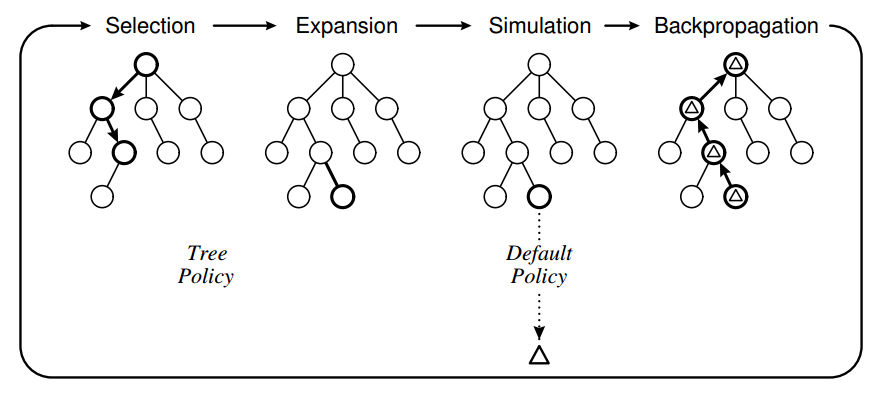
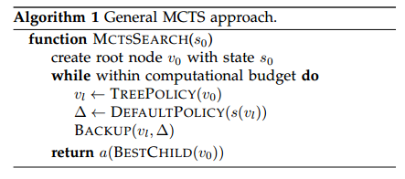
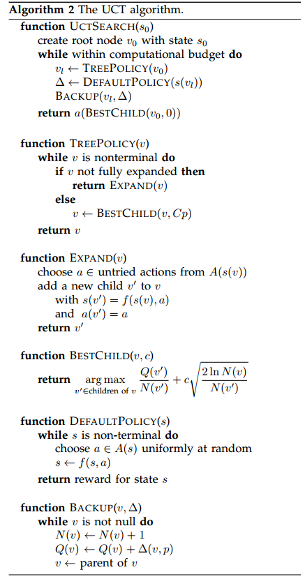
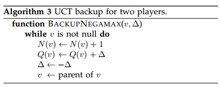

Section1 Introduction

Section2 Notation and terminology 

Section3 MCTS detail

Section4 summarises main variations MCTS

Section5 enhancements to the tree policy, 

Section6 enhancements to Simulations, Backpropagations

Section7 key applications(which MCTS has been applied)

Section8 Summaries

<!-- more -->

## Section 1 Introduce


## Section 2 Background

```
2.1 Decision Theory: MDPs; POMDPs
2.2 Game Theory: Combinatorial Games; AI in Games
2.3 Monte Carlo Methods
2.4 Bandit-Based Methods: Regret; UCB
```

### 2.1.1、MDPs

- S: A set of states, with s0 being the initial state.
- A: A set of actions.
- T (s; a; s0): A transition model that determines the probability of reaching state s0 if action a is applied to state s.
- R(s): A reward function. 

### 2.1.2、POMDPs

- O(s; o): An observation model that specifies the probability of perceiving observation o in state s. 

许多MDP和POMDP方法超出了本综述的范围，但在所有情况下，最优策略π都是确定性的，因为每个状态都映射到单个动作，而不是动作上的概率分布。


### 2.2、Game Theory 

A game may be described by the following components:

```
• S: The set of states, where s0 is the initial state.
• ST ⊆ S: The set of terminal states.
• n 2 N: The number of players.
• A: The set of actions.
• f : S × A ! S: The state transition function.
• R : S ! Rk: The utility function.
• ρ : S ! (0; 1; : : : ; n): Player about to act in each state. 
```


Combinatorial Games :

按照特性分类：

- Zero-sum：所有玩家的奖励是否等于零？

- Information： 部分可观察还是全部

- Determinism：偶然因素是否起到了作用（也称为完整性，即对奖励的不确定性）。

- Sequential：行动是顺序的，还是同时的。

- Discrete：动作是离散的还是实时的？

  

In real game:

- ***Minimax***试图在每个州最小化对手的最大奖励，这是两人组合游戏的传统搜索方法。

- ***Expectimax*** 期望值将极大极小推广到随机博弈，其中从状态到状态的转换是概率的。

- ***Miximax***类似于单玩家期望值，主要用于不完全信息的游戏中。它采用预定义的对手策略将对手决策节点作为机会节点来处理。

  

### 2.3 Monte Carlo Methods

however it is simple to construct degenerate cases in which flat monte carlo fails, as it does not allow for an opponent model

Flat Monte Carlo 适用于对手模型。


### 2.4 Bandit-Based Methods 

Bandit problem 是一个经典的序列决策问题。为了最大限度的累计收益，不断采取最优行动。

难点：行动的选择，因为潜在的报酬分布是未知的。

而潜在的回报必须根据过去的观察来估计。


也就引申到了exploitation exploration dilemma 开发探索困境：

- 我们需要平衡开发目前被认为是最优的行动，并探索目前看来不太理想但最终可能优于其他行动的行动。

The K-armed bandit problem may be approached using a policy that determines which bandit to play, **based on past rewards**. 


Regret

最小化玩家遗憾
$$
R_n = µ^*n -  µ_j \sum_{j=1}^{K}E[T_j(n)]
$$
u*: 最好的期望回报

$E[T_j(n)] $ : 在第一个 n 次试验中，手臂 j 的预期播放次数。

遗憾是由于没有选择最好的action而造成的预期损失。

重要的是要强调在任何时候对所有手臂附加非零概率的必要性，以确保最优手臂不会因为一个次优手臂的临时回报而错过。因此，重要的是，在迄今为止观察到的奖励上建立一个上限的信心，以确保这一点。

如果遗憾的增长在不变的范围内，随后的政策将被视为解决勘探开采问题。

Lai和Robbins利用较高的置信度指数(upper confidence indices)，让政策在计算出某bandit的index后，便可估计其预期回报.

Auer et al. [13] 提出,  任意报酬分布的有限时间后悔对数界。UCB1是其中之一


UCB
$$
UCB1 = \widetilde{X_j} + \sqrt[2]{ \frac{2ln n }{n_j }}
$$


$\widetilde{X_j}$ 开发利用（Exploitation）：选择利用较高收益的节点

$\sqrt{2lnn/n_j}$ 探索(Exploration)：探索较少访问次数的节点

## Section 3 vanilla MCTS

MCTS的建立于两个基础概念：

- [一个动作的真值可以用随机模拟来近似。](the true value of an action may be approximated using random simulation; )
- [这些值可以有效地用于调整策略，使其符合最佳优先策略。](and that these values may be used efficiently to adjust the policy towards a best-first strategy.  )

```
3.1 Algorithm
3.2 Development
3.3 UCT: Algorithm; Convergence to Minimax
3.4 Characteristics: Aheuristic; Anytime; Asymmetric
3.5 Comparison with Other Algorithms
3.6 Terminology
```

### 3.1 Algorithm

computational budge: 迭代建树计算预算，用于决定建树结束，一般达到time，memory，iteration constraint的预设值





选择胜利动作的四种标准

- Max child:  选择最高奖励的子节点

- Robust Child: 选择访问次数最多的child

- Max-Robust child: 根据highest visit count和highest reward 都是最大的情况

- Secure child:  最大化下限置信值，maximises a lower confidence bound


### 3.2 Development

​	MCTS的发展史，Table1

​	

### 3.3 UCT: Algorithm; Convergence to Minimax

$$
UCT = \widetilde{X_j} + 2C_p\sqrt[]{ \frac{2ln n }{n_j }}
$$

```
n is the number of times the current (parent) node has been visited, 
nj the number of times child j has been visited
Cp > 0 is a constant. 
If more than one child node has the same maximal value, the tie is usually broken randomly [120].
The values of X_{i,t} and thus of X_j are understood to be within [0; 1] 

```

当每个节点被访问时，勘探术语的分母增加，从而减少了它的贡献。

如果访问父节点的另一个子节点，则分子增加，因此未访问的兄弟姐妹的探测值增加。

探索术语确保每个孩子有一个非零的选择概率。

这也给算法带来了一种固有的重新启动特性，因为即使是低回报的孩子也会最终被选择(给出足够的时间)，从而探索不同的游戏路线。

#### UCT algorithm





##### convergence to minimax(收敛到极小极大)

Kocsis和szepesvari[119]，[120]的主要贡献是表明，在非平稳报酬分布情况下，ucb 1的遗憾约束仍然有效。

kocsis and szepesvari then show that the failure probability at the ´ root of the tree (i.e. the probability of selecting a suboptimal action) converges to zero at a polynomial rate as the number of games simulated grows to infinity. this proof implies that, given enough time (and memory), uct allows mcts to converge to the minimax tree and is thus optimal.

然后Kocsis和szepesvari表明，树根部的故障概率（选择次最佳动作的概率）即当模拟的游戏数量增长到无限时，以多项式速率收敛到零。这个证明意味着，给定足够的时间（和内存），uct允许mcts收敛到MiniMax Tree，因此是最佳的。


### 3.4 Characteristics: Aheuristic; Anytime; Asymmetric

使MCTS成为各种域的流行算法选择的一些特性，并且常常取得了显著的成功。

Aheuristic  启发式

Anytime 任何时候

Asymmetic 非对称的

### 3.5 Comparison with Other Algorithms

however, as pointed out by Ramanujan et al. [164], mcts approaches to games such as chess are not as successful as for games such as go.They consider a class of synthetic spaces in which UCT significantly outperforms minimax.  

然而，正如Ramanujan[164]等人所指出的。MCT对国际象棋等游戏的处理方法不如围棋这样的游戏成功。他们考虑了一类合成空间，其中UCT的性能明显优于Minimax。


Ramanujan et al. [162] 

uct performs poorly in domains with many trap states (states that lead to losses within a small number of moves)

UCT在具有多个陷阱状态的域中表现不佳。（在少数移动范围内移动导致损失的States）。MiniMax表现更好。

trap states are common in chess but relatively uncommon in go

陷阱状态在国际象棋中很常见，但在围棋中相对少见。

### 3.6 Terminology

- **Flat Monte Carlo**: A Monte Carlo method with uniform move selection and no tree growth.
- **Flat UCB**: A Monte Carlo method with bandit-based move selection (2.4) but no tree growth.
- **MCTS**: A Monte Carlo method that builds a tree to inform its policy online.
- **UCT**: MCTS with any UCB tree selection policy.
- **Plain UCT**: MCTS with UCB1 as proposed by Kocsis and Szepesvari [119], [120]. 

## Section 4 Variations of MCTS

```
4.1 Flat UCB
4.2 Bandit Algorithm for Smooth Trees
4.3 Learning in MCTS: TDL; TDMC(λ); BAAL
4.4 Single-Player MCTS: FUSE
4.5 Multi-player MCTS: Coalition Reduction
4.6 Multi-agent MCTS: Ensemble UCT
4.7 Real-time MCTS
4.8 Nondeterministic MCTS: Determinization; HOP; Sparse UCT; ISUCT; Multiple MCTS; UCT+; MCαβ;	MCCFR; Modelling; Simultaneous Moves
4.9 Recursive Approaches: Reflexive MC; Nested MC;NRPA; Meta-MCTS; HGSTS
4.10 Sample-Based Planners: FSSS; TAG; RRTs; UNLEO; UCTSAT; ρUCT; MRW; MHSP 
```

### 4.1 Flat UCB

Coquelin and Munos [68] propose flat UCB 

effectively treats the leaves of the search tree as a single multiarmed bandit problem.

有效地将搜索树(叶子)问题作为一个单一的多臂赌博机问题来处理。

in which the actions for a given state are uniformly sampled and no tree is built. 

在其中对给定状态的操作进行统一采样，**并且不建立树。**

Flat UCB retains the adaptivity of standard uct while improving its regret bounds in certain worst cases where uct is overly optimistic.

Flat UCB 保留了标准UCT的适应性，同时在某些最坏的情况下，在UCT过于乐观的情况下，改进了它的后悔范围。


### 4.2 Bandit Algorithm for Smooth Trees

Apply Bandit Algorithm for Smooth Trees (BAST) 


which uses assumptions on the smoothness of rewards to identify and ignore branches that are suboptimal with high confidence

它使用关于报酬平滑性的假设来识别和忽略具有高度置信度的次优分支。


they applied bast to lipschitz function approximation and showed that when allowed to run for infinite time, the only branches that are expanded indefinitely are the optimal branches.

将其应用于Lipschitz函数逼近，证明了当允许无限时间运行时，唯一无限期扩展的分支是最优分支。


this is in contrast to **plain uct**, which expands all branches indefinitely

这与无限期扩展所有分支的plain UCT形成鲜明对比。


### 4.3 Learning in MCTS: TDL; TDMC(λ); BAAL

MCTS can be seen as a type of Reinforcement Learning (RL) algorithm 

relationship with temporal difference learning (TD_Learning 标准的增强学习算法)

#### 4.3.1 TDL

​	

|        | TD & MCTS                                                    |
| ------ | ------------------------------------------------------------ |
| 相同点 | base on value of state or state-action pair                  |
| 不同点 | 1. TDL算法通常不构建树，只有当所有状态值都可以直接存储在表中时，这种等价性才成立(两只一致); <br/>2. mcts estimates temporary state values in order to decide the next move, whereas TDL learns the long-term value of each state that then guides future behaviour<br/> MCTS估计临时状态值以决定下一步，而TDL则了解每个状态的长期值，然后指导未来的行为。<br/>3. tdl can learn heuristic value functions to inform the tree policy or the simulation (playout) policy<br/>TDL可以学习启发式值函数来通知树策略或模拟(播放)策略。 |

#### 4.3.2 TDMC(λ)

“a new method of reinforcement learning using winning probability as substitute rewards in non-terminal positions”  

一个新的增强学习方法,: 非终端位置的基于胜率的替代奖励算法

report superior performance over standard TD learning for the board game Othello .

在Othell游戏上,性能优于TDL


#### 4.3.3 BAAL(Bandit-Based Active Learner )

Active Learning主动学习

将主动学习看作是一种单人博弈，最优策略由UCT和billiard算法相结合来近似。

progressive widening (5.5.1) is employed to limit the degree of exploration by ucb1 to give promising empirical results

采用渐进式加宽(5.5.1)来限制ucb 1的勘探程度，从而给出了有希望的经验结果。

### 4.4 Single-Player MCTS, FUSE

#### 4.4.1 SP-MCTS

Single-Player Monte Carlo Tree Search (SP-MCTS),
$$
\sqrt{\sigma^2 + \frac{D}{n_i}}
$$


where $σ_2$ is the variance of the node’s simulation results,

$n_i$ is the number of visits to the node, and D is a constant 

$D/n_i$ term can be seen as artificially inflating the standard deviation for infrequently visited nodes

$D/n_i$ 术语可以被看作是人为地增大了很少访问的节点的标准差。

#### 4.4.2 FUSE (Feature UCT Selection )

解决特征选择的组合优化问题

here, the problem of choosing a subset of the available features is cast as a single-player game whose states are all possible subsets of features and whose actions consist of choosing a feature and adding it to the subset.

在这里，选择可用功能的子集的问题被转换为一个单人游戏，其状态都是所有可能的功能子集，其操作包括选择一个特性并将其添加到子集中。

FUSE uses UCB1-Tuned (5.1.1) and RAVE (5.3.5) 


### 4.5 Multi-player MCTS: Coalition Reduction

the simplest way to apply mcts to multi-player games is to adopt the $max^n$ idea:

将MCT应用于多人游戏的最简单方法是采用$max^n$思想：

​	each node stores a vector of rewards, and the selection procedure seeks to maximise the UCB value calculated using the appropriate component of the reward vector. 

可以解决多玩家Game的UCT算法有:

Paranoid UCT(偏执UCT):

- player认为所有其他球员都在联合对抗他。

UCT with Allinances:

- 将联盟显式地提供给算法。

Confident UCT:

- independent searches are conducted for each possible coalition of the searching player with one other player, and the move chosen according to whichever of these coalitions appears most favourable.

  对搜索玩家与其他玩家的每个可能联盟进行独立的搜索，并且根据这些联盟中的哪一个看起来最有利的选择移动。


#### Coalition Reduction

对于诸如苏格兰场（7.7）这样的游戏，其中多个合作对手可以被减少为单个有效对手的联盟减少方法[156]。


### 4.6 Multi-agent MCTS: Ensemble UCT

UCT的模拟阶段是以一个单独的代理来对抗自身，而不是考虑多个代理的作用。

#### Ensemble UCT

fern and lewis [82] investigate an ensemble uct approach, in which multiple instances of uct are run independently and their root statistics combined to yield the final result. this approach is closely related to root parallelisation (6.3.2) and also to determinization (4.8.1).

Fern和Lewis[82]研究了一种集合UCT方法，其中UCT的多个实例独立运行，它们的根统计量相结合得到最终结果。这种方法与根并行化(6.3.2)和确定性(4.8.1)密切相关。

chaslot et al. [59] provide some evidence that, for go, ensemble uct with n instances of m iterations each outperforms plain uct with mn iterations, i.e. that ensemble uct outperforms plain uct given the same total number of iterations.

Chaslot等人[59]提供一些证据证明，对于Go，n个m迭代实例的集合UCT的性能都优于Mn迭代的简单UCT，也就是说，在相同的迭代总数下，集合UCT的性能优于普通UCT。(目前只能证明对GO有效)


### 4.7 Real-time MCTS

the largest class of real-time games are video games, which – in addition to the real-time element – are usually also characterised by uncertainty (4.8), massive branching factors, simultaneous moves (4.8.10) and open-endedness.

最大的实时游戏类是电子游戏，除了实时元素外，游戏的特点通常还包括不确定性(4.8)、巨大的分支因素、同步移动(4.8.10)和开放性。

simulation-based (anytime) algorithms such as mcts are well suited to domains in which time per move is strictly limited

基于仿真的(任何时候)算法(如mct)非常适合于每次移动时间都受到严格限制的领域。

例如: Tron, PacMan, a variety of real-time strategy games skin, Starcraft

### 4.8 Nondeterministic MCTS: Determinization; HOP; Sparse UCT; ISUCT; Multiple MCTS; UCT+;  MCαβ;	MCCFR; Modelling; Simultaneous Moves

Traditional game Ai search 通常专注于确定性，完备信息游戏；没有chance events， 游戏状态对所有玩家全部可见。

以下算法，用于处理 stochasticity（chance events）， imperfect information(Partial observability of states)

Opponent modelling  (对手建模)在不完全信息博弈中比完全信息博弈更重要。

#### 4.8.1 Determinization; 


#### 4.8.2 HOP（Hindsight optimisation ）; 

事后优化

provides a more formal basis to determinization for single-player stochastic games of perfect information.

为完全信息的单玩家随机博弈的确定提供了更为形式化的依据.

the idea is to obtain an upper bound on the expected reward for each move by assuming the ability to optimise one’s subsequent strategy with “hindsight” knowledge of future chance outcomes.

这样做的目的是通过假设有能力通过未来的机会结果的“事后”知识来优化自己的后续策略，从而获得对每一步行动的预期回报的上限。

#### 4.8.3 Sparse UCT; 

是HOP-UCT的一个推广


late random guessing significantly outperforms early probabilistic guessing

晚随机猜测明显优于早期概率猜测


#### 4.8.4 ISUCT; 
Information Set UCT  （ISUCT）

Strategy fusion 策略融合是确定技术的一个问题，它涉及到错误的假设，不同的移动可以从相同的信息集中的不同状态选择。

To address the problem of strategy fusion in determinized UCT , Whitehouse et al. [230] propose information set UCT (ISUCT) 

All information sets are from the point of view of the root player. Each iteration samples a determinization (a state from the root information set) and restricts selection, expansion and simulation to those parts of the tree compatible with the determinization.  

在[230]的实验领域，ISUCT性能不如确定性UCT，然而，isuct在那些获取隐藏信息对游戏结果影响最大的情况下表现得很好。

#### 4.8.5 Multiple MCTS（MMCTS ）

multiple trees are searched simultaneously（同时搜索多棵树）

MMCTS uses EXP3 (5.1.3) for selection. 

specifically, there is a tree for each player, and the search descends and updates all of these trees simultaneously, using statistics in the tree for the relevant player at each stage of selection.

具体地，存在用于每个玩家的树，并且搜索同时使用在每个选择阶段的相关玩家的树中的统计来同时下降和更新所有这些树。

This more accurately models the differences in information available to each player than searching a single tree. 

Auger[16]通过离线使用mmcts，绕过了在游戏中非初始点计算正确信念分布的困难。MMCTS用大量模拟(例如5000万)，以构建根植于游戏初始状态的部分游戏树，并且玩家的策略在游戏过程中直接从这个预先构建的树中读取。


#### 4.8.6 UCT+; 

opponent decision nodes are treated as chance nodes with probabilities determined by an opponent model.（对手决策节点被视为机会节点，其概率由对手模型决定。)

不适用UCB，而是使用最大化动作
$$
\overline{X_j} + c\sigma_{\overline{X_j}}
$$
$\overline{X_j}$ average reward form action j

$\sigma_{\overline{X_j}}$ standard error on $\overline{X_j}$

c constant

values  are updated according to their children; at opponent nodes and chance nodes, the calculations are weighted by the probabilities of the actions leading to each child.

node值根据他们的子节点；在opponent 和change node， calculations are weighted by probability


#### 4.8.7 MCαβ（Monte Carlo α-β）

default policy 被替换为 shallow α-β search

an obvious consideration in choosing mcαβ for a domain is that a reliable heuristic function must be known in order to drive the α-β component of the search, which ties the implementation closely with the domain

在为域选择$mc_{αβ}$时，一个明显的考虑因素是，要驱动搜索的α-β组件，必须知道一个可靠的启发式函数，该函数将实现与域紧密联系在一起。


#### 4.8.8 MCCFR; 

与CFR一样，mccfr可以用来最大限度地减少总体后悔的可能性。

CFR还可被用来创建能够利用UCT代理所使用的non-Nash策略的代理。

#### 4.8.9 Inference and Opponent Modelling;

in a game of imperfect information, it is often possible to infer hidden information from opponent actions, such as learning opponent policies directly using Bayesian inference and relational probability tree learning

在信息不完全的博弈中，往往可以从对手的行为中推断出隐藏的信息，例如利用贝叶斯推理和关系概率树学习直接学习对手策略。

opponent 有两个部分：

- a prior model of a general opponent （一般对手的先验模型）

- a corrective function for the specific opponent（针对特定对手的纠正功能）


when the mcts selection phase reaches an opponent decision node, it uses the mixed policy induced by the opponent model instead of bandit-based selection.

当MCTS选择阶段到达对手决策节点时，它使用由对手模型诱导的混合策略而不是基于 bandit-based的选择。


#### 4.8.10 Simultaneous Moves(同时移动)

simultaneous moves can be considered a special case of hidden information: one player chooses a move but conceals it, then the other player chooses a move and both are revealed.

同时移动可以被认为是隐藏信息的一个特例：一个玩家选择一个移动，但隐藏它，然后另一个玩家选择一个移动，两者都被揭示。


### 4.9 Recursive Approaches: Reflexive MC; Nested MC;NRPA; Meta-MCTS; HGSTS


递归的方法应用于MCTS

通常在单机游戏和类似的优化任务中获得成功。


#### 4.9.1 Reflexive MC; 

进行几个蒙特卡罗模拟的递归层，每一层都由下面的一层通知。

#### 4.9.2 Nested MC (NMCS)

嵌套的MonteCarlo搜索存储在每个搜索级别找到的最佳移动序列。

Rimmel et al. [168] apply a version of nested Monte Carlo search to the Travelling Salesman Problem (TSP) with time windows (7.8.1). 


#### 4.9.3 NRPA(Nested Rollout Policy Adaptation ) 

extension of nested monte carlo search in which a domain-specific policy is associated with the action leading to each child[176]

嵌套蒙特卡罗搜索的扩展，在该搜索中，特定于域的策略与导致每个子级的操作相关联。

NRPA has achieved superior results in puzzle optimisation tasks, including beating the human world record for morpion solitaire (7.4).

NRPA在拼图优化任务方面已经取得了卓越的成果，包括打破了Morpion纸牌(7.4)的人类世界纪录。


#### 4.9.4 Meta-MCTS

chaslot et al. [56] replace the default policy with a nested mcts program that plays a simulated sub-game in their meta-mcts algorithm. they describe two versions of meta-mcts: quasi best-first (which favours exploitation) and beta distribution sampling (which favours exploration). both variants improved the playing strength of the program mogo for 9 × 9 go when used for generating opening books.

Chaslot等人[56]将Defaulf policy替换为嵌套的MCTS程序，该程序在其元MCT算法中扮演模拟子游戏。他们描述了Meta-MCT的两个版本：准最佳优先(有利于开发)和β分布抽样(有利于勘探)。两种变体都提高了9×9 Go程序的播放强度，用于生成打开的书籍。

#### 4.9.5 HGSTS(Heuristically Guided Swarm Tree Search 启发式引导的群树搜索)


### 4.10 Sample-Based Planners: FSSS; TAG; RRTs; UNLEO; UCTSAT; ρUCT; MRW; MHSP 

对于许多复杂结构域的规划者，如果知道接近最优的策略，就可以用易于处理的样本复杂性来学习。这些技术通常类似于单玩家MCTS技术，但**倾向于应用于游戏以外的领域**。

#### 4.10.1 FSSS (Forward Search Sparse Sampling )

FSSS

how to replace known policies with sample-based planners in concert with sampleefficient learners in a method called forward search sparse sampling (fsss)

如何将已知的策略替换为基于样本的规划者，并以一种名为前向搜索稀疏抽样(Fsss)的方法与高效样本学习器相配合。

Bayesian FSSS (BFS3) 

#### 4.10.2 TAG (Threshold Ascent for Graphs  )

extends the mcts paradigm by maximizing an objective function over the sinks of directed acyclic graphs

通过使有向无环图的汇点，最大化目标函数来扩展MCTS范式

the algorithm evaluates nodes through random simulation and grows the subgraph in the most promising directions by considering local maximum k-armed bandits. tag has demonstrated superior performance over standard optimisation methods for automatic performance tuning using dft and fft linear transforms in adaptive libraries.

该算法通过随机模拟对节点进行评估，并考虑到当地最大的k-武装匪徒，在最有希望的方向上进行子图的生长。通过在自适应库中使用DFT和FFT线性变换，标签已证明优于标准优化方法的卓越性能。

#### 4.10.3 RRTs （Rapidly-exploring Random Trees ）快速探索随机树

a special case of Rapidly-exploring Dense Trees (RTDs) 

rrts的基本思想是将探索工作推向搜索空间中未探索的部分，逐步将搜索树拉向它们。


#### 4.10.4 UNLEO

基于置信树的最优优化算法的启发式逼近

UNLEO is based on the No Free Lunch (NFL) and Continuous Free Lunch (CFL)  

受到已知的贝叶斯推断的最优性的启发，用于在现有分布可用时进行监督学习。

#### 4.10.5 UCTSAT 

Previti et al. [160] introduce the UCTSAT class of algorithms to investigate the application of UCT approaches to the satisfiability of conjunctive normal form (CNF) problems (7.8.2).

Previti等人[160]引入UCTSAT 类算法，研究UCT方法应用于联合范式(CNF)可满足性问题(7.8.2)。

- UCTSAT_cp generates a random assignment of variables for each playout. 

- UCTSAT_sbs assigns variables one-by-one with random legal (satisfying) values. 

- UCTSAT_h replaces playouts with a simple heuristic based on the fraction of satisfied clauses.

在CP处的UCPTSAT产生用于每个播放的变量的随机分配。

UCTSATSB将变量逐个分配给随机的合法(满足)值。

在UCSATH中，基于the fraction of satisfied clauses，用简单的启发式代替playout。


#### 4.10.6 ρUCT

a generalisation of UCT that approximates a finite horizon expectimax operation given an environment model ρ.

UCT的一个推广，它近似于有限水平的期望最大运算，给出了一个环境模型ρ。

ρUCT builds a sparse search tree composed of interleaved decision and chance nodes to extend UCT to a wider class of problem domains.

ρUCT建立了一个由交叉决策和机会节点组成的稀疏搜索树，将UCT扩展到一个更广泛的问题领域。


#### 4.10.7 MRW（Monte Carlo Random Walks ）

Monte Carlo Random Walks (MRW) selectively build the search tree using random walks [238] 

Xie et al. describe the Monte Carlo Random Walk-based Local Tree Search (MRW-LTS) method which extends MCRW to concentrate on local search more than standard MCTS methods, allowing good performance in some difficult planning problems [238]. 

#### 4.10.8 MHSP （Mean-based Heuristic Search for Anytime Planning  ）

基于均值的任何时间规划的启发式搜索

与MCTS的差异：

- mhsp用一个启发式的评估函数完全取代了MCT的随机模拟：

- Mhsp的选择过程只是使用平均奖励而没有勘探条件，但使用“optimistic”平均值初始化节点。

与许多规划算法不同，mhsp可以在任何时候以真正的方式运行：即使在找到解决方案之前，mhsp也可以生成一个好的部分计划。


## Section 5 Tree policy enhancements

```
5.1 Bandit-Based: UCB1-Tuned; Bayesian UCT; EXP3; HOOT; Other
5.2 Selection: FPU; Decisive Moves; Move Groups; Transpositions; Progressive Bias; Opening Books; MCPG; Search Seeding; Parameter Tuning; History Heuristic; Progressive History
5.3 AMAF: Permutation; α-AMAF Some-First; Cutoff; RAVE; Killer RAVE; RAVE-max; PoolRAVE
5.4 Game-Theoretic: MCTS-Solver; MC-PNS; Score Bounded MCTS
5.5 Pruning: Absolute; Relative; Domain Knowledge
5.6 Expansion
```

Domain Independent ：

- 这些增强可以应用于任何领域，而无需事先了解它。
- 它们通常提供一些小的改进，或者更适合于特定类型的域。

Domain dependent ：

- 这些都是针对特定域的增强。这种增强可能使用有关域的先验知识，或者以其他方式利用域的某些独特方面。

**本节介绍了特定于树策略的增强，即选择和扩展步骤。**

### 5.1 Bandit-Based: UCB1-Tuned; Bayesian UCT; EXP3; HOOT; Other

#### 5.1.1 UCB1-Tuned;

$$
\sqrt{\frac{\ln n}{n_j} \min\{\frac14, V_j(n_j)\}} \\
V_j(s) = (1/2\sum_{\tau=1}^{s}X_{j, \tau}^2) - {\overline{X}}
^2_{j,s} + \sqrt{\frac{2\ln t}{s}}
$$

$V_j(s)$ 表示 machine j， 在第t次访问轮次中，被选择了s次，方差是大多数样本的方差加 $\sqrt{2\ln t /s}$ 


#### 5.1.2 Bayesian UCT; 

Bayesian Framework potentially 允许从有限的模拟试验中更准确地估计节点值和节点不确定性。

两种Byesian MCTS 形式：
$$
maximise B_i = µ_i + \sqrt{2 \ln n /n_i } \\
maximise B_i = µ_i + \sqrt{ \frac{2 \ln n}{n_i}} σ_i
$$
$µ_i $ 用极值(极小极大)分布Pi(假设独立随机变量)的平均值替换average reward

$σ_i$ is Pi 方差的平方根

first equation is a strict improvement over UCT if the independence assumption and leaf node priors are correct 

second equation is motivated by the central limit theorem 

结果表明，第二个方程优于第一个方程，两者都优于标准的UCT方法。


#### 5.1.3 EXP3; 

*Exploration-exploitation with exponential weights*(具有指数权重的勘探开发)

The EXP3 policy operates as follows:

- Draw an arm It from the probability distribution pt 从概率分布上选一条手臂
- Compute the estimated gain for each arm. 计算每个臂的估计增益
- Update the cumulative gain. 更新累积收益


Exp3与UCT一起用于解决部分可观察性和同时移动的游戏。


#### 5.1.4 HOOT;（Hierarchical Optimistic Optimisation for Trees ）

Hierarchical Optimistic Optimisation (HOO) algorithm ：

- a generalisation of stochastic bandits [32], [33], [34]  随机赌博问题概括
- Hoo构成了一个手臂选择政策，与以前的结果相比，针对大分类问题，具有改进的后悔界限。

The approach is similar to UCT, except that using HOO for action selection allows the algorithm to overcome the discrete action limitation of UCT. 


5.1.5 Other

UCB-V, PAC-UCB, Gaussian UCB, Meta-Bandits, Hierarchical Bandits, UCB(α),
and so on. See also the bandit-based active learner (4.3.3). 


### 5.2 Selection: 

许多增强改变了树策略，以改变MCT探索搜索树的方式。通常，选择为每个动作分配一些数值分数，以平衡探索和利用，例如在UCT中使用UCB进行节点选择。在许多领域中，使用领域知识影响每个动作的得分，偏向于某些行为的搜索和使用其他形式的奖励估计都是有益的。

#### 5.2.1 FPU; 

First Play Urgency 

MCTS算法没有指定访问未探索节点的顺序。在典型的实现中，UCT以随机顺序访问每个未访问的操作，然后使用ucb1公式重新访问。这意味着，对于具有大分支因子的问题，树中很少会有更深层次的开发。

改进：通过调整这个固定值，鼓励早期开发。

具体操作：为未访问的节点分配一个固定值，并使用ucb1公式对访问节点进行评分。


#### 5.2.2  Decisive Moves; 

决定性、反对决定性的行动（Decisive and Anti-Decisive Moves ）

Havannah. here, a decisive move is one that leads immediately to a win, and an anti-decisive move is one that prevents the opponent from making a decisive move on their next turn.

Havannah。在这里，决定性的一步是立即导致胜利，而反决定性的一步是阻止对手在下一回合采取决定性的行动。

Policy:  如果任一玩家有决定性的移动，那么就使用它；否则，恢复到标准策略。

#### 5.2.3 Move Groups; 

在一些游戏中，分支因素太大，但是很多又很相似（eg: Texas, GO ），MCTS需要很多次的模拟去区分这些高度相关性的Reward，降低分支因子以允许利用相关操作的一种方法是使用移动组。

这将创建一个额外的决策层，在该层中，所有可能的操作都被收集到组中，并且使用ucb 1来选择要从哪个组中选择移动。

#### 5.2.4 Transpositions; 

mcts naturally builds a search tree, but in many cases the underlying games can be represented as directed acyclic graphs (dags), since similar states can be reached through different sequences of move.

MCTS自然构建搜索树，但是在许多情况下，底层游戏可以被表示为有向非循环图(DAG)，因为可以通过不同的移动序列来达到类似的状态。

hence extra information can be extracted from each simulation by storing the statistics for each edge in the dag and looking these up during action selection.

因此，可以从每个模拟中提取额外的信息，方法是将每个边缘的统计信息存储在进程中，并在操作选择期间查找这些信息。

MCTS appear identical state/action pair > transposition

选择和backup的enhancement


#### 5.2.5 Progressive Bias; 

渐进偏倚： adding domain specific heuristic knowledge to MCTS 

new term added to MCTS selection formula of the form:
$$
f(n_j) = \frac{H_i}{n_j + 1}
$$
$H_i$:  heuristic value  Hi

$n_i$ : node of index has been visited ni times

- 随着对此节点的访问次数的增加，对此节点的影响也随之减小。

[60]和[232]中使用的另一个修改是等到节点被访问固定次数后再计算Hi。这是因为一些启发式函数的计算速度很慢，因此存储结果和限制使用启发式函数的节点数会提高改进的MCT算法的速度。


#### 5.2.6 Opening Books; 


#### 5.2.7 MCPG; (Monte Carlo Paraphrase Generation  )

monte carlo paraphrase generation (mcpg) is similar to plain uct except that the maximum reachable score for each state is used for selection rather than the (average) score expectation for that state

蒙特卡洛解释生成(MCPG)与普通UCT相似，只不过每个状态的最大可达分数用于选择，而不是对该状态的(平均)分数期望。

application in 自然语言语句的产生


#### 5.2.8 Search Seeding; 

seeding or “warming up” the search tree involves initialising the statistics at each node according to some heuristic knowledge.

seeding或“warming up”搜索树包括根据一些启发式知识在每个节点初始化统计信息。

有点类似NN或其他方法得到a function approximation, 从而可以得到启发式的statistical


#### 5.2.9 Parameter Tuning; 

许多MCTS增强要求对某些参数进行优化，例如UCT勘探常数$C_p$或RAVE常数V。

通常是手动调节，（尽管有一些自动化的调节尝试）

zero/non-zero/auto-tune


given a large set of enhancement parameters there are several approaches to finding optimal values, or improving hand-tuned values

考虑到大量增强参数，有几种方法来寻找最优值，或改进手调谐值

Cross-Entropy Method to fine tune parameters for the Go playing program MANGO 

Cross Entropy Methods were also used in combination with hand-tuning  【MOGO 】

neural networks have been used to  tune the parameters of MOGO 

*dynamic exploration* 


#### 5.2.10 History Heuristic; 

There have been numerous attempts to improve MCTS using information about moves previously played .

being used on two levels :
- Tree-tree level: Using history information to improve action selection in the MCTS tree.
- Tree-playout level: Using history information to improve the simulation policy (6.1) 


Tree-tree : 1.grandfather heuristic approach suggested :历史信息用于初始化新节点的操作值估计。(效果一般) 2. 对在动作选择期间计算的bandit得分，更新action的score，无论何时它被选择独立于深度，给予一个重大的改进。

Finnsson [83] describes the benefits of the history heuristic for seeding node values in his world champion general game player CADIAPLAYER (7.5). 


#### 5.2.11 Progressive History

combines progressive bias (5.2.5) with the history heuristic by replacing the heuristic value hi in the progressive bias calculation for each node i with that node’s history score, during node selection.

在节点选择期间，通过用该节点的历史得分替换每个节点i的渐进偏置计算中的启发式值Hi，将渐进偏置(5.2.5)与历史启发相组合。


### 5.3 AMAF: Permutation; α-AMAF Some-First; Cutoff; RAVE; Killer RAVE; RAVE-max; PoolRAVE

ALL Moves as First(AMAF)基本思想是更新在模拟过程中选择的所有操作的统计信息，就好像它们是应用的第一个操作一样。

the amaf algorithm treats all moves played during selection and simulation as if they were played on a previous selection step.

AMAF算法处理所有在选择和模拟过程中执行的动作，就好像它们是在前面的选择步骤上进行的一样。


#### 5.3.1 Permutation; 

this algorithm is the same as amaf but also updates nodes that can be reached by permutations of moves in the simulation that preserve the eventual state reached [101].

该算法与AMAF算法相同，但也更新了可以通过模拟中的移动排列来达到的节点，以保持最终达到的状态[101]。

 for example, it may be possible to permute the actions played by each player during a simulation and reach an identical terminal position. therefore there may be other leaf nodes in the tree from which the same terminal position could have been reached by playing the same moves but in a different order. permutation amaf would also update these nodes

例如，可以改变每个玩家在模拟期间所玩的动作，并达到相同的终端位置。因此，在树中可能有其他叶节点，可以通过播放相同的动作，但按不同的顺序到达相同的终端位置。permutation AMAF也会更新这些节点。

同一终点，不同history order（同样移动action）上的node， 也会更新。


#### 5.3.2 α-AMAF 

the total score for an action is: 
$$
\alpha A + (1 - \alpha) U
$$
U: UCT score; 

A: AMAF score;


#### 5.3.3 Some-First;

This approach is the same as the standard AMAF algorithm except that the history used to update nodes is  truncated after the first m random moves in the simulation stage [101]. 

该方法与标准的AMAF算法相同，只不过用于更新节点的历史在模拟阶段的第一次m随机移动之后被截断。

If m = 0 then only actions selected in the tree are used to update nodes,

if m is larger than the number of moves in the simulation, this is equivalent to the AMAF algorithm 


#### 5.3.4  Cutoff; 

in cutoff amaf, the amaf algorithm is used to update statistics for the first k simulations

在截断Amaf中，使用Amaf算法更新第一个k次模拟的统计量。之后使用标准UCT算法

截断Amaf的目的是用Amaf数据对树进行热身，然后在以后的搜索中使用更精确的udt数据。


#### 5.3.5 RAVE; 

Rapid Action Value Estimation (RAVE)  （快速动作值估计）

it is similar to α-amaf, except that the α value used at each node decreases with each visit. instead of supplying a fixed α value, a fixed positive integer v > 0 is supplied instead.

它类似于α-Amaf，只不过每个节点上使用的α值随着每次访问而减少。而不是提供一个固定的α值，而是提供一个固定的正整数V>0。
$$
max\{0, \frac{V-v(n)}{V} \}
$$


V 表示访问节点的次数。

RAVE是一种比截止Amaf更软的方法，因为树中被开发的区域比未开发的区域更多地使用精确的统计数据。

#### 5.3.6 Killer RAVE; 

在每次迭代中，只有最重要的步骤被用于rave更新。

#### 5.3.7 RAVE-max; 


#### 5.3.8 PoolRAVE

which modifies the MCTS simulation step as follows:
-  Build a pool of the k best moves according to RAVE.
- Choose one move m from the pool.
- Play m with a probability p, else the default policy 


#### conclude:

Helmbold and Parker-Wood [101] compare the main
AMAF variants and conclude that: 

- Random playouts provide more evidence about the goodness of moves made earlier in the playout than moves made later.

- AMAF updates are not just a way to quickly initialise counts, they are useful after every playout.
- Updates even more aggressive than AMAF can be even more beneficial.
- Combined heuristics can be more powerful than individual heuristics. 


### 5.4 Game-Theoretic: 

 MCTS-Solver;  MC-PNS; Score Bounded MCTS


### 5.5 Pruning: 

Absolute; Relative; Domain Knowledge


### 5.6 Expansion 


## Section 6 Enhance for simulation, backpropagation

```
6.1 Simulation: Rule-Based; Contextual; Fill the Board; Learning; MAST; PAST; FAST; History Heuristics; Evaluation; Balancing; Last Good Reply; Patterns
6.2 Backpropagation: Weighting; Score Bonus; Decay; Transposition Table Updates
6.3 Parallelisation: Leaf; Root; Tree; UCT-Treesplit; Threading and Synchronisation
6.4 Considerations: Consistency; Parameterisation; Comparing Enhancements
```


## Section 7 Applications

```
7.1 Go: Evaluation; Agents; Approaches; Domain Knowledge; Variants; Future Work
7.2 Connection Games
7.3 Other Combinatorial Games
7.4 Single-Player Games
7.5 General Game Playing
7.6 Real-time Games
7.7 Nondeterministic Games
7.8 Non-Game: Optimisation; Satisfaction; Scheduling; Planning; PCG
```


## Section 8 Summary

```
Impact; Strengths; Weaknesses; Research Directions
```


in section 8, we summarise the paper to give a snapshot of the state of the art in MCTS research, the strengths and weaknesses of the approach, and open questions for future research.

在第8节中，我们总结了本文以给出McTS研究中的现有技术的快照、该方法的优势和弱点以及未来研究的开放性问题