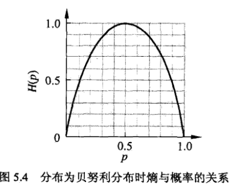

熵；表示随机变量不确定性的度量。

随机变量X的熵定义：
$$
H(X) = -\sum_{i=1}^{n} p_i \log(p_i)
$$
熵只依赖于X的分布，而于X的取值无关。所以X的熵也记作H(p)
$$
H(p) = -\sum_{i=1}^{n} p_i \log(p_i)
$$
熵越大，随机变量的不确定性越大。
$$
0 \leq H(p) \leq \log n
$$
当随机变量只取0，1时，X的分布为
$$
P(X=1)=p, P(X=0)=(1-p), 0 \le p \le 1
$$
熵为
$$
H(p) =-p \log_2 p - (1-p) \log_2(1-p)
$$
二元信源的熵:

当P=0/1时，H(p) = 0 , 随机变量完全没有不确定性。

