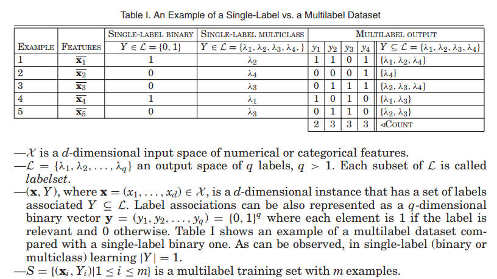
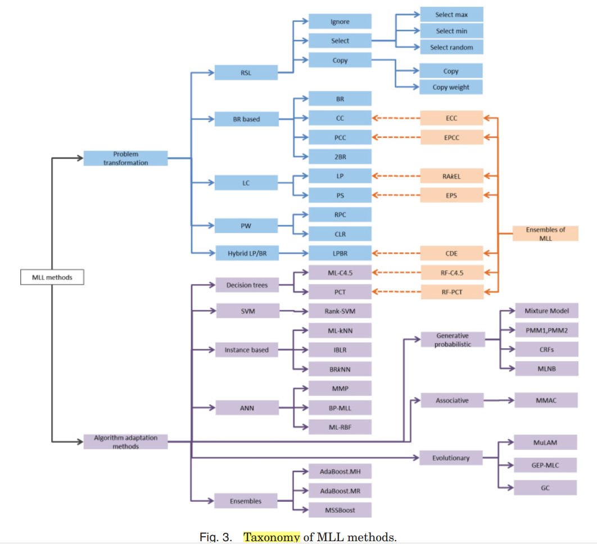

《A Tutorial on Multilabel Learning 》 [download pdf](http://dx.doi.org/10.1145/2716262 )

EVA GIBAJA， SEBASTIAN VENTURA 

西班牙 科多巴大学

this article presents an up-to-date tutorial about multilabel learning that introduces the paradigm and describes the main contributions developed. evaluation measures, fields of application, trending topics, and resources are also presented.

本文介绍了一个关于多标签学习的最新教程，介绍了该范例，并描述了已开发的主要贡献。还介绍了评估措施、应用领域、趋势主题和资源。

categories and subject descriptors: h.2.8 [database management]: database applications—data mining; h.3.3 [information storage and retrieval]: information search and retrieval—retrieval models; i.2.6 [artificial intelligence]: learning—concept learning, connectionism and neural nets, induction; i.7.5 [document and text processing]: document capture—document analysis; i.4.8 [image processing and computer vision]: scene analysis—object recognition; i.5.2 [pattern recognition]: design methodology—classifier design and evaluation; i.5.4 [pattern recognition]: applications—computer vision, text processing

类别和主题描述符：

```
H.2.8[数据库管理]：数据库应用-数据挖掘；
H.3.3[信息存储和检索]：信息搜索和检索-检索模型；
i.2.6[人工智能]：学习-概念学习、连接论和神经网络，归纳；
I.7.5[文件和文本处理]：文件捕获-文档分析；
I.4.8[图像处理和计算机视觉]：场景分析-目标识别；
I.5.2[模式识别]：设计方法-分类器设计和评价；
I.5.4[模式识别]：应用-计算机视觉、文本处理
```

## 1 introduction

分类是数据挖掘的主要任务之一。

一组特征，一个相关类的识别。

如今，人们正在考虑越来越多的分类问题，例如文本和声音分类、语义场景分类、医学诊断或基因和蛋白质功能分类，其中一个模式可以同时具有多个标签。

single-label (classical supervised learning （经典监督学习）)

multilable ( Multilabel Learning (MML))

除其他问题外，本文的目的是包括问题的正式定义、适用MLL的领域、最近几年提出的主要建议的最新摘要、评估措施和资源。


outline

Section 2, the MLL problem is formally defined. 

Section 3, some aspects related to the development and **evaluation** of MLL models are described. 

Section 4, The main approaches developed in the literature are presented

Section 5 describes findings on empirical comparisons between MLL algorithms. 

Section 6 describes the maindomains where MLL has been applied, 

finally, new trends in MLL (Section 7) and a set of conclusions are presented. 

The article also includes an Appendix with resources
(software, datasets, etc.) for MLL. 

## 2.MML

MLL includes two main tasks: 

​	Multilabel Classification (MLC) 

​	Label Ranking (LR). 

​	Multilabel Ranking  



## 3. EVALUATION OF MULTILABEL MODELS (ML models 评估)

### 3.1 evaluation metrics（评价指标）

​	3.1.1 metrics to evalute bipartitions 评估双分区的指标

​		two approches:

​			lebel-based (macro, micro)

​			example-based (*0/1 subset accuracy*=*classifification accuracy* or *exact match ratio* )
$$
B_{macro}=1/q \sum_{i=1}^{q}B(tp_i, fp_i, tn_i, fn_i)
$$

$$
B_{micro} = B(\sum_{i=1}^{q}tp_i, \sum_{i=1}^{q}fp_i, \sum_{i=1}^{q}tn_i, \sum_{i=1}^{q}fn_i)
$$

$$
0/1 -subset- accuracy = 1/t \sum_{i=1}^{t}[Z_i= Y_i]
$$

$$
Hamming loss = 1/t \sum^{t}_{i=1} 1/q|Z_i \Delta Y_i|.
$$


​	3.1.2 metrics to evaluate rankings评估排名的指标

​		One-error

​		Coverage

​		Ranking loss

​		Average precision

​		Margin loss

​		IsError

​		Ranking error


### 3.2 Partitioning Datasets（分区数据集）

第一个通过考虑标签的不同组合来分割分区。

第二项建议是一项宽松的解释，其目的是维持每个标签的正面和负面例子的分布。

两种方法，都优于随机采样。


### 3.3 Statistical Tests


### 3.4 Complexity

标签空间的高纬度，从两种方式挑战MLL方法的效率。

1-训练的计算成本受标签数目影响

2-分类阶段也会受到分类器数量的影响，而且会花费相当长的时间。

内存需求也是要考虑的


## 4. MULTILABEL LEARNING METHODS （MLL方法）

- problem transformation methods ： 将多标签问题转化为一个或多个单标签问题

- algorithm adaptation methods ：扩展SingleLabel算法以直接处理多标签数据



### 4.1. Problem Transformation Methods 

问题转换方法: 把多标签问题，转换成单独的单标签问题。

ranking via single-label learning (SLR )

Binary Relevance (BR) method 

Label Powerset Methods 

Pairwise Methods (PW). 

Transformations for Identifying Label Dependences.  


### 4.2. Algorithm Adaptation Methods 

4.2.1 Decision Tree

q classes, 
$$
entropyML(S)=\sum^{q}_{i=1}P(\lambda_i)log(P(\lambda_i)) + (1-P(\lambda_i))log(1-P(\lambda_i))
$$
4.2.2 SVM (Rank-SVM)

A set of q linear classifiers,  $ \{h_j(X) = <w_j, X> + b_j = w^T_j · X + b_j | 1 \leq j \leq q \}$ 


$$
\frac{min}{(x_i, Y_i) \in S} \frac{min}{(y_i, y_k)\in Y_i \times \overline{Y_i}}   \frac{<w_j - w_k, X_i> + b_j-b_k}{||w_j - w_k||}
$$
4.2.3 Instance Based
$$
y_j = \begin{cases}
1 & \text{if} & P(c_j|y_j = 1)P(y_j = 1) \geq P(c_j|y_j = 0)P(y_j = 0) \\
0
\end{cases}
$$


4.2.4 Neural Network
$$
E = \sum_{i=1}^{m} \frac{1}{|Y_i||\overline{Y_i}|} \sum_{(j,k)\in Y_i \times \overline{Y_i}} exp(-(o_j^i - o_k^i ))
$$
4.2.5. generative and probabilistic models 生成和概率模型
$$
Z = argmax_{Y\subseteq L}P(Y) \Pi_{w\in X} \sum_{\lambda \in Y} \gamma_{\lambda}^Y P(w|\lambda)
$$


### 4.3 Ensemble of MLL Method


### 4.4 Thresholding Strategies (策略阈值)

1. One Threshold (OT): 指定一个threshold，例如0.5，或者根据验证集tune一个
2. RCUT： 根据top k ranking，选择top-k作为预测值。（直接指定，或根据验证集tune，有误差）

More thresholding approaches can be found in Tang et al. [2009]. 


## 5. EXPERIMENTAL COMPARISONS OF MLL METHODS （MLL方法实验对比）

Madjarov et al. 2012 ，12 MLL methods, 16 evaluation measures, and 11 benchmark datasets 。

SVM在大量特征，较小数据集上表现更好。而基于树的方法在较大的数据集中表现得更好。ML-kNN性能在各个领域均比较差。

Chekina et al. 2011  研究了11个算法，12个数据集，18种评估方法。HOMER, BR, ECC, and EPS obtained the best predictive performance results.  

这些研究的结果说明了在开发新算法时应该选择哪种算法或必须考虑哪些算法。最终的决策将取决于所面临的问题和必须满足的要求：效率、灵活性、预测性能、模型的可解释性等。


## 6.APPLICATIONS OF MLL （应用）

**Text Categorization**

- Detection of emotions in music 
- Tag suggestion 
- Medical coding
- IR from narrative clinical text 
- Economic activities classification 
- Patent classification 
- E-mail filtering 
- Classifying news sentences into multiple emotion categories 
- Aeronautics reports
- Query categorization 

**Multimedia**

- Automatic image and video annotation 
- Face verification consists of determining 
- Object recognition 
- Detection of emotions in music 
- Speech emotion classification

**Biology**


**Chemical Analysis**

Drug discovery.  

Vision-Based Metal Spectral Analysis.  

Adverse Drug Reactions (ADRs) 


**Social Network Mining**

Collective behavior learning. 

Social networking advertising 

Automatic annotation. 


**Other Applications**

Automatic annotation. 

Direct Marketing 

Medical Diagnosis 


## 7. TRENDING CHALLENGES (趋势挑战)

Dimensionality Reduction 

Label Dependence 

Active learning 

Multi-instance multilabel learning （MIML）

Multiview learning 

Multitask learning (MTL) 

Hierarchical multilabel classification (HMC)


# Think

训练方法 + 损失函数

评估方法


