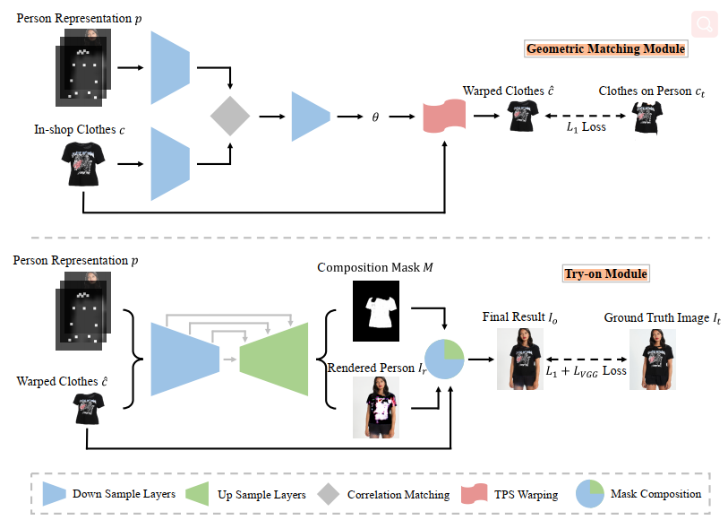
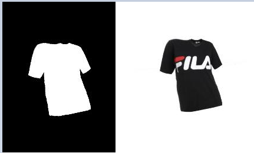
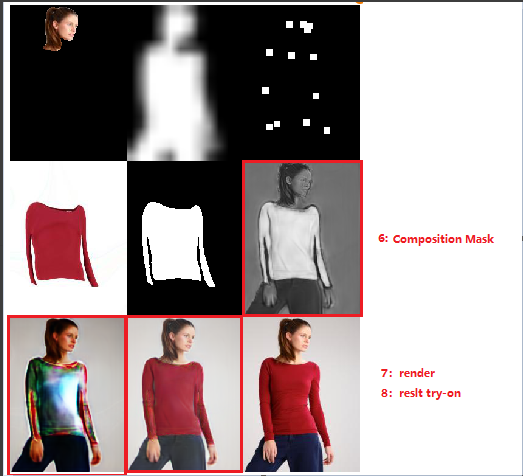
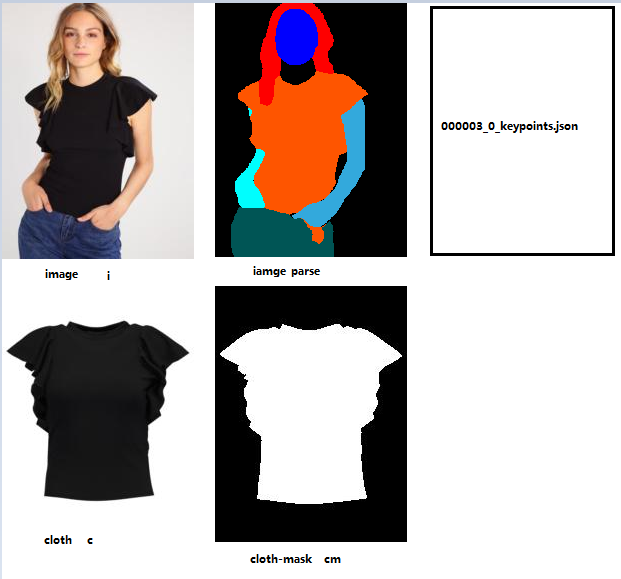

## CP-VTON

- 解决了在真实的虚拟试穿情况下面临的在大空间变形时的服装细节的保留问题。
- 通过GMM模块整合了全学习的TPS，用来获得更健壮和更强大的对齐图像。
- 在给定对齐图像的基础上，通过Try-On模块来动态合并渲染结果与变形结果。
- CP-VTON网络的性能已经在Han等人收集的数据集上进行了证明。


## Motivation：

“在保留目标服装细节的情况下将服装转换为适合目标人物的体型”

- 几何匹配模块GMM，将目标服装转换为适合目标人物体型的形状

- Try-On模块将变形后的服装与人物整合并渲染整合后的图像


## 架构

alignment Network 对齐网络

a single pass generative framework 单通道生成框架



### GMM模型 几何匹配模块

**extracting network:**

- [x] IN_cloth-agnostic_person [h, w, 22]  (64, 128, 256, 512, 512 )

- [x] IN_in_shop_cloth [h, w, 3]  (64, 128, 256, 512, 512 )

**correlation Matching:**

- [ ] 矩阵变换

**regression network:**

- [x] CNN (512, 256, 128, 64 )

**TPS transformation:**

- [ ] TPS 理解

**LOSS**

- [x] l1_loss 

**生成文件**

- warped_cloth
- warped_mask




### Tron-ON Model

**GAN:**

- [x] 12-layer UNet（输出Render 和 composite）

**MaskComposition:**

- [x] Mask Composition 实现：直接使用 cloth * m_composite + p_rendered * (1 - m_composite)

**LOSS**

- [x] L1loss_tryon_im
- [x] Lvgg_tryon_im
- [x] L1loss_composition


训练时的Vision



## 数据转换

#### 原始数据及格式：

image

image_parse

Cloth

Cloth-Mask

Pose




#### 转换后数据格式：

cloth-**agnostic**_person（22通道）：

- Pose heatmap: an 18-channel 每个通道对应一个人体姿势关键点（绘制为11×1111×11的白色矩形）。
- Body shape: a 1-channel  一个1通道的 blurred binary mask 特征图，能够粗糙地包括人体的不同部位。
- Reserved regions: an RGB image 一个包括面部和头发的RGB图像，用来维持人物身份（保证生成的是同一个人）。

```
shape 	 <- image-parse
im_h 	 <- [Regions Part]
pose_map <- [_keypoints.json]

agnostic =  [shape,  im_h, pose_map]
```


## 数据转换-难点理解：

### 0、VITON 

解析VITON数据集合得到的数据有：

```
'viton_train_pairs.txt': imname, cloth_name
women_top/             ===> cloth
women_top/ +double + imfill + medfilt2 ===> cloth-mask
women_top/			   ===> image
/VITON/segment/ + cmap ===> image-parse
/VITON/pose/pkl 		   ===> pose
```

human_colormap.mat 数据集


### 1、keypoints文件生成

首先原始数据取自VITON

CP-VTON use the json format for pose info as generated by [OpenPose](https://github.com/CMU-Perceptual-Computing-Lab/openpose).

我们使用[OpenPose](https://github.com/cmu-computing - lab/openpose)生成json格式的pose信息。


### 2、Image-Parse文件生成

- LIP-SSL得到.mat文件， 保存到/VITON/segment/
- 转换VITON的**human_colormap.mat**文件得到

```matlab
function image_parse()
        source_root_dir = 'F:/BaiduNetdiskDownload/viton_resize/train';
        iname = '000003_0.jpg';
        cname = '000003_1.jpg';
        
        % generate parsing result
		im = imread([source_root_dir '/' 'women_top/' imname]);
		h = size(im,1);
		w = size(im,2);
        s_name = strrep(imname,'.jpg','.mat');
        segment = importdata([source_root_dir '/' 'segment/' s_name]);
		segment = segment';
	
	    if h > w
	        segment = segment(:,1:int32(641.0*w/h));
	    else
	        segment = segment(1:int32(641.8*h/w),:);
	    end
	    segment = imresize(segment, [h,w], 'nearest');
        
        segment = imresize(segment, [fine_height, fine_width], 'nearest');

        % save parsing result
	    segment = uint8(segment);
	    pname = strrep(imname, '.jpg', '.png');
	    imwrite(segment,cmap,[target_root_dir '/' mode '/image-parse/' pname]);
end        
```


### 3、Cloth-Mask文件生成

cloth 文件生成

```matlab
function conver_data()
    source_root_dir = 'F:/BaiduNetdiskDownload/viton_resize/train';
    cname = '000003_1.jpg';
    target_root_dir = 'F:/BaiduNetdiskDownload/viton_resize_qs/train';
    im_c = imread([source_root_dir '/' 'cloth/' cname]);
    % save cloth mask
    mask = double((im_c(:,:,1) <= 250) & (im_c(:,:,2) <= 250) & (im_c(:,:,3) <= 250));
    mask = imfill(mask);
    mask = medfilt2(mask);
    imwrite(mask, [target_root_dir '/cloth-mask/' cname]);
end
```

### 4、Body shape裁剪 [训练时转换]


### 5、保留区域的转换 [训练时转换]


### 6、Pose heatmap 生成

ViTON-  采用OpenPose开源库，直接从源文件img生成。


## Reference：

[论文笔记MG-VTON](https://www.cnblogs.com/aldy56/p/9956160.html)