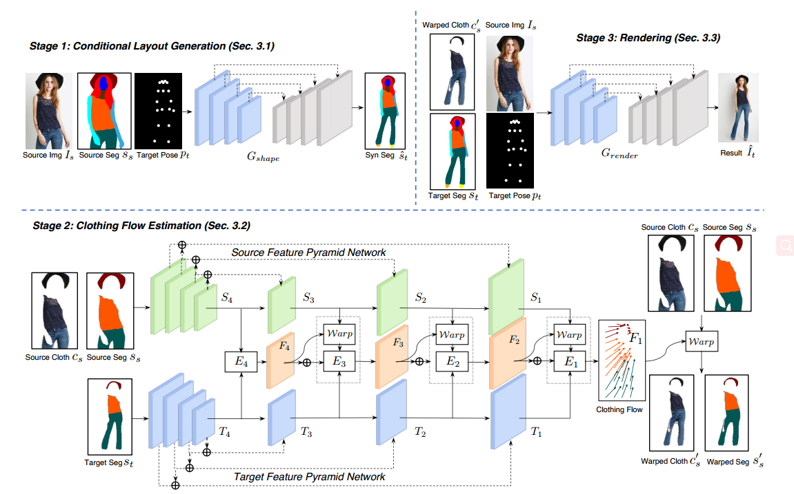
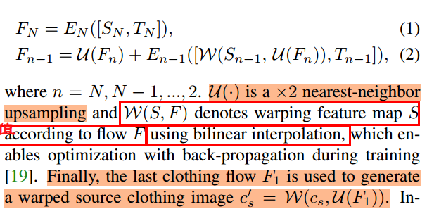
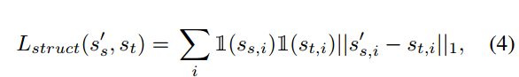
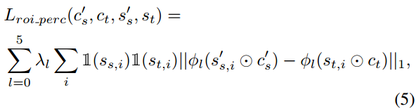

# Cloth Flow

[ICCV 2019丨ClothFlow：一种基于外观流的人物服装图像生成模型](https://zhuanlan.zhihu.com/p/89101331)

### 背景

Pose-guided person generation 和Virtual try on 领域的处理主流方法：

- Deformation-based methods (eg: affine  ; TPS)

- DensePose-based methods 

  即基于变形的方法和基于密度的方法

几何变形的更好的外观转移，但是较大的几何变换，容易导致不准确、不自然的变换估计

基于密度的方法，映射2D图片到3D的人身体，结果看起来不够逼真。

因此作者提出的ClothFlow： a flow-based generative model ；解决衣服变形clothing deformation；从而更好的合成人穿衣的图片；

### 架构

(1) A conditional layout generator  

预测Target Pose-让结果(人物身体)更连贯

(2) clothing flow estimation stage （服装流估算阶段）

ClothFlow估计了一个稠密的流场 (如2×256×256)，在捕捉空间形变时，具有较高的灵活性和准确性。

(3) clothing preserving rendering stage (保留衣服，渲染阶段)

preserve details from the warped source clothing regions. 

FPN计算

----

---

$1$ is anindicator function 

i 代表segment的通道，此处设置19（0背景不计算？）

-----

$C_s$: Source cloth;  $S_s$: Source Segment; $C_s^{'}$:  source wraped cloth

$S_t $: target Segment; $ C_t$: Target Cloth;

----------------------------------------------------

---

Apply:

**Pose-guided Person Generation.**  

**Virtual Try-On.** 

**Optical Flow Estimation.** 

