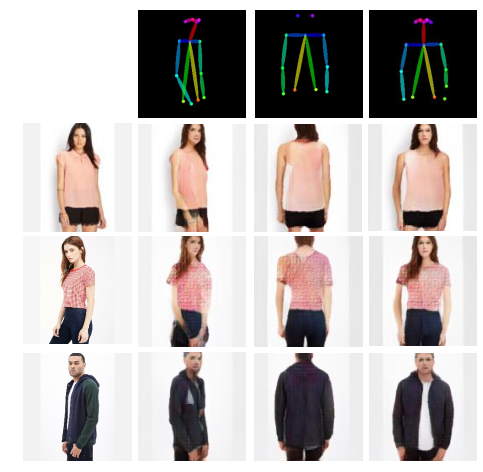
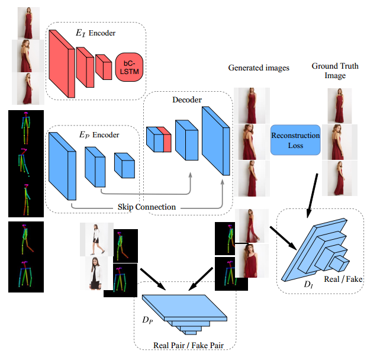
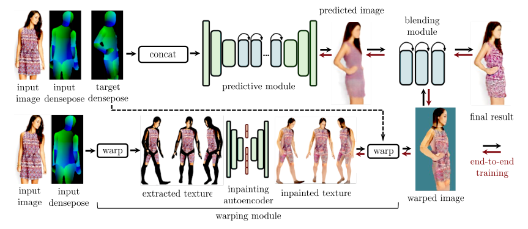
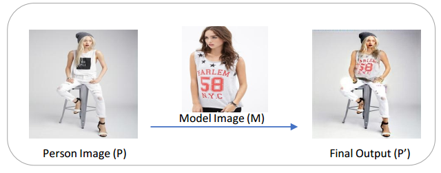

### 2019/6《Pose Guided Fashion Image Synthesis Using Deep Generative Model 》

《利用深度生成模型进行姿态引导的时尚图像合成》

- Wei Sun ncsu.edu 
- ncsu.edu , jd, oppo,

对于智能照片编辑、电影制作、虚拟试穿和时尚展示等应用来说，生成具有预期人体姿态的逼真图像是一个有前途但具有挑战性的研究课题。

2018/9《Dense Pose Transfer 》密集姿态转移

Natalia Neverova；Facebook AI Research

- 姿态转移 生成

  效果一般（脸部模糊，错位）

### 2019/8 《M2E-Try On Net: Fashion from Model to Everyone》时尚从模特到每个人

- Person Image

- Model Image

- Person + Model-cloth Image

  

### 2018/11《Coordinate-based Texture Inpainting for Pose-Guided Image Generation 》基于坐标的纹理绘制用于Pose引导图像生成

我们提出了一种新的深度学习方法，以位置引导重新合成人体照片.

--------------

以上方法都不够逼真。

### 2019/4 《Unsupervised shape transformer for image translation and cross-domain retrieval 》

《用于图像转换和跨域检索的无监督形状变换器》

We use three datasets: 

VITON [12], Fashion-Style， CMU MultiPIE[10]