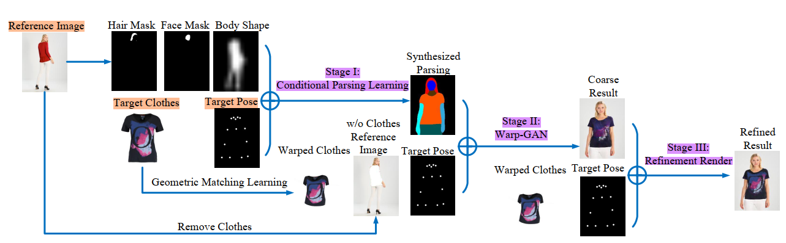
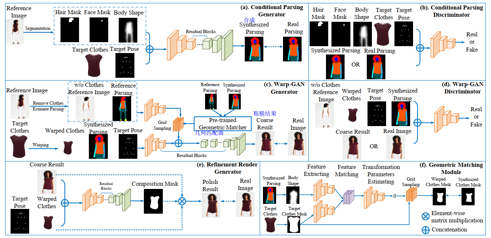
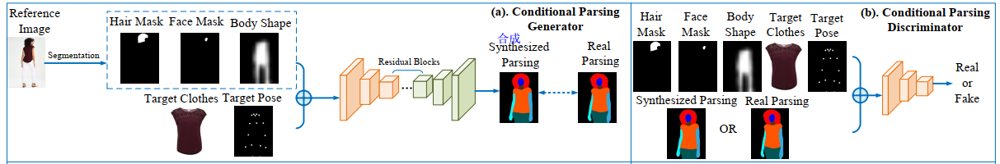
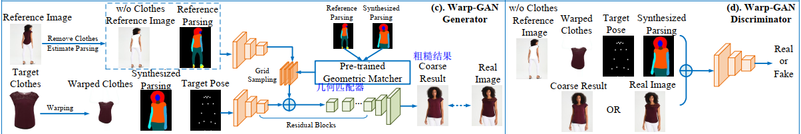
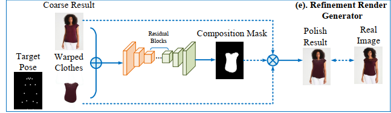
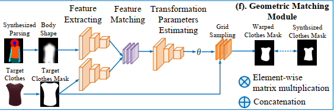

## MG-VTON  《Towards Multi-pose Guided Virtual Try-on Network 》

Virtual try-on system 虚拟试穿系统。

---现有的方法，只能从单个固定的人体姿态上换装。往往失去纹理细节，缺少姿态多样性。

three Stages:

1) a desired human parsing map of the target image is synthesized to match both the desired pose and the desired clothes shape; 合成目标图像的所需人工解析映射，以匹配所需的姿态和所需的衣服形状

2) a deep Warping Generative Adversarial Network (Warp-GAN) warps the desired clothes appearance into the synthesized human parsing map and alleviates the misalignment problem between the input human pose and desired human pose; 深度扭曲生成对抗网络(Warp-GAN)将期望的服装外观扭曲到合成的人体解析图中，解决了输入人体姿态与期望人体姿态之间的错位问题

3) a refinement render utilizing multi-pose composition masks recovers the texture details of clothes and removes some artifacts. Extensive experiments on well-known datasets and our newly collected largest virtual try-on benchmark demonstrate that our MGVTON significantly outperforms all state-of-the-art  methods both qualitatively and quantitatively with promising multipose virtual try-on performances. 使用多姿态合成蒙版的细化渲染恢复衣服的纹理细节，并删除一些人工制品.在知名数据集上的大量实验和我们新收集的最大的虚拟试测基准表明，我们的MGVTON在定性和定量上都显著优于所有最先进的方法，具有很有前途的多姿态虚拟试测性能。

**Key:**

数据(人工标记)：姿态，衣服形状

数据集: well-know【DeepFashion】 & self conllected largest

网络架构：Warp-GAN

技术储备：多姿态合成蒙版（一种利用多姿态合成掩模来恢复纹理细节和减少伪影的细化网络）

**Apply:** 虚拟试穿、虚拟现实和人机交互

Other exiting works [14, 20, 35] usually leverage 3D measurements  to solve those issues since the 3D information have abundant details of the shape of the body that can help to generate the realistic results. However, it needs expert knowledge and huge labor cost to build the 3D models, which requires collecting the 3D annotated data and massive computation. These costs and complexity would limit the applications in the practical virtual try-on simulation. 3D建模，这些费用和复杂性限制了虚拟试验仿真的实际应用。

## Dataset:

**MPV:**

​	collect from the internet, named MPV ;

​	contains 35,687 person images and 13,524 clothes images.  

​	The image is in the resolution of 256 × 192. We extract the 62,780 three-tuples of the same person in the same clothes but with diverse poses .

​	图片大小265x192，提取了62780组图片，每组含同一人的不同姿势的三张图片。

## MG_VTON

Picture  + clothes + pose -> 穿新衣的人物Pose照片

MG-VTON 四个组成部分：

1- a pose-clothes-guided human parsing network is designed to guide the image synthesis;  设计了一种基于服装姿态引导的人工解析网络来指导图像合成;

2- a Warp-GAN learns to synthesized realistic image by using a warping features strategy。GAN学习合成真实图像。

3- a refinement network learns to recover the texture details 

4- a mask-based geometric matching network is presented to warp clothes that enhances the visual quality of the generated image 提出了一种基于掩模的几何匹配网络，通过对衣服的变形来提高图像的视觉质量。

我们采用了一个“粗-精”策略，将这个任务分成三个子任务，three subtasks ：

- [ ] conditional parsing learning,(条件解析学习)

- [ ] the Warp-GAN, 

- [ ] the refinement render.  （细化纹理）

姿态编码：使用pose estimator [4]  ，我们将姿态编码为18个热图，其中填充一个半径为4像素的圆，其他地方为0。

使用人解析器[6]来预测由20个标签组成的人类分割地图，从中提取面部、头发和身体形状的二进制掩码

根据VITON[8]，我们将身体形状的采样降低到一个较低的分辨率(16×12)，并直接将其调整到原始分辨率(256×192)，这减轻了由于身体形状的变化所造成的人为影响

Architecture 

### 3.1. Conditional Parsing Learning 【~人体解析/语义分割】

L1-loss 产生更平滑的结果

softmax_loss 合成高质量的人工Parsing Map

IN: (ImageOfClothes, postHeatMap, body shape, mask Hair, mask Face)

p(St’|(Mh, Mf, Mb, C, P))

G: 该阶段基于条件生成对抗网络(CGAN)

D: We adopt the discriminator D directly from the pix2pixHD  

OUT: Parsing

### 3.2. Warp-GAN 【~Fake】

[geometric matching](《Convolutional neural network architecture for geometric matching》) module to warp clothes image[3.4](###3.4) 

### 3.3. Refinement render 【~高像素修复】

### 3.4. Geometric matching learning 【~】

## Implementation Detail:

**Setting.** We train the conditional parsing network, WarpGAN, refinement render, and geometric matching network for 200, 15, 5, 35 epochs, respectively, using ADAM optimizer [13], with the batch size of 40, learning rate of 0.0002, β1 = 0:5, β2 = 0:999. We use two NVIDIA Titan XP GPUs and Pytorch platform on Ubuntu 14.04. 

**Architecture.** 

each **generator** of MG-VTON is a ResNet-like network, which consists of three  downsample layers, three upsample layers, and nine residual blocks, each block has three convolutional layers with 3x3 filter kernels followed by the bath-norm layer and Relu activation function.  

64, 128, 256, 512, 512, 512, 512, 512, 512, 512, 512, 512, 256, 128, 64. 

**discriminator**  we apply the same architecture as **pix2pixHD** [30], which can handle the feature map
in different scale with different layers. Each discriminator contains four downsample layers which include 4x4 kernels, InstanceNorm, and LeakyReLU activation function. 

## 相关技术

### GAN

### Person image synthesis （人像合成）

骨架辅助[32]提出了一种骨架导向的人体图像生成方法，该方法以人体图像和目标骨骼为条件。

PG2[17]应用了由粗到细的框架，包括粗级和精级。novel model [18] to further improve the quality of result by using a decomposition strategy（分解策略）

deformableGANs[27]和[1]分别在粗糙矩形区域使用仿射变换和在pixellevel上对零件进行翘曲，试图缓解不同位姿之间的错位问题

V-UNET[5]引入了一个变化的U-Net[24]，通过用stickman标签重组形状来合成人的图像

[21]直接应用CycleGAN[36]进行位姿操作

However, all those works fail to preserve the texture details consistency corresponding with the pose. 然而，所有这些作品都未能保持与姿态相对应的纹理细节的一致性。

The reason behind that is they ignore to consider the interplay between the human parsing map and the pose in the person image synthesis。

这背后的原因是他们忽略了人解析映射和人图像合成中的姿态之间的相互作用。

人体解析图可以指导生成器在精确的区域级合成图像，保证了人体结构的一致性

### Virtual try-on. 

**fiexd pose**:

VITON[8]  computed the transformation mapping by the shape context TPS warps [2]  

CP-VTON[29] 估计变换参数的学习方法。

FanshionGAN[37] 学会了在输入图像的基础上生成新衣服，这个人以描述不同衣服的句子为条件

ClothNet[15]提出了一种基于图像的生成模型，根据颜色生成新衣服。

CAGAN[10]提出了一个条件类比网络来合成以衣服配对为条件的人的图像，这限制了实际的虚拟试穿场景。

ClothCap[20]利用3D扫描仪自动捕捉衣服和身体的形状

[26]提出了一种需要三维人体形态的虚拟试衣系统，对注释的采集十分繁琐。

----learning to synthesize image with the new outfit on the person through adversarial learning , which can manipulate the pose simultaneously. 

----使用对抗学习用新衣服合成图像, 同时控制姿势

