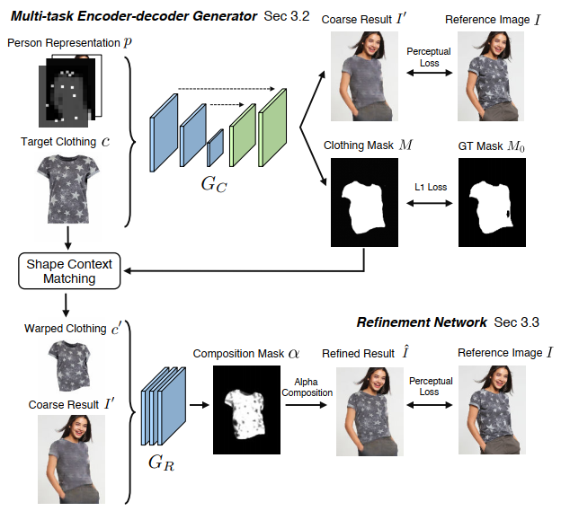
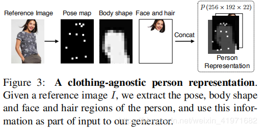
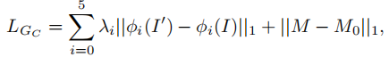

[VTON code]( https://github.com/xthan/VITON)

## VITON：基于映像的虚拟试穿网络

CVPR 2018论文“ VITON：基于图像的虚拟试穿网络”的代码和数据集

### 人像提取

本文中使用的人物表示由2D姿态估计器和人工解析器提取：

- [实时多人姿势估计](https://github.com/ZheC/Realtime_Multi-Person_Pose_Estimation)
- [自我监督的结构敏感学习](https://github.com/Engineering-Course/LIP_SSL)

### 数据集

由于版权问题，该数据集不再公开可用。对于已经下载数据集的用户，请注意，使用或分发数据集是非法的！

### 测试

#### 第一阶段

在[Google云端硬盘](https://drive.google.com/drive/folders/1qFU4KmvnEr4CwEFXQZS_6Ebw5dPJAE21?usp=sharing)上下载经过预训练的模型。将它们放在`model/`文件夹下。

运行`test_stage1.sh`以进行推断。结果在中`results/stage1/images/`。`results/stage1/index.html`可视化结果。

#### 第二阶段

运行matlab脚本`shape_context_warp.m`以提取TPS转换控制点。

然后`test_stage2.sh`进行优化并生成最终结果，该结果位于中`results/stage2/images/`。`results/stage2/index.html`可视化结果。

### 培养

#### 准备数据

往里走`prepare_data`。

首先运行`extract_tps.m`。这将需要一些时间，您可以尝试并行运行它，也可以直接通过Google云端硬盘下载预先计算的TPS控制点，然后将其放入`data/tps/`。

然后运行`./preprocess_viton.sh`，生成的TF记录将位于中`prepare_data/tfrecord`。

#### 第一阶段

跑 `train_stage1.sh`

#### 第二阶段

跑 `train_stage2.sh`

### 引文

如果此代码或数据集有助于您的研究，请引用我们的论文：

```
@inproceedings{han2017viton,
  title = {VITON: An Image-based Virtual Try-on Network},
  author = {Han, Xintong and Wu, Zuxuan and Wu, Zhe and Yu, Ruichi and Davis, Larry S},
  booktitle = {CVPR},
  year  = {2018},
}
```

https://github.com/xthan/VITON

# Paper[札记]

VITON用一个由粗到细的框架解决了这个问题，并期望通过TPS变形来捕捉布料的变形。

An overview of VITON.  




# VITON Paper:

VITON 的目标在于，对给定的参考图像（模特）I和目标衣服c，生成合成图像I霸；I霸中c被自然地“穿”到参考图像I中模特对应的区域上，而模特的姿势和其他身体部位特征被保留。最直接的方法是用这样的训练集：同一个模特（姿势和人体特征相同）穿着不同衣服的多张图片和对应的这些衣服的产品图。但是这种数据集是很难大规模得到的。
在实际虚拟试衣场景中，在测试时只有参考图像和目标产品的图像是可以得到的。因此，我们把这种设定同样运用到训练集中来，所以输入的参考图像I中模特穿的衣服就是目标衣服c，这样的数据集是易得的（就像某宝上卖衣服，不仅给产品图还要给卖家秀)。那么现在的重点就是，给定c和模特人体信息，怎么训练一个网络->不仅可以生成合成图像，更重要的是要在测试中能够泛化，用任意所需的服装项目合成感知上令人信服的图像。

### Person Representation 人体特征表示

##### Pose heatmap 姿势热图

人体姿势的多样性导致了衣服不同程度的变形，因此我们使用最先进的姿势估计器明确地建模姿势信息。（用的是CVPR2017的人体姿势估计Realtime Multi-Person Pose Estimation）人体姿势估计包含了18个关键点，为了使Represent表示的各个部分可以空间堆叠，每个关键点被转换成热图heatmap，在关键点附近有一个11×11的邻居，在其他地方填充了1和0，然后把这些热图堆叠成一个18通道的姿势热图。

##### Human body representation 人体身体部位表示

衣服的外形很大程度上取决于人的形状（高矮胖瘦），因此如何将目标衣服进行变形取决于不同的身体部位（如手臂，躯干）和身体形态。一个先进的人体解析的方法（LIP-SSL，个人感觉LIP-SSP比较难跑，caffe环境配置复杂，建议跑它的另一个版本JPPNet，不过要是想得到.mat要自己改一下输出）输出人体分割图（.mat格式，不同分割区域标记了不同编号）。然后我们把这个分割图转换成一个单通道的二进制掩模，其中1代表身体部分，0表示其他部位。这个二进制掩模呗下采样成一个低分辨率的图（16*12），当身体形状和目标衣服混淆时，避免伪影。

##### Face and hair segment 脸部、头发的分割

为了维持人本身的特点，我们在人体表示中融入了身体特征，如脸、肤色、头发之类。我们用Human body representation里一样的人体解析器分离出人脸和头发部分的RGB图，作为新合成图像的身份信息。

最后，把以上得到的三个部分转换到统一分辨率，然后堆叠形成与衣物无关的人体表示P（256，192，22），示意图如下。P包含了丰富的人体信息，convNet就是基于这些信息学习它们之间的关系，比以往的person Presentation都精细。


### Multi-task Encoder-Decoder Generator -> Gc

输入：Person Representation P和目标衣服Target Clothing C
输出：粗合成I’和对应区域掩模M
Gc：这里用到的编码解码框架是一种包含连接跳跃skip connections的U-net网络结构。
设Gc为编码解码器估计的方程，它将P和C组合作为输入并输出四通道（I‘和M）结果。我们希望得到一个生成器，使得粗合成图I’尽可能接近参考图I，掩模M尽可能接近从参考图I模特上预测得到的伪ground truth掩模M0。一个简单的方法就是用L1损失，使当输出目标是M0这样的二进制掩模时，它会产生不错的结果。但是如果输出要是RGB图像的话，L1 Loss就会使输出图像变模糊。我们还引入了a perceptual loss感知损失。下式是感知损失的和以及LI Loss加和的结果。

网络用ImageNet数据集训练的VGG19权重初始化。超参数lamda_i控制第i层的贡献。第一个Stage的Gc没有学习细节（L1 Loss导致），所以得到的是粗合成图。

### Refinement Network -> GR

是为了从目标衣服产品图中学习对应模糊图像区域的细节并恢复。

#### Warped clothing item 衣服变形

为了运用目标衣服产品图中的纹理细节，要先对衣服进行变形。

a thin plate spline (TPS) transformation

[ copy from ](https://blog.csdn.net/weixin_41971682/article/details/90549389)