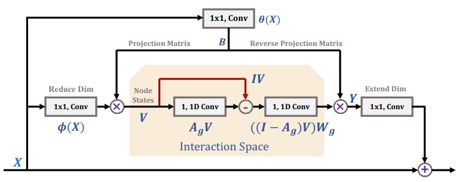

## 注意力机制分类：

soft attention: SENet, CBAM
		self attention: Nonlocal, DANet

Atrous Self Attention、Local Self Attention、Sparse Self Attention都算是稀疏Attention，直观上来看就是注意力矩阵变得很稀疏了。

---------------

注意力机制可以分为四类：

```

基于输入项的柔性注意力（Item-wise Soft Attention）、

基于输入项的硬性注意力（Item-wise Hard Attention）、

基于位置的柔性注意力（Location-wise Soft Attention）、

基于位置的硬性注意力（Location-wise Hard Attention）。
```


总的来说，一种是**软注意力(soft attention)**，另一种则是**强注意力(hard attention)**。

软注意力的关键点在于，这种注意力更关注区域或者通道，而且**软注意力是确定性的注意力**，学习完成后直接可以通过网络生成，最关键的地方是**软注意力是可微的**，这是一个非常重要的地方。可以微分的注意力就可以通过神经网络算出梯度并且前向传播和后向反馈来学习得到注意力的权重。

强注意力与软注意力不同点在于，首先强注意力是更加关注点，也就是图像中的每个点都有可能延伸出注意力，同时强注意力是一个随机的预测过程，更强调动态变化。当然，最关键是强注意力是一个不可微的注意力，训练过程往往是通过**增强学习(reinforcement learning)**来完成的。


从注意力域（attention domain）的角度来分析几种注意力的实现方法。其中主要是三种注意力域，**空间域(spatial domain)**，**通道域(channel domain)**，**混合域(mixed domain)。**

### （1） 空间域

设计思路**：**

Spatial Transformer Networks（STN）模型是15年NIPS上的文章，这篇文章通过注意力机制，将原始图片中的空间信息变换到另一个空间中并保留了关键信息。这篇文章的思想非常巧妙，因为卷积神经网络中的池化层（pooling layer）直接用一些max pooling 或者average pooling 的方法，将图片信息压缩，减少运算量提升准确率。但是这篇文章认为之前pooling的方法太过于暴力，直接将信息合并会导致关键信息无法识别出来，所以提出了一个叫空间转换器（spatial transformer）的模块，将图片中的的空间域信息做对应的**空间变换**，从而能将关键的信息提取出来。

### （2） 通道域

设计思路：

通道域的注意力机制原理很简单，我们可以从基本的信号变换的角度去理解。信号系统分析里面，任何一个信号其实都可以写成正弦波的线性组合，经过时频变换之后，时域上连续的正弦波信号就可以用一个频率信号数值代替了。

在卷积神经网络中，每一张图片初始会由（R，G，B）三通道表示出来，之后经过不同的卷积核之后，每一个通道又会生成新的信号，比如图片特征的每个通道使用64核卷积，就会产生64个新通道的矩阵（H,W,64），H,W分别表示图片特征的高度和宽度。每个通道的特征其实就表示该图片在不同卷积核上的分量，类似于时频变换，而这里面用卷积核的卷积类似于信号做了傅里叶变换，从而能够将这个特征一个通道的信息给分解成64个卷积核上的信号分量。既然每个信号都可以被分解成核函数上的分量，产生的新的64个通道对于关键信息的贡献肯定有多有少，如果我们给每个通道上的信号都增加一个权重，来代表该**通道与关键信息的相关度**的话，这个权重越大，则表示相关度越高，也就是我们越需要去注意的通道了。

可参考 [SENet](https://github.com/weiaicunzai/awesome-image-classification#senet)模型结构。

### （3） 混合域

了解前两种注意力域的设计思路后，简单对比一下。首先，空间域的注意力是忽略了通道域中的信息，将每个通道中的图片特征同等处理，这种做法会将空间域变换方法局限在原始图片特征提取阶段，应用在神经网络层其他层的可解释性不强。

而通道域的注意力是对一个通道内的信息直接全局平均池化，而忽略每一个通道内的局部信息，这种做法其实也是比较暴力的行为。所以结合两种思路，就可以设计出混合域的注意力机制模型


## 背景

Attention 机制继在 NLP 领域取得主导地位[1]之后，近两年在 CV 领域也开始独领风骚。率先将之引入的是 Kaiming He 组的 Nonlocal[2]。此后层出不穷的文章，引发了一波研究 attention 机制的热潮。

仅2018年，在语义分割领域就有多篇高影响力文章出炉，如 PSANet[3]，DANet[4]，OCNet[5]，CCNet[6]，以及今年的Local Relation Net[7]。

此外，针对 Attention 数学形式的优化，又衍生出A2Net[8]，CGNL[9]。而 A2Net 又开启了本人称之为“低秩”重建的探索，同一时期的SGR[10]，Beyonds Grids[11]，GloRe[12]，LatentGNN[13] 都可以此归类。

上述四文皆包含如下三步：1.像素到语义节点映射 2.语义节点间推理 3.节点向像素反映射。其中，step 2的意义尚未有对比实验验证，目前来看，step 1 & 3 构成的对像素特征的低秩重建发挥了关键作用。关于如何映射和反映射，又有了 APCNet[14]  和笔者的 EMANet[15]  等相关工作。


## Attention Models

本文中的 attention 仅指 self-attention，不涉及 soft-attention


### NoLocal[2]

Nonlocal[2]中的核心操作为：
$$
y_i = \frac{1}{C(X)} \sum_{\forall j}f(X_j, X_j)g(Xj)
$$


其中 $X_i \in R^C , 1 \leq i \leq N$ ， $N$ 是像素个数， $C$ 是像素特征维度（通道数），  计算 $X_i$  和 $X_j$  之间的相关度（或称“能量”）， $g$  对 $X_j$ 进行变换。可以看作对 $g(X_j)$ 的加权平均得到 $y_j$，作为对 $X_i$ 的重构，这里权重为 $\frac{1}{C(X)} f(X_j, X_j)$  。

关于 $f $ 和$g $  的选择，作者列出了多个选项，并最终选择了

$$
y = softmax(X^T W^T_\theta W_\phi X) (X^T W^T_\sigma)
$$

的形式，其中  $\theta, \phi, \sigma$  分别对应  NLP Transformer  里的 query ， key 和 value 。此外， $y $  经过  $1 \times 1 $ 卷积后和 $ X $ 相加，作为 Non-local 模块的输出。

最后结构图如下：


**Non-local Block**


其实，这里  $f$ 和 $g$  的具体选择，对效果影响不大。在笔者做过的语义分割实验中， query 和 key 共享，节省一些参数，并且这样计算出的 $f \in R^{N \times N} $ 是个对称矩阵。甚至可以考虑将 $\theta, \phi , \sigma$ 转换省略，直接用 $X$  本身计算，而把 $1 \times 1 $ 卷积放在模块之前之后，这样的效果也不逊色。当然，不同的任务应该对应于不同的最优选项。

今年 arxiv 有篇文章[16]详细对比分析了这些细节在不同任务中的影响。笔者认为此处最关键的是加权平均，而非$\theta, \phi , \sigma$  转换。这里  $f$  计算时，只考虑了像素的特征，而没有考虑相对位置。倘若也将像素坐标位置 $(x, y )$ 考虑进来，其实就是全图版的 MeanShift Filter，一种经典的保边滤波算法。

Nonlocal 还可以溯源到经典的 Non-local means 和 BM3D。其功效也来源于此，即高维  feature map 里存在大量的冗余信息，该类算法可以消除大量噪音。Kaiming 组的另一篇文章[17]分析了 Nonlocal 对模型鲁棒性的提升，考虑到上述的去噪效果，这个结论是显而易见的。效果如下：


a. 原图 	b. Feature map 	c. Feature map after Nonlocal


Nonlocal 对于每个  $y_i$ 的计算，都要在全图上进行，因此复杂度为$O(N^2C)$  。


### PSANet[3]

PSANet 和  Nonlocal  最大的区别在于，相关度矩阵 相关度矩阵 $f$ 的计算。对于像素 $i$，其相关度向量 $f(X_i, X)$ ，通过施加在 $X_i$上的两个 $1 \times 1$卷积得到，即由$f(X_i, X)$变为$f(X_i)$ ，只和 query 及相对位置相关。此外，PSANet  包含两路  attention ，相当于 transformer 中的两个 head 。两路分别起到  collect  和 distribute  的作用。


### DANet[4]

是把 Nonlocal 操作视为 spatial attention，以此引出了 channel attention ，两路融合。

[git ] https://github.com/junfu1115/DANet


### OCNet[5]

OCNet[5]，则是将 object context (spatial attention) 和卷积强强联合，分别捕捉全局和局部信息，并在多个数据集上取得很高的精度。

[翻译] https://zhangbin0917.github.io/2018/09/13/OCNet-Object-Context-Network-for-Scene-Parsing/

[model unoffical pytorch ] https://github.com/PkuRainBow/OCNet.pytorch

![Figure 2: (a) The overall network structure of OCNet: Given an input image, we employ a fully convolution network (FCN) to extract a feature map, then employ an object context module on the feature map and output an updated feature map. Based on the updated feature map, we employ a classifier to predict the pixel-wise label map and employ bilinear method to up-sample the label map for 8× times as the final prediction. (b) Base-OC: Given an input feature map, we employ an object context pooling (OCP) on it, then we concatenate the output feature map of OCP and the input feature map as the output feature map. (c) Pyramid-OC: Given an input feature map, we employ four parallel OCPs independently. Each branch partitions the input to different pyramid scales, and the object context pooling is shared within each branch, then we concatenate the four output feature maps with a new feature map that is generated by increasing the channels of the input feature map. (d) ASP-OC: Given an input feature map, we employ an OCP and four dilated convolutions (these four branches are the same with the original ASPP), then we concatenate the five output feature maps as the output.](https://ai2-s2-public.s3.amazonaws.com/figures/2017-08-08/796a6e78d4c4b63926ee956f202d874a8c4542b0/3-Figure2-1.png)

### CCNet[6]

所属领域：语义分割

[ git ] https://github.com/speedinghzl/CCNet

[Paper Reader](https://zhuanlan.zhihu.com/p/51393573)

将全图计算分解为两步，一步是按行计算，一步是按列计算。类比于将矩阵 $M \in R^{m \times n}$ 分解为 $P\times Q, P\in R^{m\times 1}, Q\in R^{1\times n} $ 。因此 CCNet 复杂度为  $O(N\sqrt{N}C)$


### ISA[18]

PKU兄弟实验室的 ISA[18]也是将 attention map 的全图计算分解为两步：第一步长距离attention ，第二步短距离。中间夹着一步 permute 操作。其实类似组卷积- shuffle -组卷积的过程，思路上顺承 IGCV[19]，其复杂度也是 $O(N\sqrt{N}C)$


### DGMN[20]

Oxford的DGMN[20]则通过MC采样，使每个像素计算attention所需的参考像素从 $N$ 降为 $ K, K \ll N$ . 此外，采样过程可导，可以和网络同步学习。且$K$ 个参考像素各自对应不同的变换 $g$ . DGMN把复杂的降低为$O(NKC)$ , 且精度超Nolocal。


### OTHER IDEA DIRECTION

上面的算法，均是从矩阵变换方面，压缩计算量，得到更好的性能，更低的内存占用。本质不变的是全图的attention。

另一种减少计算量的方法，是将 attention 的**全图计算改为窗口内计算**。MeanShift 若限制窗口大小，便是 **Bilateral Filter(双边滤波)**，即每个像素的特征，更新为邻域内其他像素的加权平均。权重由特征相似度和空间距离计算而来。而 MeanShift 也被证明等价于迭代至收敛的Bilateral Filter[21]。

###  Local Relation Net

MSRA 的 Local Relation Net[7]设计了类似 Bilateral Filter 的操作，在特征相关度计算上使用了标准的 query，key，value 三元组，在空间相关度上设计了Geometry Prior（几何prior）。并且大胆地用这一算子替代了 $3\times 3$ 卷积。其节省参数的同时，还具有旋转等变性。整个结构下来有 Transformer 的感觉，即不用 RNN，CNN来收集 context 信息，而是用 attention 来做。至于为什么起效，笔者更想归根到 Bilateral Filter 本身的效果，即保边滤波，起到了保持类间方差的同时，减少类内方差的效果。


### CARAFE[22]

MMLab 的 CARAFE[22]，用来进行特征上采样。其计算方式也是用窗口内像素特征的特征加权平均。其特殊之处在于，用于加权的权重是学习出来的，通过对特征变换、pixelshuffle上采样和通道归一化得到。


其实关于选择 global 还是 local 的问题，NLP 领域已经有好多研究，详见苏剑林的博文 《为节约而生：从标准Attention到稀疏Attention》。两个领域的研究，其实都在做类似的事情。


### A2Net[8] and CGNL[9]

NUS 的 A2Net[8] 和 百度的 CGNL[9] 另辟蹊径，从另一个角度优化了 Nonlocal 的复杂度。

Nonlocal 高昂的复杂度 $O(N^2C)$ 成为制约其应用的关键瓶颈。我们可以重新审视下Nolocal公式(2)

$$
y = softmax(X^T W^T_\theta W_\phi )(W_\sigma X)^T = softmax(θ(X)^T Φ(X)) σ(X)^T
$$

其中 $θ(X)^T \in R^{N \times C} $,   $\phi (X) \in R^{C \times N}$ , $σ(X)_T \in R^{N \times C}$ . 因此，两步矩阵的乘法计算量均是$O(N^2C)$. 使用下乘法结合律，先算后两者的乘积，便可以得到$O(NC^2)$ 的复杂度，由于 $C << N$, 复杂度减少了整整一个量级。再加入softmax便可以得到：
$$
y = softmax(W_θX)^T[softmax(W_Φ X)(W_σ X)^T] = softmax(θ(X))^T [softmax(W_Φ X)(W_σ X)^T]
$$
由于softmax的原因，两式并不完全等价，但是对于deep learning来说，两者的capacity是近似的。其实一般地，$θ(X_i)$ 和 $\phi (X_i)$ 的维度被设定小于 $\sigma (X_i)$ 。如前两者64，后者512，我们这里将前者的维度标记为K，则Noloca和A2Net的复杂度分别为$O(N^2CN^2K)$ 和 $O(NCK)$


那么，如何从直觉上理解公式4呢？ $[·]$ 里面得到的是一个 $K \times C$ 的矩阵，可以看作是 $K$ 个描述，表达整个freature map的关键概念。

而$softmax(\phi(X)) \in R^{K \times N} $ 表示的是从$N$ 个像素到$K$ 个描述子的映射关系，可以看作像素特征加权平均得到了描述子，权重就是这个映射矩阵。

$sotfmax(\theta(X))^T$ 则反之，作为权重，将描述子加权平均，得到重构后的像素特征。


### GloRe[12] and SGR[10], Beyonds Grids[11] 、 LatenGNN[13]

在 A2Net 基础上，Yunpeng Chen 继续做出了 GloRe[12]。相比于 A2Net，GloRe 在映射 ($N \to K$）和反映射（$K \to N$） 之间插入了一步GCN的操作，使 $K \times C$ 的描述子矩阵内部交互和更新。GCN的具体实现是两步 $1\times 1$卷积。

此外作者发现，θ 和 Φ 其实是可以共享的。即下图的B，结论和上下文本人所言query和key共享一致。



其实，和 GloRe 同一时期的相关工作还有 SGR[10], Beyonds Grids[11] 和 LatenGNN[13]。它们都采取三步走的策略，即**映射、GCN 和反映射**。他们的区别在于每一步的具体操作。

四篇文章在 GCN 步骤各有设计。不过，目前为止，没有看到任何公开的 ablation study 证明第二步 GCN 有效果，自己复现的部分实验，也没有跑出 GCN 有增益的结果。所以，只能暂且认为关键还是在于映射和反映射。

那么，映射和反映射，为何能表现突出呢？这里只说一下自己对语义分割这个任务的分析。我们用来抽取 Feature 用的 ResNet，在 ImageNet 千类数据集上训练，因此特征维度至少 1000 维。而分割问题少则 20 类左右，多也不超过几百类。使用过千维的特征，显然是过参数化了。

对高维数据分类是低效的，因为高维空间中分类边界过于复杂。而映射反映射的流程，其实是对特征的一个低秩重构，使得高维空间中的特征重新分布到低维流形上，便于后续的分类。其实，A2Net 在 ImageNet 上也证明了自己的价值，这说明不只是分割问题合适，类似的一系列任务，都适用这种映射-反映射模块。

上述的几篇文章，映射和反映射矩阵，多是通过 1X1卷积学习到的。其实，最常见的池化-上采样，也属于一种超级简化的映射-反映射范式。PSPNet 中的 PPM 和 DeeplabV3 中的 GAP 带来的效益，也可由这个角度进行一定的解释。SIAT-MMLAB 的 APCNet[14]，也属于这一范式的一个具体结构。其 ACM 模块的映射步骤用池化，反映射用学习到的反映射矩阵 (Global-guided Local Affinity)。此外，APCNet 和上述的 Beyonds Grid 都用了多路并行，每路用不同的 K, 来进行不同程度的稀疏重建。
  

### EMANet[23]

本文认为，映射的关键，在于寻找一组“最合适”的描述子，即论文中的“基”。这组基最好具有如下的几条性质：1. 具有代表性 2. 数量少 3. 互不相似。性质1能保证重构后的 feature map 能够最大限度地还原有效信息；性质2则可以保证重构的低秩性，使重构后的特征处在高维空间中的低维流形中；性质3则是在性质2的约束下，尽可能达到性质1的保证。使用池化，即简单下采样的，得到的基充分满足性质2；但互相之间仍十分相似，因此性质3不满足；小物体下采样后可能会信息丢失，因此性质1也仅仅能对大物体满足。

笔者被ICCV 2019收录为Oral的论文 EMANet[23]，提出了用 EM 算法来求解映射和反映射。EM 算法用于求解隐变量模型的最大似然解。这里把隐变量视为映射矩阵，模型参数即为 $ K$ 个描述子。

E步更新映射矩阵 $Z$，

M步更新描述子 $\mu$ 。

$T$ 次迭代后，用映射矩阵的转置（以及归一化）作为反映射矩阵，重构特征图。

EM 本身保证收敛到似然函数的局部最大值，因此 EM 算法迭代而出的描述子和映射关系，相对于简单地用网络学习到的，更能保证满足性质1；性质2可以通过设置较小的 $K$ 来满足；而性质3，则可通过良好的描述子迭代初始化来做到。EMANet 的解读见笔者的另一篇文章：[期望最大化注意力网络 EMANet 详解](http://mp.weixin.qq.com/s?__biz=MzA3MzI4MjgzMw==&mid=2650768486&idx=4&sn=8dd39c05a69021007f8f2d9ccae5ffb6&chksm=871a4018b06dc90e5ef9320dc9a032a92e7a609a34765ea37f6eacd7382b2f93b23d3f51f717&scene=21#wechat_redirect)。


此处，我们可以考虑下 EMANet 和 A2Net 的关联。将公式(4)摘抄下来：
$$
y = softmax(θ(X))^T [softmax(Φ(X))(σ(X))^T]
$$
如果我们将其中的 $\theta$  和  $\phi$ 的参数共享，并将$W_\theta$ 和 $W_\phi$ 记作$\mu$ 。 那么 $softmax(\phi(X))$ 和 $A_E$ 无异；而 $[·]$  就相当于 $A_E$  和 $A_M$ 迭代一次。

因此，A2-Block 可以看作 EMAU 的特殊例子，它只迭代一次 EM，且 $\mu$ 由反向传播来更新。

而 EMAU 迭代 $T$  步，用滑动平均来更新 $\mu$ 。

在实验中，将 Nonlocal、A2Net 和 EMANet 中的模块在PASCAL VOC上作简单的对比实验。EMANet 仅迭代一次时分数与 Nonlocal 和 A2Net 无显著差异，符合上文对 Nonlocal 和 A2Net 的分析和对比。而 EMANet 在迭代多次时，性能可以有显著的提升。


## 参考

1. Attention is All You Need https://arxiv.org/abs/1706.03762
2. Non-local Neural Networks https://arxiv.org/pdf/1711.07971.pdf
3. PSANet: Point-wise Spatial Attention Network for Scene Parsing [eccv18_psanet.pdf](https://hszhao.github.io/papers/eccv18_psanet.pdf)
4. Dual Attention Network for Scene Segmentation https://arxiv.org/abs/1809.02983
5. OCNet: Object Context Network for Scene Parsing https://arxiv.org/abs/1809.00916
6. CCNet: Criss-Cross Attention for Semantic Segmentation https://arxiv.org/abs/1811.11721
7. Local Relation Networks for Image Recognition https://arxiv.org/abs/1904.11491
8. A2 -Nets: Double Attention Networks https://papers.nips.cc/paper/7318-a2-nets-double-attention-networks.pdf
9. Compact Generalized Non-local Network https://arxiv.org/abs/1810.13125
10. Symbolic Graph Reasoning Meets Convolutions [SGR](https://pdfs.semanticscholar.org/4959/7c2c8d65f4d3b817aabfa31f16f3791be974.pdf)
11. Beyond Grids: Learning Graph Representations for Visual Recognition https://www.biostat.wisc.edu/~yli/preprints/yin_nips2018_camera_ready.pdf
12. Graph-Based Global Reasoning Networks [Chen_Graph-Based_Global_Reasoning_Networks_CVPR_2019_paper.pdf](http://openaccess.thecvf.com/content_CVPR_2019/papers/Chen_Graph-Based_Global_Reasoning_Networks_CVPR_2019_paper.pdf)
13. LatentGNN: Learning Efficient Non-local Relations for Visual Recognition https://arxiv.org/abs/1905.11634
14. Adaptive Pyramid Context Network for Semantic Segmentation [He_Adaptive_Pyramid_Context_Network_for_Semantic_Segmentation_CVPR_2019_paper.pdf](http://openaccess.thecvf.com/content_CVPR_2019/papers/He_Adaptive_Pyramid_Context_Network_for_Semantic_Segmentation_CVPR_2019_paper.pdf)
15. Expectation-Maximization Attention Networks for Semantic Segmentation https://arxiv.org/abs/1907.13426
16. An Empirical Study of Spatial Attention Mechanisms in Deep Networks https://arxiv.org/abs/1904.05873
17. Feature Denoising for Improving Adversarial Robustness https://arxiv.org/abs/1812.03411
18. Interlaced Sparse Self-Attention for Semantic Segmentation https://arxiv.org/abs/1907.12273
19. Interleaved Group Convolutions for Deep Neural Networks https://arxiv.org/abs/1707.02725
20. Dynamic Graph Message Passing Networks https://arxiv.org/abs/1908.06955
21. A General Framework for Bilateral and Mean Shift Filtering https://people.csail.mit.edu/jsolomon/assets/MeshBilateral.pdf
22. CARAFE: Content-Aware ReAssembly of FEatures https://arxiv.org/abs/1905.02188
23. Expectation Maximization Attention Networks for Semantic Segmentation [RMANet](https://xialipku.github.io/publication/expectation-maximization-attention-networks-for-semantic-segmentation/)


## [Copy from]

[用Attention玩转CV，一文总览自注意力语义分割进展](https://cloud.tencent.com/developer/article/1494635)

《EM 算法的九层境界》