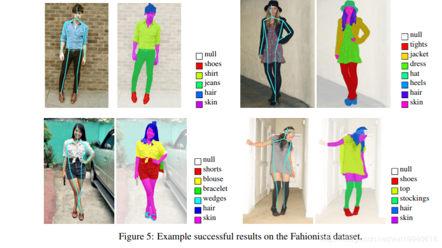
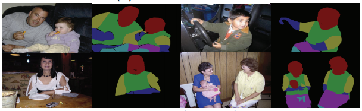
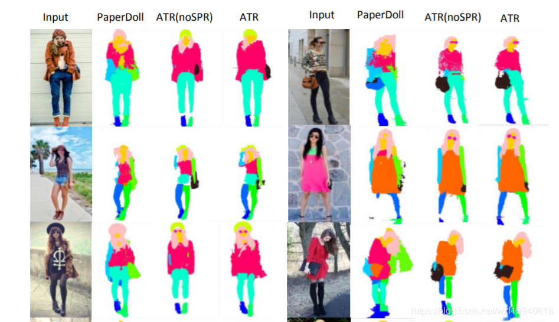
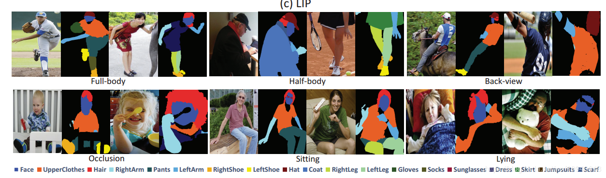
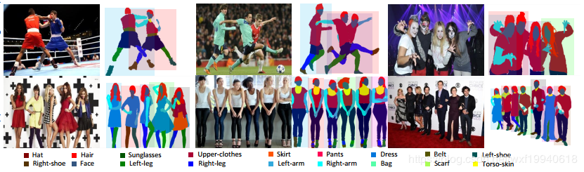
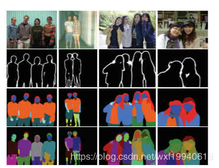

# 人体解析数据集 -human parsing

|                 | 开源   |      | 项目    |                                                              |
| --------------- | ------ | ---- | ------- | ------------------------------------------------------------ |
| **LIP**         | [open] | 2017 | SS-NAN  | Single Person http://hcp.sysu.edu.cn/lip <br>https://github.com/Engineering-Course/LIP_SSL |
| **CIHP**        | [open] | 2018 |         | http://sysu-hcp.net/lip/overview.php                         |
| **ATR**         | [open] | 2015 |         |                                                              |
| *Chictopia10k*  |        |      | Co-CNN  | human parsing  ["Human parsing with contextualized convolutional neural network." ICCV'15](http://www.cv-foundation.org/openaccess/content_iccv_2015/html/Liang_Human_Parsing_With_ICCV_2015_paper.html), |
| **VIP**         | [open] |      |         | Video Multi-Person Human Parsing                             |
| **MHP**         | [open] | 2017 |         | https://lv-mhp.github.io/dataset                             |
| **Person-Part** | [open] | 2014 |         | http://www.stat.ucla.edu/~xianjie.chen/pascal_part_dataset/pascal_part.html |
| Fashionista     |        | 2012 |         |                                                              |
| **DeepFashion** |        |      |         |                                                              |
| VITON           |        | 2017 | VITON   | 闭源；16,253 pairs                                           |
| *MPV*           |        | 2019 | MG-VTON | 已经闭源                                                     |

[refer](https://blog.csdn.net/wxf19940618/article/details/83661891) 

# [引文1]人体解析-human parsing

人体解析-human parsing

研究目标与意义
人体解析是指将在图像中捕获的人分割成多个语义上一致的区域，例如， 身体部位和衣物。作为一种细粒度的语义分割任务，它比仅是寻找人体轮廓的人物分割更具挑战性。 人体解析对于以人为中心的分析非常重要，并且具有许多工业上的应用，例如，虚拟现实，视频监控和人类行为分析等等。


 

Fashionista 数据集

论文：Parsing Clothing in Fashion Photographs

论文地址：http://www.tamaraberg.com/papers/parsingclothing.pdf




Person-part 数据集

论文：Detect What You Can: Detecting and Representing Objects using Holistic Models and Body Parts

论文地址：http://www.stat.ucla.edu/~xianjie.chen/paper/Chen14cvpr.pdf

数据集地址：http://www.stat.ucla.edu/~xianjie.chen/pascal_part_dataset/pascal_part.html



ATR 数据集

论文：Deep Human Parsing with Active Template Regression

论文地址：https://arxiv.org/pdf/1503.02391.pdf




LIP数据集

论文：Look into Person: Self-supervised Structure-sensitive Learning and A New Benchmark for Human Parsing

论文地址：https://arxiv.org/pdf/1703.05446.pdf

数据集地址：http://hcp.sysu.edu.cn/lip

代码地址：https://github.com/Engineering-Course/LIP_SSL




MHP数据集

论文：Multi-Human Parsing in the Wild

论文地址：https://arxiv.org/pdf/1705.07206.pdf

数据集地址：https://lv-mhp.github.io/dataset



 

CIHP 数据集

论文：Instance-level Human Parsing via Part Grouping Network

论文地址：http://openaccess.thecvf.com/content_ECCV_2018/papers/Ke_

Gong_Instance-level_Human_Parsing_ECCV_2018_paper.pdf

数据集地址：http://sysu-hcp.net/lip/overview.php

代码地址：http://sysu-hcp.net/lip/



**DeepFashion:**

[HomePage -Download](http://mmlab.ie.cuhk.edu.hk/projects/DeepFashion.html)

​	DeepFashion [38] only have the pairs of the same person in different poses but do not have the image of clothes. 

### 人体解析近年论文:

```
2018-ECCV-Mutual Learning to Adapt for Joint Human Parsing and Pose Estimation
【MuLA】用于联合人体解析和姿态估计，通过反复利用其并行任务中的指导信息来预测动态任务特定的模型参数

2018-ECCV-Instance-level Human Parsing via Part Grouping Network
【PGN】在一次传递中解析图像中的多个人，将实例级人类解析重新定义为两个可以通过统一网络共同学习和相互提炼的双关联子任务：1）用于将每个像素指定为人体部位（例如，面部，手臂）的语义分割; 2）实例感知边缘检测，以将语义部位分组为不同的人物实例

2018-ECCV-Macro-Micro Adversarial Network for Human Parsing
【MMAN】有两个判别器，一个Macro D用于低分辨率标签图并对语义不一致进行惩罚，例如错位的身体部位。另一个Micro D专注于高分辨率标签图的多个patch，以解决局部不一致性，例如模糊和孔洞

2018-CVPR-Weakly and Semi Supervised Human Body Part Parsing via Pose-Guided Knowledge Transfer
提出了一种获得训练数据的新方法，可以使用人体关键点的数据来生成人体部位解析数据。主要想法是利用人类之间的形态相似性，将一个人的部位解析结果传递给具有相似姿势的另一个人

2017-CVPR-Look Into Person: Self-Supervised Structure-Sensitive Learning and a New Benchmark for Human Parsing
不引入额外信息，可以用自生成的人类关节的信息反过来指导人体解析

2017-CVPR-Learning Adaptive Receptive Fields for Deep Image Parsing Network
一种自动调节深度图像解析网络中感受野的新方法，在网络主干中使用两个仿射变换层并在特征映射上运行

2017-CVPR- Multiple-Human Parsing in the Wild
MH-Parser借助新的Graph-GAN模型以自下而上的方式同时生成全局解析和人物解析

2015-ICCV-Human Parsing with Contextualized Convolutional Neural Network
【Co-CNN】架构，将多级图像上下文集成到一个统一的网络中
```

# [引文2] Dataset Overview [中山大]

## 1. Overview

Look into Person (LIP) is a new large-scale dataset, focus on semantic understanding of person. Following are the detailed descriptions.

### 1.1 Volume

The dataset contains 50,000 images with elaborated pixel-wise annotations with 19 semantic human part labels and 2D human poses with 16 key points.

### 1.2 Diversity

The annotated 50,000 images are cropped person instances from [COCO dataset](http://mscoco.org/home/) with size larger than 50 * 50.The images collected from the real-world scenarios contain human appearing with challenging poses and views, heavily occlusions, various appearances and low-resolutions. We are working on collecting and annotating more images to increase diversity.

## 2. Download

### 2.1 Single Person

We have divided images into three sets. 30462 images for training set, 10000 images for validation set and 10000 for testing set.The dataset is available at [Google Drive](https://drive.google.com/drive/folders/0BzvH3bSnp3E9ZW9paE9kdkJtM3M?usp=sharing) and [Baidu Drive](http://pan.baidu.com/s/1nvqmZBN).

Besides we have another large dataset mentioned in ["Human parsing with contextualized convolutional neural network." ICCV'15](http://www.cv-foundation.org/openaccess/content_iccv_2015/html/Liang_Human_Parsing_With_ICCV_2015_paper.html), which focuses on fashion images. You can download the dataset including 17000 images as extra training data.

### 2.2 Multi-Person

To stimulate the multiple-human parsing research, we collect the images with multiple person instances to establish the first standard and comprehensive benchmark for instance-level human parsing. Our Crowd Instance-level Human Parsing Dataset (CIHP) contains 28280 training, 5000 validation and 5000 test images, in which there are 38280 multiple-person images in total.

You can also downlod this dataset at [Google Drive](https://drive.google.com/drive/folders/0BzvH3bSnp3E9ZW9paE9kdkJtM3M?usp=sharing) and [Baidu Drive](http://pan.baidu.com/s/1nvqmZBN).

### 2.3 Video Multi-Person Human Parsing

VIP(Video instance-level Parsing) dataset, the first video multi-person human parsing benchmark, consists of 404 videos covering various scenarios. For every 25 consecutive frames in each video, one frame is annotated densely with pixel-wise semantic part categories and instance-level identification. There are 21247 densely annotated images in total. We divide these 404 sequences into 304 train sequences, 50 validation sequences and 50 test sequences.

You can also downlod this dataset at [OneDrive](https://1drv.ms/f/s!ArFSFaZzVErwgSHRpiJNJTzgMR8j) and [Baidu Drive](https://pan.baidu.com/s/18_PVNy7FCh4T74nVzRXbtA).

- VIP_Fine: All annotated images and fine annotations for train and val sets.
- VIP_Sequence: 20-frame surrounding each VIP_Fine image (-10 | +10).
- VIP_Videos: 404 video sequences of VIP dataset.

### 2.4 Image-based Multi-pose Virtual Try On

MPV (Multi-Pose Virtual try on) dataset, which consists of 35,687/13,524 person/clothes images, with the resolution of 256x192. Each person has different poses. We split them into the train/test set 52,236/10,544 three-tuples, respectively.

You can also downlod this dataset at [Google Drive](https://drive.google.com/open?id=1dCqrNCp9zac7vikYkBRZAPl-RFFsmZdR) or [Baidu Drive](https://pan.baidu.com/s/1ym9o9ScPRwGlfGjsPBlDkw).
Baidu Drive extract password:
		f6i2


# 引文

引文1：https://blog.csdn.net/wxf19940618/article/details/83661891

引文2:  http://www.sysu-hcp.net/lip/overview.php