[TOC]


# Human Pose Estimation

|                    | 论文/原理                                                    | S-单人<br>D-多人 |
| ------------------ | ------------------------------------------------------------ | ---------------- |
| OpenPose           | Realtime Multi-Person 2D Pose Estimation using Part Affinity Fields |                  |
| DensePose          | 实时人体姿态估计                                             |                  |
| **单人姿态估计**   |                                                              |                  |
| DeepPose           | 最早应用CNN的方法,直接回归关节坐标                           | S                |
| Flowing ConvNets   | 热力图->关节点                                               | S                |
| CPM                | multi-stage和refine heatmap的思想                            | S                |
| stacked hourglass  | 卷积层、解卷积层.                                            | S                |
| **多人姿态估计**   |                                                              |                  |
| PAF                | Realtime Multi-Person 2D Pose Estimation using Part Affinity Fields | D                |
| Mask R-CNN         |                                                              |                  |
| **人体姿态跟踪**   |                                                              |                  |
|                    |                                                              |                  |
| **3D人体姿态估计** |                                                              |                  |
|                    |                                                              |                  |
|                    |                                                              |                  |

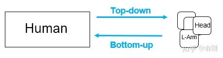

# 数据集：

单人：常见的数据集有[MPII](https://link.zhihu.com/?target=http%3A//human-pose.mpi-inf.mpg.de/), [LSP](https://link.zhihu.com/?target=https%3A//sam.johnson.io/research/lsp.html), [FLIC](https://link.zhihu.com/?target=https%3A//bensapp.github.io/flic-dataset.html), [LIP](https://link.zhihu.com/?target=http%3A//sysu-hcp.net/lip/)。MPII目前可以认为是单人姿态估计中最常用的benchmark， 使用的是PCKh的指标（可以认为预测的关键点与GT标注的关键点经过head size normalize后的距离）

多人：主要有[COCO](https://link.zhihu.com/?target=http%3A//cocodataset.org/%23keypoints-2019), 最近有新出一个数据集[CrowdPose](https://link.zhihu.com/?target=https%3A//github.com/Jeff-sjtu/CrowdPose)。

Track：[PoseTrack](https://link.zhihu.com/?target=https%3A//posetrack.net/)

3D     :  [Human3.6M](https://link.zhihu.com/?target=http%3A//vision.imar.ro/human3.6m/description.php),  [DensePose](https://link.zhihu.com/?target=http%3A//densepose.org/)


# 单人姿态估计


## Flowing ConvNets

对于当前帧t及相邻的前后n帧使用全卷积网络为每帧输出一个预测的heatmap（去掉FC层），再用光流信息将这些heatmap扭曲到当前帧t。之后将warped的heatmap合并到另一个卷积层中，权衡来自附近框架的扭曲的heatmap。最后使用集合热图的**最大值**作为关节点。


## CPM

Convolution pose machine

CPM是CMU Yaser Sheikh组的工作，后续非常有名的openpose也是他们的工作。从CPM开始，神经网络已经可以e2e的把feature representation以及关键点的空间位置关系建模进去（隐式的建模），输入一个图片的patch， 输出带spatial信息的tensor，channel的个数一般就是人体关键点的个数（或者是关键点个数加1）。空间大小往往是原图的等比例缩放图。通过在输出的heatmap上面按channel找最大的响应位置(x,y坐标），就可以找到相应关键点的位置。

这种heatmap的方式被广泛使用在人体骨架的问题里面。这个跟人脸landmark有明显的差异，一般人脸landmark会直接使用回归(fully connected layer for regression)出landmark的坐标位置。这边我做一些解释。首先人脸landmark的问题往往相对比较简单，对速度很敏感，所以直接回归相比heatmap来讲速度会更快，另外直接回归往往可以得到sub-pixel的精度，但是heatmap的坐标进度取决于在spatial图片上面的argmax操作，所以精度往往是pixel级别（同时会受下采样的影响）。 但是heatmap的好处在于空间位置信息的保存，这个非常重要。一方面，这个可以保留multi-modal的信息，比如没有很好的context信息的情况下，是很难区分左右手的，所以图片中左右手同时都可能有比较好的响应，这种heatmap的形式便于后续的cascade的进行refinement优化。另外一个方面，人体姿态估计这个问题本身的自由度很大，直接regression的方式对自由度小的问题比如人脸landmark是比较适合的，但是对于自由度大的姿态估计问题整体的建模能力会比较弱。相反，heatmap是比较中间状态的表示，所以信息的保存会更丰富。

后续2D的人体姿态估计方法几乎都是围绕heatmap这种形式来做的（3D姿态估计将会是另外一条路），通过使用神经网络来获得更好的feature representation，同时把关键点的空间位置关系隐式的encode在heatmap中，进行学习。大部分的方法区别在于网络设计的细节。先从CPM开始说起。

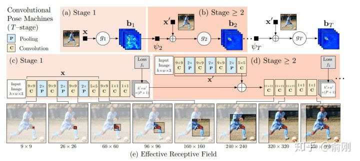

整个网络会有多个stage，每个stage设计一个小型网络，用于提取feature，然后在每个stage结束的时候，加上一个监督信号。中间层的信息可以给后续层提供context，后续stage可以认为是基于前面的stage做refinement。这个工作在MPII上面的结果可以达到88.5，在当时是非常好的结果。

## Hourglass

在2016年的7月份，Princeton的Deng Jia组放出了另外一个非常棒的人体姿态估计工作，Hourglass。后续Deng Jia那边基于Hourglass的想法做了Associate Embedding，以及后续的CornerNet都是非常好的工作。

Hourglass相比CPM的最大改进是网络结构更简单，更优美。

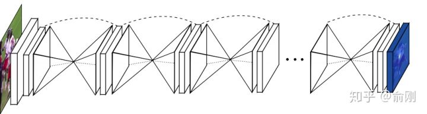

上图可以看出，网络是重复的堆叠一个u-shape的structure.

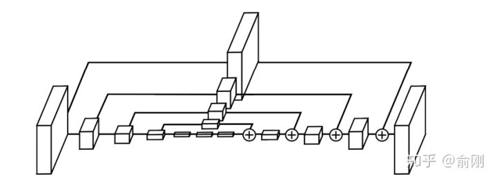

pipeline上面跟CPM很类似。只是结构做了修改。从MPII上的结果来看，也有明显的提升，可以达到90.9的PCKh。

这种u-shape的结构其实被广泛应用于现代化的物体检测，分割等算法中，同时结果上面来讲也是有非常好的提升的。另外，Hourglass这种堆多个module的结构，后续也有一些工作follow用在其他任务上面。

但是Hourglass也是存在一些问题的，具体可以看后续讲解的MSPN网络。

在CPM以及Hourglass之后，也有很多不错的工作持续在优化单人姿态估计算法，比如[10] [11]。

2016年的下半年还出现了一个非常重要的数据集: [COCO](https://link.zhihu.com/?target=http%3A//cocodataset.org/%23keypoints-eval)。这个时间点也是非常好的时间点。一方面，MPII已经出现两年，同时有很多非常好的工作，比如CPM， Hourglass已经把结果推到90+，数据集已经开始呈现出一定的饱和状态。另外一方面，物体检测/行人检测方面，算法提升也特别明显，有了很多很好的工作出现，比如Faster R-CNN和SSD。所以COCO的团队在COCO的数据集上面引入了多人姿态估计的标注，并且加入到了2016年COCO比赛中，当成是一个track。从此，多人姿态估计成为学术界比较active的研究topic。正如前面我在“问题”的部分描述的，多人姿态估计会分成top-down以及bottom-up两种模式。我们这边会先以bottom-up方法开始描述。


# 多人姿态估计


## OpenPose

在2016年COCO比赛中，当时的第一名就是[OpenPose](https://link.zhihu.com/?target=https%3A//github.com/CMU-Perceptual-Computing-Lab/openpose) [12]。 CMU团队基于CPM为组件，先找到图片中的每个joint的位置，然后提出Part Affinity Field （PAF)来做人体的组装。

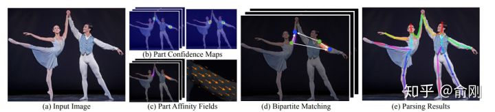

PAF的基本原理是在两个相邻关键点之间，建立一个有向场，比如左手腕，左手肘。我们把CPM找到的所有的左手腕以及左手肘拿出来建立一个二分图，边权就是基于PAF的场来计算的。然后进行匹配，匹配成功就认为是同一个人的关节。依次类别，对所有相邻点做此匹配操作，最后就得到每个人的所有关键点。

在当时来讲，这个工作效果是非常惊艳的，特别是视频的结果图，具体可以参考Openpose的Github官网。在COCO的benchmark test-dev上面的AP结果大概是61.8。

### Keypoint-json

output_overview:

```bash
CUDA_VISIBLE_DEVICES='1' ./build2/examples/openpose/openpose.bin  --image_dir ./image --write_images ./output_image --write_json ./output_json     --display 0

```
v1.1-25

```
// Result for BODY_25 (25 body parts consisting of COCO + foot)
// const std::map<unsigned int, std::string> POSE_BODY_25_BODY_PARTS {
//     {0,  "Nose"},
//     {1,  "Neck"},
//     {2,  "RShoulder"},
//     {3,  "RElbow"},
//     {4,  "RWrist"},
//     {5,  "LShoulder"},
//     {6,  "LElbow"},
//     {7,  "LWrist"},
//     {8,  "MidHip"},
//     {9,  "RHip"},
//     {10, "RKnee"},
//     {11, "RAnkle"},
//     {12, "LHip"},
//     {13, "LKnee"},
//     {14, "LAnkle"},
//     {15, "REye"},
//     {16, "LEye"},
//     {17, "REar"},
//     {18, "LEar"},
//     {19, "LBigToe"},
//     {20, "LSmallToe"},
//     {21, "LHeel"},
//     {22, "RBigToe"},
//     {23, "RSmallToe"},
//     {24, "RHeel"},
//     {25, "Background"}
```


v1.0-18

```
// C++ API call
 #include <openpose/pose/poseParameters.hpp>
 const auto& poseBodyPartMappingCoco = getPoseBodyPartMapping(PoseModel::COCO_18);
 const auto& poseBodyPartMappingMpi = getPoseBodyPartMapping(PoseModel::MPI_15);
 
 // Result for COCO (18 body parts)
 // POSE_COCO_BODY_PARTS {
 //     {0,  "Nose"},
 //     {1,  "Neck"},
 //     {2,  "RShoulder"},
 //     {3,  "RElbow"},
 //     {4,  "RWrist"},
 //     {5,  "LShoulder"},
 //     {6,  "LElbow"},
 //     {7,  "LWrist"},
 //     {8,  "RHip"},
 //     {9,  "RKnee"},
 //     {10, "RAnkle"},
 //     {11, "LHip"},
 //     {12, "LKnee"},
 //     {13, "LAnkle"},
 //     {14, "REye"},
 //     {15, "LEye"},
 //     {16, "REar"},
 //     {17, "LEar"},
 //     {18, "Background"},
 // }
```


### heatmap order

对于**热图存储格式**，而不是分别保存67个热图(18个主体部分+背景+ 2 x 19个PAFs)，库将它们连接成一个巨大的(宽度x #热图)x(高度)矩阵(即。，由列连接)。例如：列[0，单个热图宽度]包含第一个热图，列[单个热图宽度+ 1, 2 *单个热图宽度]包含第二个热图，等等。注意，一些图像查看器由于尺寸的原因无法显示结果图像。然而，Chrome和Firefox能够正确地打开它们。

PAFs遵循“getposepartpair (const PoseModel PoseModel)”和“getPoseMapIndex(const PoseModel PoseModel)”中指定的顺序。例如，假设COCO(参见下面的示例代码)，COCO中的PAF通道从19开始(‘getPoseMapIndex’中最小的数字，等于#body parts + 1)，到56结束(最高的一个)。

## Hourglass + Associative Embedding 

A **single-stage**，end-to-end way for joint detection and grouping

关节点检测使用stacked hourglass，在原来的基础上每一次下采样时增加输出通道的个数，同时individual layers的残差模型改为3*3的卷积结构，其他结构不变。


在2016年比赛的榜单上面，还有另外一个很重要的工作就是Deng Jia组的Associative Embedding[13]。文章类似Openpose思路，使用**bottom-up**的方法，寻找part使用了Hourglass的方式来做。关键在于行人的组装上面，提出了Associative Embedding的想法。大概想法是希望对每个关键点输出一个embedding，使得同一个人的embedding尽可能相近，不同人的embedding尽可能不一样。

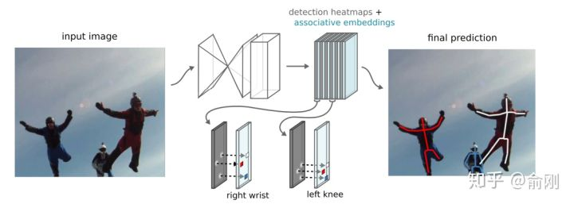

在COCO2016比赛后，这个工作持续的在提升，文章发表的时候，COCO test-dev上面的结果在65.5。

除了Openpose以及Associative Embedding之外，bottom-up还有一个工作非常不错，DeepCut[14]以及DeeperCut[15]，他们使用优化问题来直接优化求解人的组合关系。


## CPN（18cvpr，stoa）

topdown思路

第一个stage检测可见的easy keypoint，第二个stage专门解决hard keypoint。


后面一部分章节我会重点围绕COCO数据集，特别是COCO每年的比赛来描述多人姿态估计的进展。虽然2016年bottom-up是一个丰富时间点，但是**从2017年开始，越来的工作开始围绕top-down展开**，一个直接的原因是top-down的效果往往更有潜力。top-down相比bottom-up效果好的原因可以认为有两点。首先是人的recall往往更好。因为top-down是先做人体检测，人体往往会比part更大，所以从检测角度来讲会更简单，相应找到的recall也会更高。其次是关键点的定位精度会更准，这部分原因是基于crop的框，对空间信息有一定的align，同时因为在做single person estimation的时候，可以获得一些中间层的context信息，对于点的定位是很有帮助的。当然，top-down往往会被认为速度比bottom-up会更慢，所以在很多要求实时速度，特别是手机端上的很多算法都是基于openpose来做修改的。不过这个也要例外，我们自己也有做手机端上的多人姿态估计，但是我们是基于top-down来做的，主要原因是我们的人体检测器可以做的非常快。

说完了背景后，在COCO2017年的比赛中，我们的CPN[16]一开始就决定围绕top-down的算法进行尝试。我们当时的想法是一个coarse-to-fine的逻辑，先用一个网络出一个coarse的结果(GlobalNet)，然后再coarse的结果上面做refinement (RefineNet)。具体结果如下：

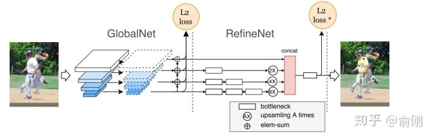

为了处理处理难的样本，我们在loss上面做了一定的处理，最后的L2 loss我们希望针对难的关键点进行监督，而不是针对所有关键点uniform的进行监督，所以我们提出了一个Hard keypoint mining的loss。这个工作最后在COCO test-dev达到了72.1的结果 （不使用额外数据以及ensemble)，获得了2017年的COCO骨架比赛的第一名。

另外，这个工作的另外一个贡献是比较完备的ablation。我们给出了很多因素的影响。比如top-down的第一步是检测，我们分析了检测性能对最后结果的影响。物体检测结果从30+提升到40+(mmAP)的时候，人体姿态估计能有一定的涨点（1个点左右），但是从40+提升到50+左右，涨点就非常微弱了（0.1-0.2）。另外，我们对data augmentation，网络的具体结构设计都给出了比较完整的实验结果。另外，我们开始引入了传统的ImageNet basemodel (ResNet50)做了backbone，而不是像Openpose或者Hourglass这种非主流的模型设计结构，所以效果上面也有很好的提升。


## G-RMI

CVPR 2017《Towards accurate multi-person pose estimation in the wild》

第一阶段使用faster rcnn做detection，检测出图片中的多个人，并对bounding box进行image crop； 第二阶段采用fully convolutional resnet对每一个bonding box中的人物预测dense heatmap和offset; 最后通过heatmap和offset的融合得到关键点的精确定位 （如下）。

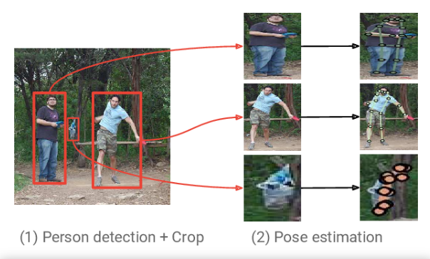


## RMPE（AlphaPose）

ICCV 2017《REPE: Regional Multi-person Pose Estimation》

现已更新到新版本AlphaPose，效果拔群

在SPPE结构上添加SSTN，能够在不精准的区域框中提取到高质量的人体区域。并行的SPPE分支（SSTN）来优化自身网络。使用parametric pose NMS来解决冗余检测问题，在该结构中，使用了自创的姿态距离度量方案比较姿态之间的相似度。用数据驱动的方法优化姿态距离参数。最后我们使用PGPG来强化训练数据，通过学习输出结果中不同姿态的描述信息，来模仿人体区域框的生成过程，进一步产生一个更大的训练集。

识别姿态使用Stacked Hourglass. 致力于解决对于imperfect proposal，使得crop的person能够被单人姿态估计方法很好的识别，从而克服检测带来的定位误差。第一步获得human proposal第二步是将proposal输入到两个并行的分支里面，上面的分支是STN+SPPE+SDTN的结构，STN接收的是human proposal，SDTN产生的是pose proposal。下面并行的分支充当额外的正则化矫正器。第三步是对pose proposal做Pose NMS（非最大值抑制），用来消除冗余的pose proposal。

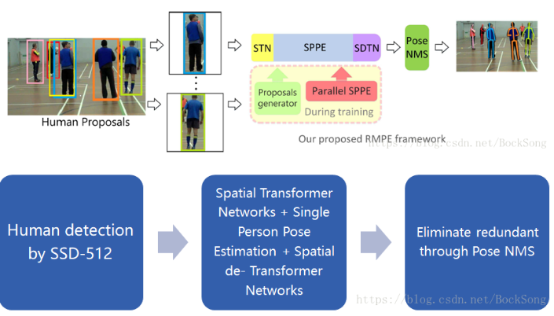

## MSPN

2018年的COCO比赛中，我们继续沿用top-down的思路。当时我们基于CPN做了一些修改，比如把backbone不停的扩大，发现效果提升很不明显。我们做了一些猜测，原来CPN的两个stage可能并没有把context信息利用好，单个stage的模型能力可能已经比较饱和了，增加更多stage来做refinement可能是一个解决当前问题，提升人体姿态估计算法uppper-bound的途径。所以我们在CPN的globalNet基础上面，做了多个stage的堆叠，类似于Hourglass的结构。

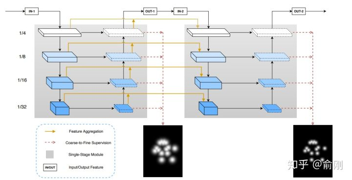

相比Hourglass结构，我们提出的MSPN[17]做了如下三个方面的改进。首先是Hourglass的每个stage的网络，使用固定的256 channel，即使中间有下采样，这种结构对信息的提取并不是很有益。所以我们使用了类似ResNet-50这种标准的ImageNet backbone做为每个stage的网络。另外，在两个相邻stage上面，我们也加入了一个连接用于更好的信息传递。最后，我们对于每个stage的中间层监督信号做了不同的处理，前面层的监督信号更侧重分类，找到coarse的位置，后面更侧重精确的定位。从最后效果上面来看，我们在COCO test-dev上面一举跑到了76.1 （单模型不加额外数据）。


## HRNet

之前我们讲的很多人体姿态估计方面的工作，都在围绕context来做工作，如何更好的encode和使用这些context是大家工作的重点。到了2019年， MSRA wang jingdong组出了一个很好的工作，提出了spatial resolution的重要性。在这篇工作之前，我们往往会暴力的放大图片来保留更多信息，同时给出更精准的关键点定位，比如从256x192拉大到384x288。这样对效果提升还是很明显的，但是对于计算量的增加也是非常大的。 HRNet从另外一个角度，抛出了一个新的可能性：

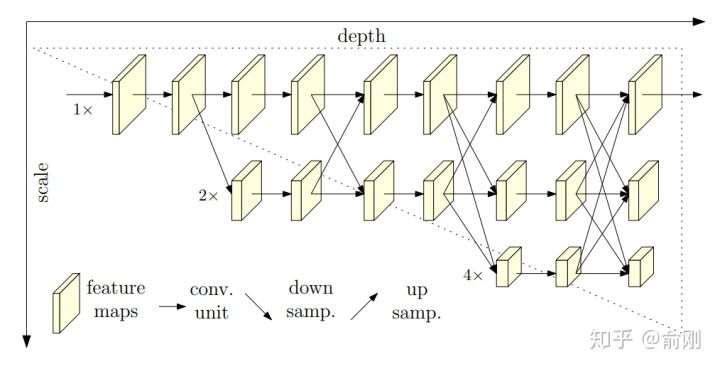

相比传统的下采样的网络结构，这里提出了一种**新的结构**。**分成多个层级，但是始终保留着最精细的spaital那一层的信息，通过fuse下采样然后做上采样的层，来获得更多的context以及语义层面的信息**（比如更大的感受野）。从结果上面来看，在COCO test-dev上面单模型可以达到75.5。

------


到此为止，我们重点讲述了几个多人姿态估计的算法，当然中间穿插了不少我们自己的私货。在多人姿态估计领域还有很多其他很好的工作，因为篇幅问题，这里我们就略过了。

回到2017年，MPI提出了一个新的数据集， [PoseTrack](https://link.zhihu.com/?target=https%3A//posetrack.net/)，主要是希望能帮忙解决视频中的人体姿态估计的问题，并且在每年的ICCV或者ECCV上面做challenge比赛。 PoseTrack的数据集主要还是来源于MPII的数据集，标注风格也很相近。围绕PoseTrack这个任务，我们重点讲一个工作, Simple Baselines。


# Pose Track


## Simple Baselines

Simple Baselines [19]是xiao bin在MSRA的工作。提出了一种非常简洁的结构可以用于多人姿态估计以及人体姿态估计的跟踪问题。这里重点讲一下对于PoseTrack的处理方法：

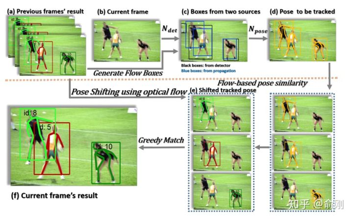

这里有两个细节，首先是会利用上一帧的检测结果，merge到新的一帧，避免检测miss的问题。另外，在两帧间，会使用OKS based相似度来做人体的关联，而不是只是简单的使用框的overlap，这样可以更好的利用每个关键点的temporal smooth的性质。从结果上面来看，这个方法也获得了PoseTrack2018比赛的第一名。

到目前位置，我们描述了单人的姿态估计，多人的姿态估计，以及简单讲了一下视频中的人体姿态跟踪的问题。最后，我们讲一下3D人体姿态估计的问题，这个我觉得这个是目前非常active的研究方向，也是未来的重要的方向。


# 3D 人体姿态估计

- 3D keypoint （Skeleton）
- 3D shape (3D surface)
  - Densepose
  - SMPL（参数化人体模型）


2017年deva Ramanan组的一个非常有意思的工作【20】开始说起，**3D Human Pose Estimation = 2D Pose Estimation + Matching**。从名字可以看出，大致的做法。首先是做2D的人体姿态估计，然后基于Nearest neighbor最近邻的match来从training data中找最像的姿态。2D的姿态估计算法是基于CPM来做的。3D的match方法是先把training data中的人体3d骨架投射到2D空间，然后把test sample的2d骨架跟这些training data进行对比，最后使用最相近的2d骨架对应的3D骨架当成最后test sample点3D骨架。当training数据量非常多的时候，这种方法可能可以保证比较好的精度，但是在大部分时候，这种匹配方法的精度较粗，而且误差很大

也在17年，另外一个非常有意思的工作【21】发表在ICCV2017。同样，从这个工作的名字可以看出，这个工作提出了一个比较simple的baseline，但是效果还是非常明显。方法上面来讲，就是先做一个2d skeleton的姿态估计，方法是基于Hourglass的，文章中的解释是较好的效果以及不错的速度。 基于获得的2d骨架位置，后续接入两个fully connected的操作，直接回归3D坐标点。这个做法非常**粗暴直接**，但是效果还是非常明显的。在回归之前，需要对坐标系统做一些操作。

从2017年的ICCV开始，已经有工作【22】开始把2D以及3d skeleton的估计问题joint一起来做优化。这样的好处其实是非常明显的。因为很多2d数据对于3d来讲是有帮助的，同时3D姿态对于2d位置点估计也能提供额外的信息辅助。2D的MPII， COCO数据可以让算法获得比较强的前背景点分割能力，然后3D的姿态估计数据集只需要关注前景的3D骨架估计。这也是目前学术界数据集的现状。从实际效果上面来讲，**joint training**的方法效果确实也比割裂的train 2d以及3d skeleton效果要好。

**2018年开始，3D skeleton开始往3d shape发展。**

原先只需要知道joint点的3D坐标位置，但是很多应用，比如人体交互，美体，可能需要更dense的人体姿态估计。这时候就有了一个比较有意思的工作densePose 【23】。这个工作既提出来一个新的问题，也包含新的benchmark以及baseline。相比传统的SMPL模型，这个工作提出了使用UV map来做估计（同时间也有denseBody类似的工作），可以获得非常dense的3d姿态位置，等价于生成了3d shape。当然，从3d shape的角度来讲，有很多非常不错的工作，这里就不做重点展开。

最后讲一下3d人体姿态估计目前存在的问题(训练集小，数据鲁棒性不足，Pose固定)。我**个人认为**主要是benchmark。目前最常使用的human 3.6M实际上很容易被overfit，因为subjects数量太小（实际训练样本只有5－6人，depend on具体的测试方法，测试样本更少）。同时，是在受限的实验室场景录制，跟真实场景差异太大，背景很干净，同时前景的动作pose也比较固定。当然，3d skeleton的数据集的难度非常大，特别是需要采集unconstrained条件下面的数据。目前也有一些工作在尝试用生成的数据来提升结果。


**Apply**


首先的一个应用是人体的**动作行为估计**，要理解行人，人体的姿态估计其实是一个非常重要的中间层信息。目前有蛮多基于人体姿态估计直接做action recogntion的工作，比如把关键点当成graph的节点，然后是使用graph convolution network来整合各种信息做动作分类。我博士的研究课题是action recognition，我读完四年博士的一个总结是action这个问题，如果需要真正做到落地，人体姿态估计算法是必不可少的组成部分。

第二类应用是偏娱乐类的，比如**人体交互，美体**等。比如可以通过3d姿态估计来虚拟出一个动画人物来做交互，使用真实人体来控制虚拟人物。另外比如前一段时间比较火热的瘦腰，美腿等操作背后都可能依赖于人体姿态估计算法。

第三类应用是可以做为其他算法的辅助环节，比如Person ReID可以基于人体姿态估计来做alignment，姿态估计可以用来辅助行人检测，杀掉检测的FP之类的。


## SMPL

[SMPL 介绍](https://blog.csdn.net/chenguowen21/article/details/82793994)

SMPL模型是一种参数化人体模型，是马普所提出的一种人体建模方法，该方法可以进行任意的人体建模和动画驱动。这种方法与传统的LBS的最大的不同在于其提出的人体姿态影像体表形貌的方法，这种方法可以模拟人的肌肉在肢体运动过程中的凸起和凹陷。因此可以避免人体在运动过程中的表面失真，可以精准的刻画人的肌肉拉伸以及收缩运动的形貌。 

该方法中β和θ是其中的输入参数，其中β代表是个人体高矮胖瘦、头身比等比例的10个参数，θ是代表人体整体运动位姿和24个关节相对角度的75个参数。

β参数是ShapeBlendPose参数，可以通过10个增量模板控制人体形状变化： 具体而言：每个参数控制人体形态的变化可以通过动图来刻画：
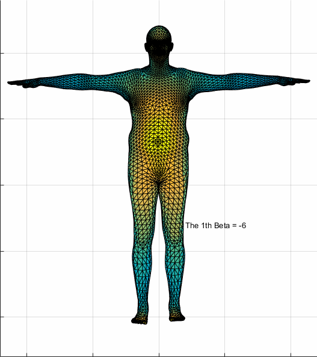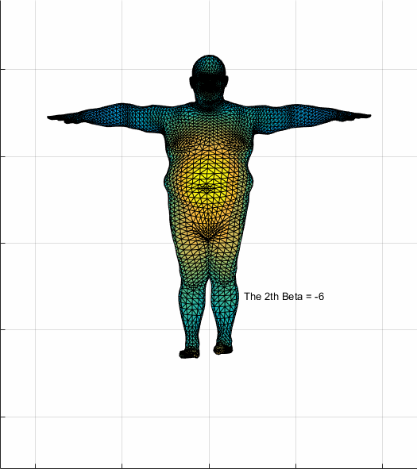


## DensePose

[实时人体姿态估计：Dense Pose及其应用展望](https://new.qq.com/omn/20190210/20190210A0ADS1.html)

- 「人体姿态估计」(human pose estimation) 


应用场景:

  - 「密集姿态转移」（dense pose transfer）

Facebook 和 Inria France 的研究人员分别在 CVPR 2018 和 ECCV 2018 相继发表了两篇有关「人体姿态估计」(human pose estimation) 的文章 [1] [2]，用于介绍他们提出的 Dense Pose 系统以及一个应用场景「密集姿态转移」（dense pose transfer）。

数据集：

- DensePose COCO 的大型数据集，包含了预先手工标注的 5 万张各种人类动作的图片。

  

**三点：**

（1）利用 Dense Pose 实现单张 2D 人体图像到 3D 表面模型的原理 ；

（2）如何将 Dense Pose 系统应用在「姿态转移」（pose transfer）这一问题上；

（3）粗略展望 Dense Pose 的一些潜在应用。

**<1> 2D 图片中描述人体的像素，映射到一个 3D 表面模型**

- 系统架构
- 工作流程


图 1：密集姿态估计的目标是将 2D 图片中描述人体的像素，映射到一个 3D 表面模型。左：输入的原始图像，以及利用 [1] 中提出的 Dense Pose-RCNN，获得人体各区域的 UV 坐标。UV 坐标又称纹理坐标 (texture coordinates), 用于控制 3D 表面的纹理映射； 中：DensePose COCO 数据集中的原始标注；右：人体表面的分割以及 UV 参数化示意图。

密集姿态估计的核心任务是，训练一个深度网络，用于预测 2D 图片像素 (image pixels）与 3D 表面模型点 (surface points) 之间的密集联系 (dense correspondences)。这个任务最近已经通过基于全连接卷积网络 [4] 的 Dense Regression (DenseReg) 系统 [3] 得到了解决。

而 Dense Pose-RCNN 系统 [1]，正是结合了 DenseReg 系统以及 Mask-RCNN 架构 [5]。


图 2 展示了 Dense Pose-RCNN 的级连 (cascade) 架构：这是一个全卷积网络 (fully-convolutional network)，并连接着 ROIAlign 池化层 (ROIAlign pooling)，用于处理两个核心任务，分别是：**（1）分类**。判断图片的某一像素来自于「背景」，还是「人体部位」；**（2）回归**。预测该像素在「人体部位」的具体坐标。

图 2 中的 ResNet50 FPN (feature pyramid networks) 将输出 feature map，然后通过 ROIAlign 模块对每一个 ROI 生成固定尺寸的 feature map。


图 3 展示了 ROIAlign 模块的「跨级连」(cross-cascading) 结构，这种结构利用两个辅助任务 (keypoint estimation & mask) 提供的信息，帮助提高 Dense Pose 系统的姿态估计效果。作为 Dense Pose-RCNN 基础之一的 Mask-RCNN [5] 结构，正是借助两个相关任务（即 keypoint estimation 和 instance segmentation）提供的信息，用于提高分割效果。

图 3：Dense Pose-RCNN[1] 中的 ROIAlign 模块采用了「跨级连」(cross-cascading) 架构。


**<2>Dense Pose 到「姿态转移」（pose transfer)**

应用：「纹理转移」(texture transfer)

 ECCV 2018 上，论文 [1] 的三名作者发表了 Dense Pose 的一个后续应用，即「密集姿态转移」(dense pose transfer，以下简称为 DPT) [2]。与纹理转换不同的是，DPT 这一任务的目标是，根据输入的 2D 人体图像和目标姿态 (target dense pose)，将输入图像中的人体姿态转换成目标姿态，并且不改变人体表面纹理。

如图 5 所示，DPT 系统以 Dense Pose[1] 为基础，并且由两个互补的模块组成，分别是（1）推测模块 (predictive module)，用于根据输入图像，预测出具有目标姿态的人体图像；（2）变形模块 (warping module)，负责从输入图像中提取纹理，并「补全」(inpainting) 具有目标姿态的人体表面纹理。此外，系统中还有一个合成模块 (blending module)，通过端对端、可训练的单一框架，将推测和变形模块的输出进行合成，并产生最终的图像。


图 5：密集姿态转移（DPT) 系统的流程图。该系统包括推测模块、变形模块，以及合成模块。

**<3>展望 Dense Pose**

一个应用方向是，利用单一图片进行服装的虚拟试穿

另一个应用方向则是，远程视频诊断背部痛疾。


## AMA-net

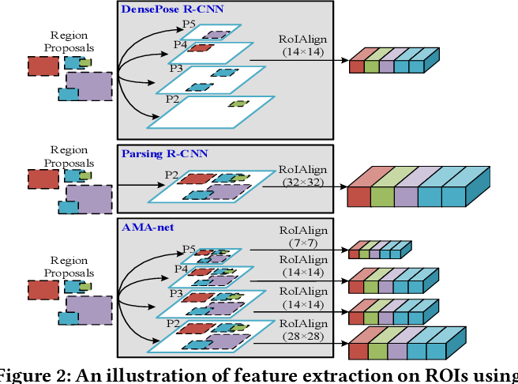


Figure 5: DensePose R-CNN vs AMA-net. Left: input image; middle: DensePose R-CNN; right: AMA-net. The red circles spot the difference between the DensePose R-CNN and AMA-net estimation. The yellow circles mark the positions where both methods fail to estimate UV coordinates.

- 从论文的结果看，效果比DensePose的结果更好。

  

# refrence 1:


```
[1] Alp Güler, Riza, Natalia Neverova, and Iasonas Kokkinos. "Densepose: Dense human pose estimation in the wild." Proceedings of the IEEE Conference on Computer Vision and Pattern Recognition. 2018.

[2] Neverova, Natalia, Riza Alp Guler, and Iasonas Kokkinos. "Dense pose transfer." Proceedings of the European Conference on Computer Vision (ECCV). 2018.

[3] Alp Guler, Riza, et al. "Densereg: Fully convolutional dense shape regression in-the-wild." Proceedings of the IEEE Conference on Computer Vision and Pattern Recognition. 2017.

[4] Chen, Liang-Chieh, et al. "Deeplab: Semantic image segmentation with deep convolutional nets, atrous convolution, and fully connected crfs." IEEE transactions on pattern analysis and machine intelligence 40.4 (2017): 834-848.

[5] He, Kaiming, et al. "Mask r-cnn." Computer Vision (ICCV), 2017 IEEE International Conference on. IEEE, 2017.

[6] Liu, Ziwei, et al. "Deepfashion: Powering robust clothes recognition and retrieval with rich annotations." Proceedings of the IEEE conference on computer vision and pattern recognition. 2016.

[7] Siarohin, Aliaksandr, et al. "Deformable gans for pose-based human image generation." CVPR 2018-Computer Vision and Pattern Recognition. 2018.
```


# refrence 2:

```
Reference

[1] Randomized Trees for Human Pose Detection, Rogez etc, CVPR 2018

[2] Local probabilistic regression for activity-independent human pose inference, Urtasun etc, ICCV 2009

[3] Strong Appearance and Expressive Spatial Models for Human Pose Estimation, Pishchulin etc, ICCV 2013

[4] Pictorial Structures Revisited: People Detection and Articulated Pose Estimation, Andriluka etc, CVPR 2009

[5] Latent Structured Models for Human Pose Estimation, Ionescu etc, ICCV 2011

[6] Poselet Conditioned Pictorial Structures, Pishchulin etc, CVPR 2013

[7] Learning Human Pose Estimation Features with Convolutional Networks, Jain etc, ICLR 2014

[8] Convolutional Pose Machines, Wei etc, CVPR 2016

[9] Stacked Hourglass Networks for Human Pose Estimation, Newell etc, ECCV 2016

[10] Multi-Context Attention for Human Pose Estimation, Chu etc, CVPR 2017

[11] Deeply Learned Compositional Models for Human Pose Estimation, ECCV 2018

[12] Realtime Multi-Person 2D Pose Estimation using Part Affinity Fields, Cao etc, CVPR 2017

[13] Associative Embedding: End-to-End Learning for Joint Detection and Grouping, Newell etc, NIPS 2017

[14] DeepCut: Joint Subset Partition and Labeling for Multi Person Pose Estimation, Pishchulin etc, CVPR 2016

[15] DeeperCut: A Deeper, Stronger, and Faster Multi-Person Pose Estimation Model, Insafutdinov, ECCV 2016

[16] Cascaded Pyramid Network for Multi-Person Pose Estimation, Chen etc, CVPR 2017

[17] Rethinking on Multi-Stage Networks for Human Pose Estimation, Li etc, Arxiv 2018

[18] Deep High-Resolution Representation Learning for Human Pose Estimation, Sun etc, CVPR 2019

[19] Simple Baselines for Human Pose Estimation and Tracking, Xiao etc, ECCV 2018

[20] 3D Human Pose Estimation = 2D Pose Estimation + Matching, Chen etc, CVPR 2017

[21] A simple yet effective baseline for 3d human pose estimation, Martinez, ICCV 2017

[22] Compositional Human Pose Regression, Sun etc, ICCV 2017

[23] Densepose: Dense Human Pose Estimation in the Wild, Guler etc, CVPR 2018

[24] ThunderNet: Toward Real-time Generic Object Detection, Qin etc, ICCV 2019
```

