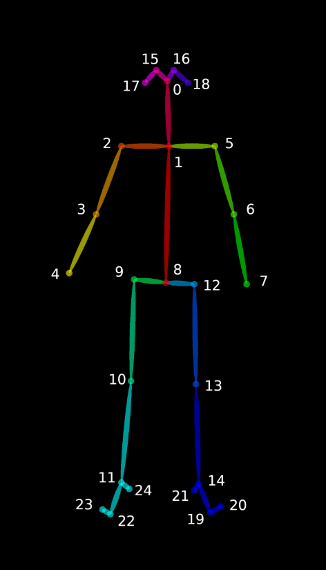
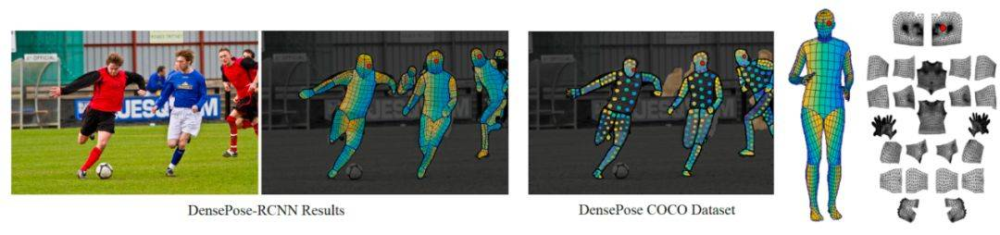
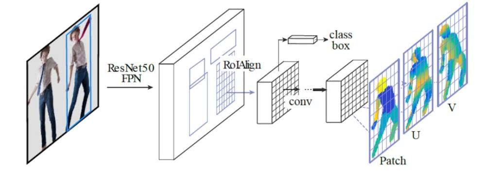
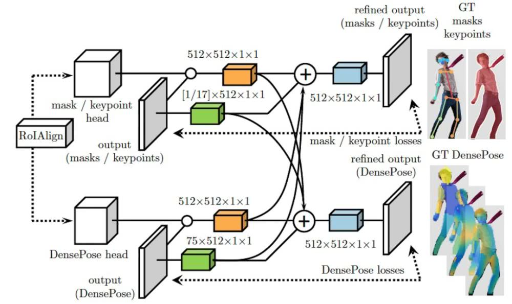
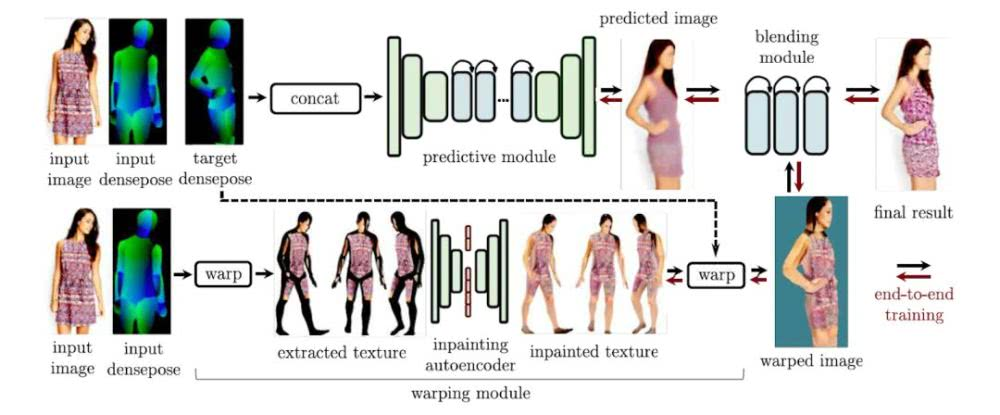

--

Pose Estimation

|           | 论文                                                         |      |
| --------- | ------------------------------------------------------------ | ---- |
| OpenPose  | Realtime Multi-Person 2D Pose Estimation using Part Affinity Fields |      |
| DensePose | 实时人体姿态估计                                             |      |
| AlphaPose |                                                              |      |
| DeepPose  |                                                              |      |
|           |                                                              |      |


## OpenPose 

### Keypoint-json

output_overview:

```bash
CUDA_VISIBLE_DEVICES='1' ./build2/examples/openpose/openpose.bin  --image_dir ./image --write_images ./output_image --write_json ./output_json     --display 0

```
v1.1-25

```
// Result for BODY_25 (25 body parts consisting of COCO + foot)
// const std::map<unsigned int, std::string> POSE_BODY_25_BODY_PARTS {
//     {0,  "Nose"},
//     {1,  "Neck"},
//     {2,  "RShoulder"},
//     {3,  "RElbow"},
//     {4,  "RWrist"},
//     {5,  "LShoulder"},
//     {6,  "LElbow"},
//     {7,  "LWrist"},
//     {8,  "MidHip"},
//     {9,  "RHip"},
//     {10, "RKnee"},
//     {11, "RAnkle"},
//     {12, "LHip"},
//     {13, "LKnee"},
//     {14, "LAnkle"},
//     {15, "REye"},
//     {16, "LEye"},
//     {17, "REar"},
//     {18, "LEar"},
//     {19, "LBigToe"},
//     {20, "LSmallToe"},
//     {21, "LHeel"},
//     {22, "RBigToe"},
//     {23, "RSmallToe"},
//     {24, "RHeel"},
//     {25, "Background"}
```


v1.0-18

```
// C++ API call
 #include <openpose/pose/poseParameters.hpp>
 const auto& poseBodyPartMappingCoco = getPoseBodyPartMapping(PoseModel::COCO_18);
 const auto& poseBodyPartMappingMpi = getPoseBodyPartMapping(PoseModel::MPI_15);
 
 // Result for COCO (18 body parts)
 // POSE_COCO_BODY_PARTS {
 //     {0,  "Nose"},
 //     {1,  "Neck"},
 //     {2,  "RShoulder"},
 //     {3,  "RElbow"},
 //     {4,  "RWrist"},
 //     {5,  "LShoulder"},
 //     {6,  "LElbow"},
 //     {7,  "LWrist"},
 //     {8,  "RHip"},
 //     {9,  "RKnee"},
 //     {10, "RAnkle"},
 //     {11, "LHip"},
 //     {12, "LKnee"},
 //     {13, "LAnkle"},
 //     {14, "REye"},
 //     {15, "LEye"},
 //     {16, "REar"},
 //     {17, "LEar"},
 //     {18, "Background"},
 // }
```



### heatmap order

对于**热图存储格式**，而不是分别保存67个热图(18个主体部分+背景+ 2 x 19个PAFs)，库将它们连接成一个巨大的(宽度x #热图)x(高度)矩阵(即。，由列连接)。例如：列[0，单个热图宽度]包含第一个热图，列[单个热图宽度+ 1, 2 *单个热图宽度]包含第二个热图，等等。注意，一些图像查看器由于尺寸的原因无法显示结果图像。然而，Chrome和Firefox能够正确地打开它们。

PAFs遵循“getposepartpair (const PoseModel PoseModel)”和“getPoseMapIndex(const PoseModel PoseModel)”中指定的顺序。例如，假设COCO(参见下面的示例代码)，COCO中的PAF通道从19开始(‘getPoseMapIndex’中最小的数字，等于#body parts + 1)，到56结束(最高的一个)。


## DensePose

[实时人体姿态估计：Dense Pose及其应用展望](https://new.qq.com/omn/20190210/20190210A0ADS1.html)

- 「人体姿态估计」(human pose estimation) 


应用场景:

  - 「密集姿态转移」（dense pose transfer）

Facebook 和 Inria France 的研究人员分别在 CVPR 2018 和 ECCV 2018 相继发表了两篇有关「人体姿态估计」(human pose estimation) 的文章 [1] [2]，用于介绍他们提出的 Dense Pose 系统以及一个应用场景「密集姿态转移」（dense pose transfer）。

数据集：

- DensePose COCO 的大型数据集，包含了预先手工标注的 5 万张各种人类动作的图片。

  

**三点：**

（1）利用 Dense Pose 实现单张 2D 人体图像到 3D 表面模型的原理 ；

（2）如何将 Dense Pose 系统应用在「姿态转移」（pose transfer）这一问题上；

（3）粗略展望 Dense Pose 的一些潜在应用。

### <1> 2D 图片中描述人体的像素，映射到一个 3D 表面模型

- 系统架构
- 工作流程



图 1：密集姿态估计的目标是将 2D 图片中描述人体的像素，映射到一个 3D 表面模型。左：输入的原始图像，以及利用 [1] 中提出的 Dense Pose-RCNN，获得人体各区域的 UV 坐标。UV 坐标又称纹理坐标 (texture coordinates), 用于控制 3D 表面的纹理映射； 中：DensePose COCO 数据集中的原始标注；右：人体表面的分割以及 UV 参数化示意图。

密集姿态估计的核心任务是，训练一个深度网络，用于预测 2D 图片像素 (image pixels）与 3D 表面模型点 (surface points) 之间的密集联系 (dense correspondences)。这个任务最近已经通过基于全连接卷积网络 [4] 的 Dense Regression (DenseReg) 系统 [3] 得到了解决。

而 Dense Pose-RCNN 系统 [1]，正是结合了 DenseReg 系统以及 Mask-RCNN 架构 [5]。



图 2 展示了 Dense Pose-RCNN 的级连 (cascade) 架构：这是一个全卷积网络 (fully-convolutional network)，并连接着 ROIAlign 池化层 (ROIAlign pooling)，用于处理两个核心任务，分别是：**（1）分类**。判断图片的某一像素来自于「背景」，还是「人体部位」；**（2）回归**。预测该像素在「人体部位」的具体坐标。

图 2 中的 ResNet50 FPN (feature pyramid networks) 将输出 feature map，然后通过 ROIAlign 模块对每一个 ROI 生成固定尺寸的 feature map。



图 3 展示了 ROIAlign 模块的「跨级连」(cross-cascading) 结构，这种结构利用两个辅助任务 (keypoint estimation & mask) 提供的信息，帮助提高 Dense Pose 系统的姿态估计效果。作为 Dense Pose-RCNN 基础之一的 Mask-RCNN [5] 结构，正是借助两个相关任务（即 keypoint estimation 和 instance segmentation）提供的信息，用于提高分割效果。

图 3：Dense Pose-RCNN[1] 中的 ROIAlign 模块采用了「跨级连」(cross-cascading) 架构。


### <2>Dense Pose 到「姿态转移」（pose transfer)

应用：「纹理转移」(texture transfer)

 ECCV 2018 上，论文 [1] 的三名作者发表了 Dense Pose 的一个后续应用，即「密集姿态转移」(dense pose transfer，以下简称为 DPT) [2]。与纹理转换不同的是，DPT 这一任务的目标是，根据输入的 2D 人体图像和目标姿态 (target dense pose)，将输入图像中的人体姿态转换成目标姿态，并且不改变人体表面纹理。

如图 5 所示，DPT 系统以 Dense Pose[1] 为基础，并且由两个互补的模块组成，分别是（1）推测模块 (predictive module)，用于根据输入图像，预测出具有目标姿态的人体图像；（2）变形模块 (warping module)，负责从输入图像中提取纹理，并「补全」(inpainting) 具有目标姿态的人体表面纹理。此外，系统中还有一个合成模块 (blending module)，通过端对端、可训练的单一框架，将推测和变形模块的输出进行合成，并产生最终的图像。



图 5：密集姿态转移（DPT) 系统的流程图。该系统包括推测模块、变形模块，以及合成模块。

### <3>展望 Dense Pose

一个应用方向是，利用单一图片进行服装的虚拟试穿

另一个应用方向则是，远程视频诊断背部痛疾。


```
[1] Alp Güler, Riza, Natalia Neverova, and Iasonas Kokkinos. "Densepose: Dense human pose estimation in the wild." Proceedings of the IEEE Conference on Computer Vision and Pattern Recognition. 2018.

[2] Neverova, Natalia, Riza Alp Guler, and Iasonas Kokkinos. "Dense pose transfer." Proceedings of the European Conference on Computer Vision (ECCV). 2018.

[3] Alp Guler, Riza, et al. "Densereg: Fully convolutional dense shape regression in-the-wild." Proceedings of the IEEE Conference on Computer Vision and Pattern Recognition. 2017.

[4] Chen, Liang-Chieh, et al. "Deeplab: Semantic image segmentation with deep convolutional nets, atrous convolution, and fully connected crfs." IEEE transactions on pattern analysis and machine intelligence 40.4 (2017): 834-848.

[5] He, Kaiming, et al. "Mask r-cnn." Computer Vision (ICCV), 2017 IEEE International Conference on. IEEE, 2017.

[6] Liu, Ziwei, et al. "Deepfashion: Powering robust clothes recognition and retrieval with rich annotations." Proceedings of the IEEE conference on computer vision and pattern recognition. 2016.

[7] Siarohin, Aliaksandr, et al. "Deformable gans for pose-based human image generation." CVPR 2018-Computer Vision and Pattern Recognition. 2018.
```