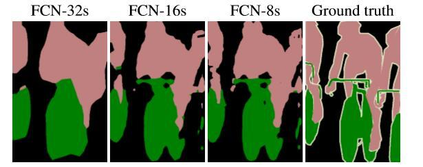
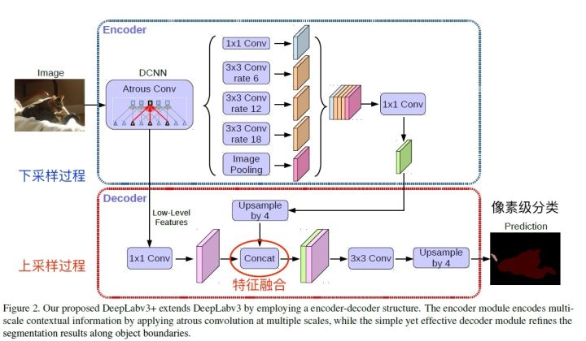
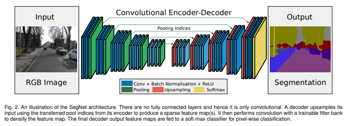

### Segmentation

- semantic segmentation
- Instance segmentation

|                               |                      |      |
| ----------------------------- | -------------------- | ---- |
| VGGNet                        |                      |      |
| ResNet                        | ENet,FRRN,AdapNey... |      |
| FCN                           |                      |      |
| Segnet                        |                      |      |
| Unet                          |                      |      |
| DeepLab v3                    |                      |      |
| 特征金字塔（Feature Pyramid） |                      |      |
| Make R-CNN                    |                      |      |
| Mask Scoring R-CNN            |                      |      |

参考：https://zhuanlan.zhihu.com/p/70758906

### FCN

[FCN paper](https://arxiv.org/abs/1411.4038)

[official code](https://github.com/shelhamer/fcn.berkeleyvision.org)

[code ](https://zhuanlan.zhihu.com/p/22976342)

FCN提出可以把后面几个全连接都换成卷积，这样就可以获得一张2维的feature map，后接softmax获得每个像素点的分类信息，从而解决了分割问题

那么：

1. 对于FCN-32s，直接对pool5 feature进行32倍上采样获得32x upsampled feature，再对32x upsampled feature每个点做softmax prediction获得32x upsampled feature prediction（即分割图）。
2. 对于FCN-16s，首先对pool5 feature进行2倍上采样获得2x upsampled feature，再把pool4 feature和2x upsampled feature**逐点相加**，然后对相加的feature进行16倍上采样，并softmax prediction，获得16x upsampled feature prediction。
3. 对于FCN-8s，首先进行pool4+2x upsampled feature**逐点相加**，然后又进行pool3+2x upsampled**逐点相加**，即进行更多次特征融合。具体过程与16s类似，不再赘述。

作者在原文种给出3种网络结果对比，明显可以看出效果：FCN-32s < FCN-16s < FCN-8s，即**使用多层feature融合有利于提高分割准确性**。

### U-Net

[u-net offical ](https://lmb.informatik.uni-freiburg.de/people/ronneber/u-net/)

https://arxiv.org/abs/1505.04597

**语义分割网络在特征融合时也有2种办法：**

1. **FCN式的逐点相加，对应caffe的EltwiseLayer层，对应tensorflow的tf.add()**
2. **U-Net式的channel维度拼接融合，对应caffe的ConcatLayer层，对应tensorflow的tf.concat()**

**总结一下，CNN图像语义分割也就基本上是这个套路：**

1. **下采样+上采样：Convlution + Deconvlution／Resize**
2. **多尺度特征融合：特征逐点相加／特征channel维度拼接**
3. **获得像素级别的segement map：对每一个像素点进行判断类别**

### DeepLab v3

## 语义分割

### SegNet 

[SegNet Paper](https://arxiv.org/abs/1511.00561)

[复现详解](http://mi.eng.cam.ac.uk/projects/segnet/tutorial.html)

[github caffe](https://github.com/alexgkendall/caffe-segnet)

[gitub TensorFlow](https://github.com/tkuanlun350/Tensorflow-SegNet)

### Bayesian SegNet

## FCN

## 实例分割

### Mark R-CNN

像素级分割

[arxiv mark r-cnn](https://arxiv.org/pdf/1703.06870.pdf)

[github official](https://github.com/facebookresearch/Detectron)

**RoiAlign——重对齐 RoIPool 以使其更准确**

