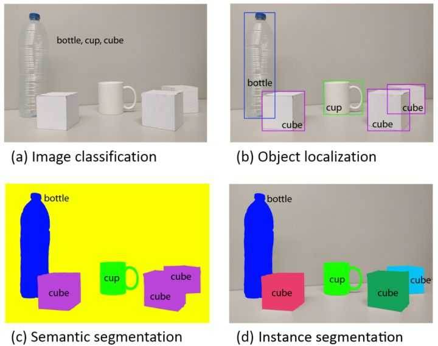

# 图像识别中，目标分割、目标识别、目标检测和目标跟踪这几个方面区别是什么？

目标分割，应该是Target Segmentation，

目标识别，应该是Target Recognition。

目标检测，应该是Target Detection

目标追踪，应该是Target Tracking

https://www.zhihu.com/question/36500536

计算机视觉旨在识别和理解图像/视频中的内容，包含四大基本任务：分类(图a)、定位、检测(图b)、语义分割(图c)、和实例分割(图d)。

