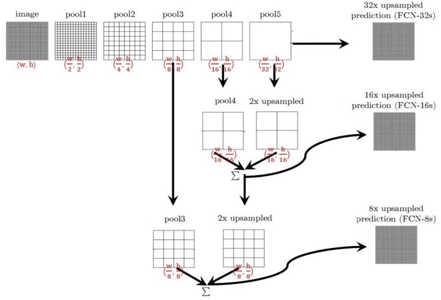

### Segmentation

- semantic segmentation
- Instance segmentation


| Model                         | Submitted |                                                              |      |
| ----------------------------- | --------- | ------------------------------------------------------------ | ---- |
| VGGNet                        |           |                                                              |      |
| ResNet                        |           | ENet,FRRN,AdapNey...                                         |      |
| Unet                          | 2015.5    |                                                              |      |
| Make R-CNN                    | 2017.3    |                                                              |      |
| Mask Scoring R-CNN |  | | |
| Fast R-CNN |  | | |
| FPN | 2017.4 | 特征金字塔（Feature Pyramid）特征金字塔是不同尺度目标识别系统的基本组成部分。 | |
| Human Part Segmentation       |           |                                                              |      |
| FCN                           | 2014.11   |                                                              |      |
| Segnet                        | 2015.11   | 剑桥提出的旨在解决自动驾驶或者智能机器人的图像语义分割深度网络，SegNet基于FCN，与FCN的思路十分相似 |      |
| Attention                     |           |                                                              |      |
| DeepLab v3(Vgg-16/resnet-101)        |           |                                                              |      |
| LIP-SSL                       | CVPR 2017 |                                                              |      |
| LIP-JPPNet                    | 2018.4    |                                                              |      |
| SS-JPPNet                     | 2018.4    |                                                              |      |
| Parsing R-CNN                 | 2018.11   |                                                              |      |
| Self-Correction for Human Parsing                 | CVPR2019   |          ranks 1st in CVPR2019 LIP Challenge.                                                     |      |

参考：https://zhuanlan.zhihu.com/p/70758906
【segmentation】
[32] J. Long, E. Shelhamer, and T. Darrell. Fully convolutional networks for semantic segmentation. In CVPR, 2015. 
[6] J. Dai, K. He, and J. Sun. Instance-aware semantic segmentation via multi-task network cascades. In CVPR, 2016.
[3] L. Chen, G. Papandreou, I. Kokkinos, K. Murphy, and A. Yuille. Deeplab: Semantic image segmentation with deep convolutional nets, atrous convolution, and fully connected crfs. TPAMI, 2016.
[4] L. Chen, G. Papandreou, F. Schroff, and H. Adam. Rethinking atrous convolution for semantic image segmentation. arXiv:1706.05587, 2017.
[41] L. Yi, H. Qi, J. Dai, X. Ji, and Y. Wei. Fully convolutional instance-aware semantic segmentation. In CVPR, 2017. 
[5] L. Chen, Y. Zhu, G. Papandreou, F. Schroff, and H. Adam. Encoder-decoder with atrous separable convolution for semantic image segmentation. In ECCV, 2018.
[30] S. Liu, L. Qi, H. Qin, J. Shi, and J. Jia. Path aggregation network for instance segmentation. In CVPR, 2018. 
[22] A. Kirillov, K. He, R. Girshick, C. Rother, and P. Dollar. Panoptic segmentation. arXiv:1801.00868, 2018. 

【human parsing 】
[25] J. Li, J. Zhao, Y. Wei, C. Lang, Y. Li, T. Sim, S. Yan, and J. Feng. Multi-human parsing in the wild. arXiv:1705.07206, 2017. 
[12] K. Gong, X. Liang, Y. Li, Y. Chen, and L. Lin. Instance-level human parsing via part grouping network. In ECCV, 2018. 
[24] J. Li, J. Zhao, Y. Chen, S. Roy, S. Yan, J. Feng, and T. Sim. Multi-human parsing machines. In ACM MM, 2018. 
[27] X. Liang, K. Gong, X. Shen, and L. Lin. Look into person: Joint human parsing and pose estimation network and a new benchmark. TPAMI, 2018. 
[43] J. Zhao, J. Li, Y. Cheng, and J. Feng. Understanding humans in crowded scenes: Deep nested adversarial learning and a new benchmark for multi-human parsing. In ACM MM, 2018. 
[20] R. Hu, P. Dollar, K. He, T. Darrell, and R. Girshick. Learning to segment every thing. In CVPR, 2018. 
[  ] Parsing R-CNN for Instance-Level Human Analysis

【detection】
[7] C. Gao, Y. Zou, and J. Huang. ican: Instance-centric attention network for human-object interaction detection. In BMVC,2018.
[9] R. Girshick, J. Donahue, T. Darrell, and J. Malik. Rich feature hierarchies for accurate object detection and semantic segmentation. In CVPR, 2014 
[19] H. Hu, J. Gu, Z. Zhang, J. Dai, and Y. Wei. Relation networks for object detection. In CVPR, 2018. 
[28] T. Lin, P. Dollar, R. Girshick, K. He, B. Hariharan, and S. Be- ´ longie. Feature pyramid networks for object detection. In CVPR, 2017. 
[33] S. Ren, K. He, R. Girshick, and J. Sun. Faster r-cnn: Towards real-time object detection with region proposal networks. In NIPS, 2015. 


【 estimation 】
[14] R. Guler, N. Neverova, and I. Kokkinos. Densepose: Dense human pose estimation in the wild. In CVPR, 2018. 
[27] X. Liang, K. Gong, X. Shen, and L. Lin. Look into person: Joint human parsing and pose estimation network and a new benchmark. TPAMI, 2018. 
[34] G. Rohit, G. Georgia, T. Lorenzo, P. Manohar, and T. Du. Detect-and-track: Efficient pose estimation in videos. In CVPR, 2018. 


【recognition】
[16] K. He, X. Zhang, S. Ren, , and J. Sun. Deep residual learning for image recognition. In CVPR, 2016. 
[17] K. He, X. Zhang, S. Ren, and J. Sun. Spatial pyramid pooling in deep convolutional networks for visual recognition. In ECCV, 2014. 
[35] O. Russakovsky, J. Deng, H. Su, J. Krause, S. Satheesh, S. Ma, Z. Huang, A. Karpathy, A. Khosla, M. Bernstein, A. C. Berg, and L. Fei-Fei. Imagenet large scale visual recognition challenge. IJCV, 2015. 
[37] J. R. Uijlings, K. E. van de Sande, T. Gevers, and A. W. Smeulders. Selective search for object recognition. IJCV, 2013. 


[8] R. Girshick. Fast r-cnn. In ICCV, 2015.
[10] R. Girshick, F. N. Iandola, T. Darrell, and J. Malik. Deformable part models are convolutional neural networks. In CVPR, 2015. 
[11] G. Gkioxari, R. Girshick, P. Dollar, and K. He. Detecting and recognizing human-object interactions. In CVPR, 2018. 
[13] P. Goyal, P. Dollar, R. Girshick, P. Noordhuis, L. Wesolowski, A. Kyrola, A. Tulloch, Y. Jia, and K. He. Accurate, large minibatch sgd: Training imagenet in 1 hour. arXiv:1706.02677, 2017. 
[15] K. He, G. Gkioxari, P. Dollar, and R. Girshick. Mask r-cnn. In ICCV, 2017. 
[18] K. He, X. Zhang, S. Ren, and J. Sun. Identity mappings in deep residual networks. In ECCV, 2016. 
[21] S. Ioffe and C. Szegedy. Batch normalization: Accelerating deep network training by reducing internal covariate shift. In ICML, 2015. 
[29] T.-Y. Lin, M. Maire, S. Belongie, J. Hays, P. Perona, D. Ramanan, P. Dollar, and C. L. Zitnick. Microsoft coco: Common objects in context. In ECCV, 2014. 
[23] A. Krizhevsky, I. Sutskever, and G. Hinton. Imagenet classification with deep convolutional neural networks. In NIPS, 2012. 
[26] Z. Li and F. Zhou. Fssd: Feature fusion single shot multibox detector. arXiv:1712.00960, 2017. 
[31] W. Liu, D. Anguelov, D. Erhan, C. Szegedy, and S. Reed. Ssd: Single shot multibox detector. In ECCV, 2016. 
[36] C. Szegedy, V. Vanhoucke, S. Ioffe, J. Shlens, and Z. Wojna. Rethinking the inception architecture for computer vision. In CVPR, 2016. 
[38] X. Wang, R. Girshick, A. Gupta, and K. He. Non-local neural networks. In CVPR, 2018. 
[39] Y. Wu and K. He. Group normalization. In ECCV, 2018. 
[40] S. Xie, R. Girshick, P. Dollar, Z. Tu, and K. He. Aggregated ´ residual transformations for deep neural networks. In CVPR, 2017. 
[42] M. Zeiler and R. Fergus. Visualizing and understanding convolutional neural networks. In ECCV, 2014. 
[44] C. L. Zitnick and P. Dollar. Edge boxes: Locating object ´ proposals from edges. In ECCV, 2014

### FCN

[FCN paper](https://arxiv.org/abs/1411.4038)

[official code](https://github.com/shelhamer/fcn.berkeleyvision.org)

[code ](https://zhuanlan.zhihu.com/p/22976342)

FCN提出可以把后面几个全连接都换成卷积，这样就可以获得一张2维的feature map，后接softmax获得每个像素点的分类信息，从而解决了分割问题



那么：

1. 对于FCN-32s，直接对pool5 feature进行32倍上采样获得32x upsampled feature，再对32x upsampled feature每个点做softmax prediction获得32x upsampled feature prediction（即分割图）。
2. 对于FCN-16s，首先对pool5 feature进行2倍上采样获得2x upsampled feature，再把pool4 feature和2x upsampled feature**逐点相加**，然后对相加的feature进行16倍上采样，并softmax prediction，获得16x upsampled feature prediction。
3. 对于FCN-8s，首先进行pool4+2x upsampled feature**逐点相加**，然后又进行pool3+2x upsampled**逐点相加**，即进行更多次特征融合。具体过程与16s类似，不再赘述。


作者在原文种给出3种网络结果对比，明显可以看出效果：FCN-32s < FCN-16s < FCN-8s，即**使用多层feature融合有利于提高分割准确性**。


### U-Net

[u-net offical ](https://lmb.informatik.uni-freiburg.de/people/ronneber/u-net/)

https://arxiv.org/abs/1505.04597


**语义分割网络在特征融合时也有2种办法：**

1. **FCN式的逐点相加，对应caffe的EltwiseLayer层，对应tensorflow的tf.add()**
2. **U-Net式的channel维度拼接融合，对应caffe的ConcatLayer层，对应tensorflow的tf.concat()**


**总结一下，CNN图像语义分割也就基本上是这个套路：**

1. **下采样+上采样：Convlution + Deconvlution／Resize**
2. **多尺度特征融合：特征逐点相加／特征channel维度拼接**
3. **获得像素级别的segement map：对每一个像素点进行判断类别**


### DeepLab v3


## 语义分割

### SegNet 

[SegNet Paper](https://arxiv.org/abs/1511.00561)

[复现详解](http://mi.eng.cam.ac.uk/projects/segnet/tutorial.html)

[github caffe](https://github.com/alexgkendall/caffe-segnet)

[gitub TensorFlow](https://github.com/tkuanlun350/Tensorflow-SegNet)


### Bayesian SegNet


## FCN

[《Fully Convolutional Networks for Semantic Segmentation 》 Jonathan Long∗ Evan Shelhamer∗ Trevor Darrell； UC Berkeley ](https://people.eecs.berkeley.edu/~jonlong/long_shelhamer_fcn.pdf)

https://arxiv.org/pdf/1605.06211.pdf

https://arxiv.org/pdf/1411.4038.pdf

[caffe official](http://fcn.berkeleyvision.org) [重定向GitHub](https://github.com/shelhamer/fcn.berkeleyvision.org)


## LIP-JPPNet

```python
label_colours = [(0,0,0)                
# 0=Background,

(128,0,0),(255,0,0),(0,85,0),(170,0,51),(255,85,0)                
# 1=Hat,  2=Hair,    3=Glove, 4=Sunglasses, 5=UpperClothes               

(0,0,85),(0,119,221),(85,85,0),(0,85,85),(85,51,0)
# 6=Dress, 7=Coat, 8=Socks, 9=Pants, 10=Jumpsuits

(52,86,128),(0,128,0),(0,0,255),(51,170,221),(0,255,255)
# 11=Scarf, 12=Skirt, 13=Face, 14=LeftArm, 15=RightArm              

(85,255,170),(170,255,85),(255,255,0),(255,170,0)]
# 16=LeftLeg, 17=RightLeg, 18=LeftShoe, 19=RightShoe
```


## 实例分割

### Mark R-CNN

像素级分割

[arxiv mark r-cnn](https://arxiv.org/pdf/1703.06870.pdf)

[github official](https://github.com/facebookresearch/Detectron)

**RoiAlign——重对齐 RoIPool 以使其更准确**


