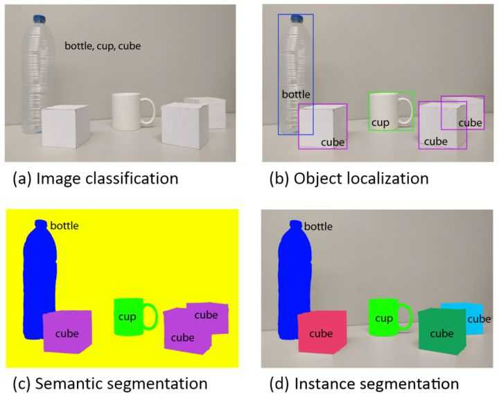

### 计算机视觉分类：

目标识别，应该是Object Recognition。 （分类）

目标检测，应该是Object Detection	（定位，检测）

目标分割，应该是Object Segmentation，(语义分割，实例分割)

目标追踪，应该是Object Tracking

计算机视觉旨在识别和理解图像/视频中的内容，包含四大基本任务：

分类(图a)、

定位、检测(图b):  **Faster R-CNN**和基于**YOLO**的目标检测的算法

语义分割(图c)、

实例分割(图d)	:**Mask R-CNN**

reference:

[zhihu](https://www.zhihu.com/question/36500536)

[csdn](https://blog.csdn.net/kk123k/article/details/86584216)