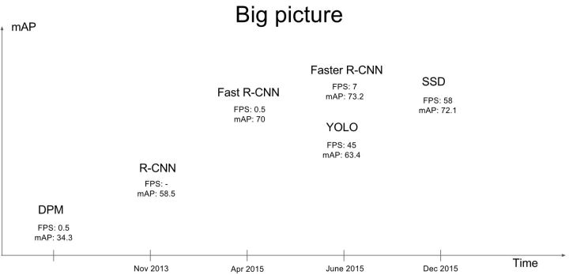
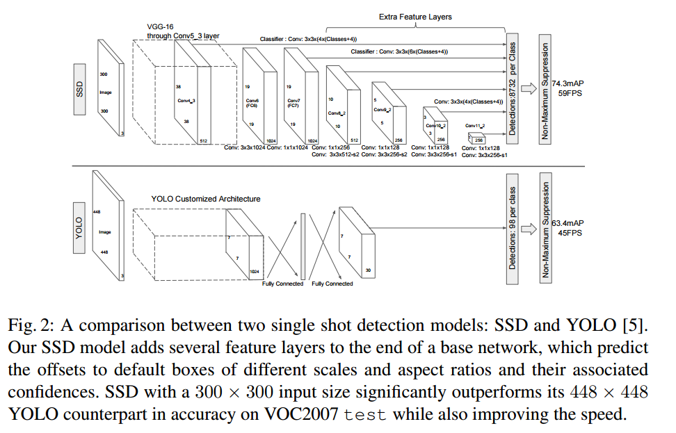

背景：

图像分类、目标检测、语义分割；

发展历史：

R-CNN

Fast R-CNN

Faster R-CNN

Mask R-CNN

SSD (Single Shot MultiBox Defender)

YOLO (You Only Look Once)

YOLO_V2

YOLO_V3

DSSD

IoU-Net(旷视科技)

《Speed/accuracy trade-offs for modern convolutional object detectors》2017
翻译：http://blog.gwyve.com/blog/2017/04/10/reading-note-Speed-Accuracy.html

- SSD、Faster R-CNN、R-FCN
- 三个object Detection模型的总结

### SSD

- ECCV 2016
- [PDF.v5 arXiv：1512.02325.pdf](https://arxiv.org/pdf/1512.02325.pdf)
- [github](https://github.com/weiliu89/caffe/tree/ssd)

### Faster R-CNN

- NIPS 2015
- [PDF.v3](https://arxiv.org/pdf/1506.01497v3.pdf)

### R-FCN

- [NIPS 2016](https://nips.cc/Conferences/2016/AcceptedPapers)
- [PDF arXiv：1605.06409.pdf](https://arxiv.org/pdf/1605.06409.pdf)
- [ github ](https://github.com/daijifeng001/R-FCN)

## Refernce

https://zhuanlan.zhihu.com/p/59398728

