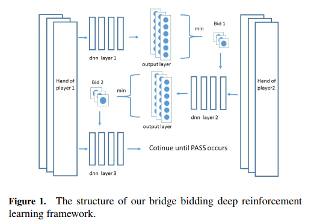
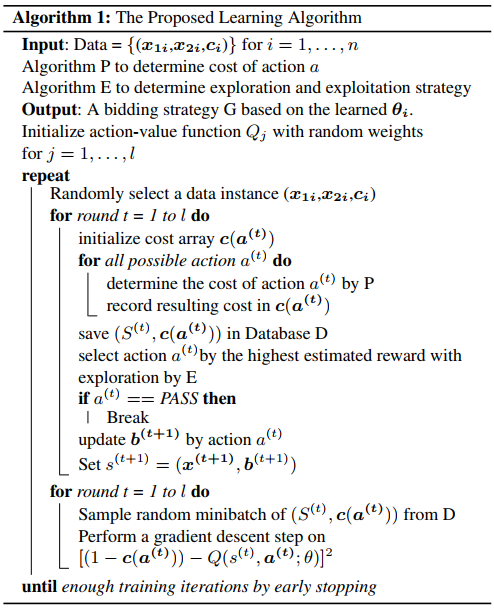

## Contract Bridge

trick-taking card game .

由一个叫牌阶段和一个打牌阶段组成

opponent(s) and partner 

--------------------------

规则：同Skat类似分两个阶段，叫分和出牌阶段

4人，两两一组，没人13张牌，共计52张

打13轮，每轮一张（与Skat的出牌规则一致），赢一轮则称之为赢一墩。基本局要赢6墩。

无将（最高）、黑桃、红桃、方片、梅花（最低）

叫分：NT； 1H(赢7墩), 2C（赢8墩）...

出牌：同花色比大小，（有将牌，奖牌大）；最大队赢一墩。

### GIB

Not Plan or mimic human

PIMC, a brute force approach

#### PIMC:

当PIMC玩家move时，我们先创建一个虚拟的世界，对所有未观察到的变量赋值（当前游戏状态下）。

然后当成完全信息游戏PK。repeat 多次，选择平均效用最高的move。

-------------

strategy fusion

non-locality

## Paper: GIB

## Paper :The State of Automated Bridge Play

Paul M Bethe, NYU 2010 

## Paper : Automatic Bridge Bidding Using Deep Reinforcement Learning 

使用Q-Learning进行叫牌。

算法： 不考虑竞争？

## Paper: Competitive Bridge Bidding with Deep Neural Networks

基于**神经网络**构建叫牌系统的方法。

桥牌游戏分为叫牌和打牌两个阶段。对计算机程序来说，虽然打牌相对容易，但叫牌是非常具有挑战性的。在叫牌阶段，每个玩家只知道自己牌，但同时，他需要在对手的干扰下与搭档交换信息。现有的解决完全信息博弈的方法不能直接应用于叫牌中。大多数桥牌程序都是基于人工设计的规则，但是，这些规则并不能覆盖所有的情况，而且，它们通常模棱两可甚至相互矛盾。本文首次提出了一种基于深度学习技术的叫牌系统，在文中，我们展示了两个创新点。首先，我们设计了一个紧凑的表示，对私人和公共信息进行编码，供玩家投标。第二，在分析其他玩家的未知牌对最终结果的影响的基础上，设计了**两个神经网络**来处理不完全信息，**第一个神经网络推断出搭档的牌**，第二个神经网络将第一个神经网络的输出作为其输入的一部分来**选择叫牌**。实验结果表明，我们的叫牌系统优于基于规则的最优方案。

思路：

​	预测队友的牌来缩小信息集，从而降低结果的不确定性。

​	SL + RL(Self-Play); 同一个团队的 2 个智能体会通过不断修正对队友牌面的预测准确性来保持信息交换和协作，同时与自己的历史版本对抗，在不断的学习中提升自己的胜率。

项目设计：

​	PI: 自己的牌，局况，叫牌序列

​	in-PI: 队友牌的预测

​	ENN: ($c_p,v, h, c_p+$); label $c_p+$ contains 13 ones and 39 zeros; sigmoid(52); 推断出搭档的牌

​	PNN: ($c_p, v, h, ϕ_w, (c_p, v, h), b_p$) ; softmax(39); 选择叫牌

算法：

成果:

​	在叫牌阶段超越了当前版本的 Wbridge5

## Reference

《Search, Inference and Opponent Modelling in an Expert-Caliber **Skat** Player》

《GIB: Imperfect Information in a Computationally Challenging Game.》 M. Ginsberg.  Journal
of Artificial Intelligence Research, pages 303–358, 2001. 

《The State of Automated Bridge Play 》Paul M Bethe, NYU 2010 

《Automatic Bridge Bidding Using Deep Reinforcement Learning 》Chih-Kuan Yeh 2016

《Competitive Bridge Bidding with Deep Neural Networks∗》Jiang Rong  [arxiv](https://arxiv.org/abs/1903.00900v2) AAMAS 2019 的 140 篇入选论文; [论文采访解读](https://www.yanxishe.com/blogDetail/13392)
