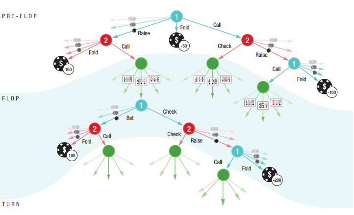
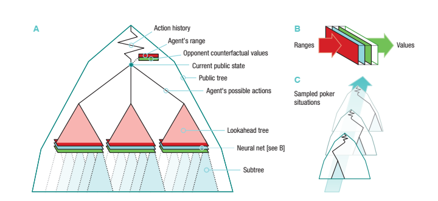
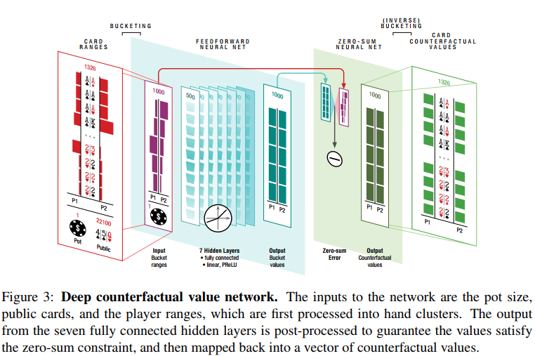
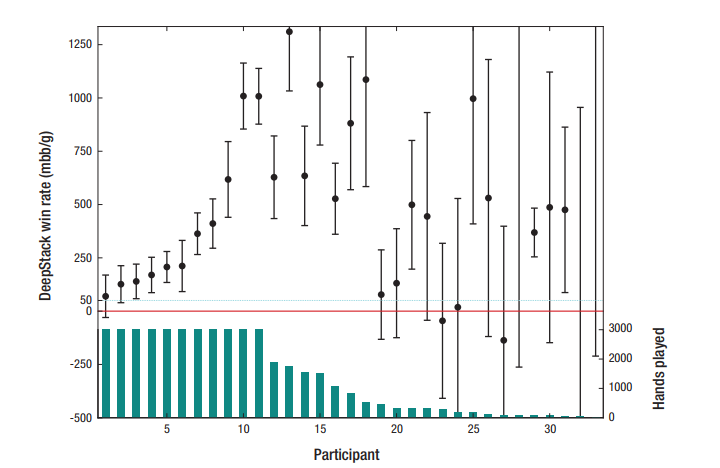
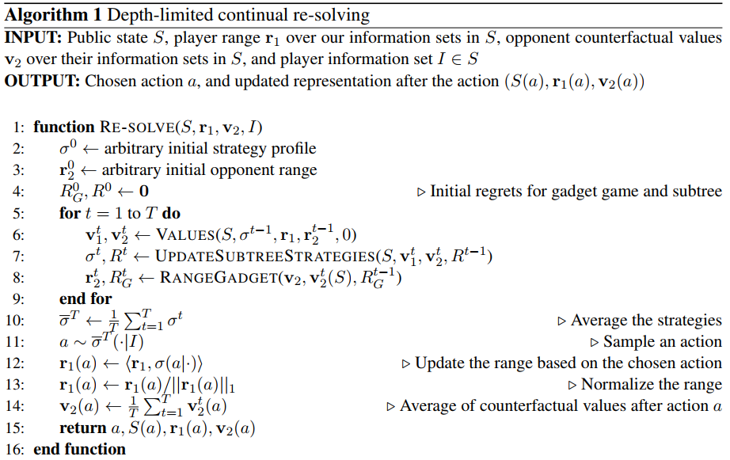
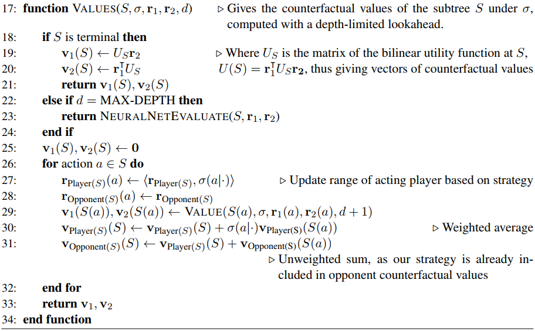
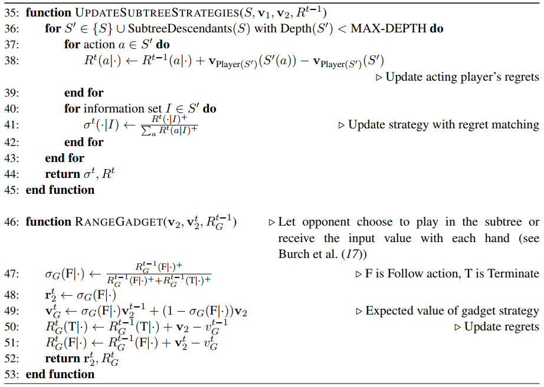

## DeepStack

图 1：HUNL 中公开树的一部分。

图2：DeepStack架构： 

A: 公共树的推理，action probabilities for all cards

B: evaluation function: 使用NN，该网络以当前迭代的公开状态和范围作为输入，然后输出两个玩家的反事实价值。

C: 随机生成poker situations(pot size, board cards, ranges)，生成训练样本，供NN训练。

#### Continual re-solving 持续解决

#### Limited depth lookahead via intuition 通过直觉实现有限深度前瞻

#### Sound reasoning 合理推理

DeepStack的深度有限的连续重算是可靠的。如果DeepStack的直觉是“好的”, 并且在每一个重新求解的步骤中都使用了“足够的”计算，那么DeepStack就扮演了一个任意接近于纳什均衡的近似。

#### Sparse lookahead trees 稀疏前瞻树

reduction in the number of actions.

#### Relationship to heuristic search in prefect information games

#### Relationship to abstraction-based approaches 

## Deep Counterfactual Value Networks

#### Architecture & Train:

两个NN；

Flop Network: 1 million randomly generated flop games. 

Turn Network: 10 million randomly generated poker turn games. 

一个辅助网络；在处理任何公共卡之前，使用一个辅助的值网络来加速早期动作的重新求解

输入：池底大小，公共牌，手牌范围（Player Card ranges）=> hand clusters。

输出：Zero-sum; Conterfactual values。

## Evaluating DeepStack 

## Online

DeepStack 会在游戏的每一个节点重新计算一小段可能性的树，而不是提前算出整个博弈树。

## Algorithm 

reference

[重磅 | Science论文详解击败德扑职业玩家的DeepStack，Nature探讨其与Libratus的优劣](http://www.sohu.com/a/127773829_465975)

[*Pluribus* Science论文解读：打牌一时爽，一直打牌一直爽](http://www.sohu.com/a/345097139_500659)

