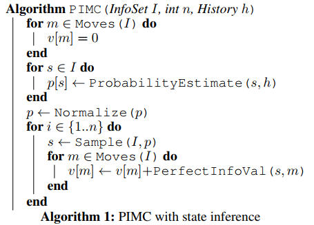
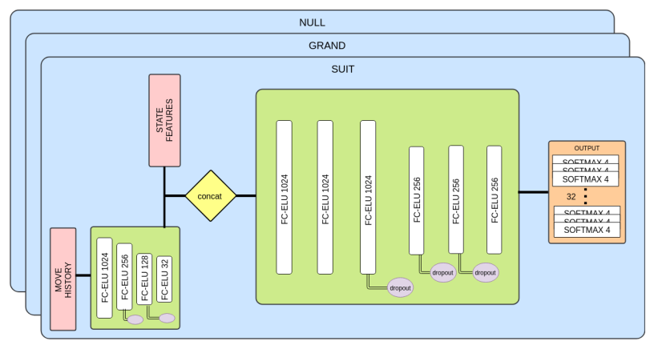
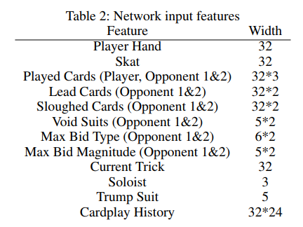
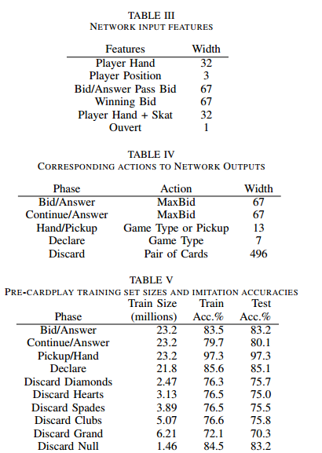
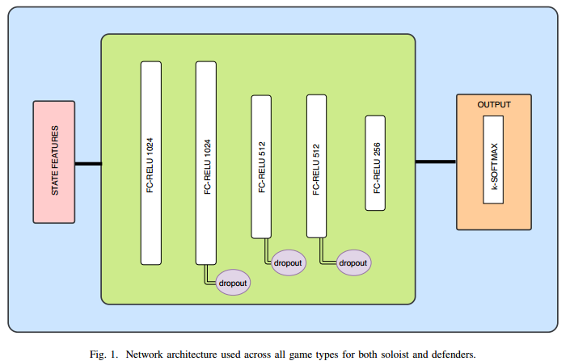
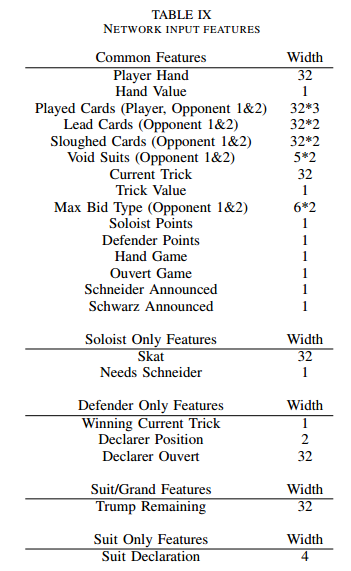
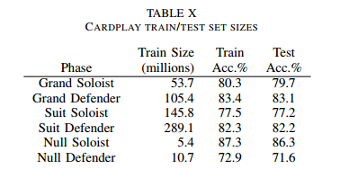
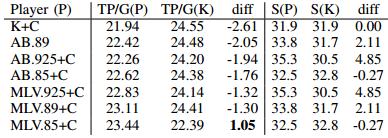
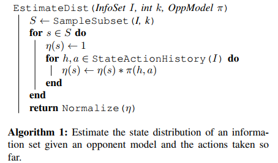

## Back

JTAKQ987 x 4 = 32

**Rule**:

​	Grand（J王牌）

​	Null （无王牌）

​	Suit（J王牌，Suit王牌）

​	https://www.pagat.com/schafkopf/skat.html

J A 10 K Q 9 8 7

2 11 10 4 3 0 0 0 

## Skat: 《Doctor》

《2011 [Skat] Policy Based Inference in Trick-Taking Card Games 》 【博士论文】Jeffrey Richard Long 
```
三个贡献

【4】专家级计算机SKAT-AI (组合游戏树搜索、状态评估和隐藏信息推理三个核心方面的组合来实现这一性能)
《M. Buro, J. Long, T. Furtak, and N. R. Sturtevant. Improving state evaluation, inference, and search in trick-based card games. In Proceedings of the 21st International Joint Conference on Artificial Intelligence (IJCAI2009), 2009. 》

【26】次优解决方案方法的框架
《 J. Long, N. R. Sturtevant, M. Buro, and T. Furtak. Understanding the success of perfect information monte carlo sampling in game tree search. In Proceedings of the 24th AAAI Conference on Artificial Intelligence (AAAI2010), 2010.》

【27】一种简单的自适应对手实时建模技术。
《 J. R. Long and M. Buro. Real-time opponent modelling in trick-taking card games. In Proceedings of the 22nd International Joint Conference on Artificial Intelligence (IJCAI2011), page To appear, 2011. 》
```


- 介绍Best Defense Model的构建（三个假设）【Contract Bridge】


  - 对手(Miner)是完全信息的，我们(Maxer)是非完全
  - 对手在Maxer选择之后play
  - Maxer采用纯策略，不适用融合策略

  this results in an algorithm for solving the best defense form of a game which frank and basin term exhaustive strategy minimisation（穷举策略最小化）.


#### SKAT:

**DDS(Double-Dummy Solver ):**	MC simulation + ab-search

- 采用PIMC算法的直接实现来构建的 (很大程度上)
- 以及加入了AB算法(对alpha-beta搜索组件的两个主要增强):
  - 准对称缩小(quasi-symmetry reduction )，是Ginsberg的分区搜索的一种改编，它将搜索状态组合在一起，这些状态“几乎”等价
  - 启发式对抗（adversarial heuristics ）
- k-mean for bidding

**UCT:**


#### Poker

CFR是一个离线过程，它在游戏的每个信息集中学习移动概率。

迭代算法。

当到达游戏的终端状态时，树中的每个节点都会根据程序对实际执行策略的后悔程度来更新，该策略与每个信息集中的最佳可用移动相比较。

这一过程将收敛到纳什均衡（2人）

CFR =》an enormous table of move probabilities, 


Multi-player

- 桥牌

  在文献中，桥牌通常被视为一种两人游戏，但实际上它是由四位不同的玩家玩的；

  对双玩家游戏的抽象是有意义的，因为玩家是在两个团队中结盟的，而对游戏的所有现有方法都是基于游戏的完美信息模型，在那里我们忽略了两个伙伴不一定知道对方的事实，

  因此实际上并不像他们是一个实体那样玩。

- Skat

  虽然Cardplay阶段可以(而且已经)被视为一个两人游戏（**this is interesting？ how?**），但在biding阶段，每个玩家都是为自己而战。

  

  更重要的是，vonstengel和koller[47]已经显示，在非合作的零和团队游戏中，一个具有共同回报但不同信息的agent小组与一个无所不知的对手竞争，最好的回报是，团队玩家可以希望得到团队-MaxMin平衡。


### Kermit 

并且搭建了*当时最强Skat AI* ‘Kermit ‘  论文介绍了Kermit 的信息有：

- Card Play [采用PIMC]： Perfect Information Monte Carlo Search for Cardplay
- 估值：State Evaluation for Bidding
- 推理：Inference
- Ai水平对比：Kermit Versus the World: Experimental Results


#### 4.1 Perfect Information Monte Carlo Search for Cardplay 


【23】实现了一系列的card game  and skat move 排序启发式算法。

eg:	相等牌力出牌分组，单张7，8 出一张即可


**4.1.1 Perfect Information Search Enhancements** 

​	采用ab-search和启发式算法提升搜索树的性能；-- **可采用NN直接拟合在Sates下的action的选择**

**4.1.2 Search Payoffs** 

相反，我们采用一系列零窗口搜索来缩小搜索空间。零窗口Alpha-beta搜索是将Alpha和Beta分别设置为值V和V1的一个。使用这样的窗口执行搜索将确定该位置的真实值是否大于或小于-或-等于V

在Kermit的构造中，我们提出了直接逼近不完全信息状态值的方法，并将其应用于博弈树搜索博弈的竞价阶段。

- 在非完备博弈数据可以得到的情况下，利用监督学习技术可以直接估计评价参数。

- 否则，就有可能从完善的信息评估中引导不完美的信息评估。{使用Cardplay方法(如pimc搜索)}


#### 4.2 State Evaluation for bidding

作者实验了PIMC的胜率评估结果，均比实际结果差，因此转为采用**static evaluation**


**4.2.1 Learning Table-Based State Evaluations** 

the generalized linear evaluation model (GOEM) framework [3]广义线性评价模型框架[3]
$$
e(s) = l (\sum_i w_i · f_i(s) )
$$


where $e(s)$ is the state evaluation, $l$ is an increasing and differentiable link function, $w_i \in R$ are
weights and $f_i(s)$ are state features. 

通常选择：$l(x)=x$(线性回归)  和 $ l(x) = 1/(1+exp(-x))$ (logitic 回归)


the resulting expressiveness of $e$ may be low ; (因为这样e的结果会比较小，影响不够)，--> 采用table-based features
$$
f(s) = T [h_1(s)] ... [h_n(s)]
$$


其中索引函数$h_j：s -> {0,.., n_j−1}$ 计算状态 $s$ 的属性，并使用索引向量从多维表T中检索值。

**基于表的特性的优点是表值可以很容易地从有标签的样本中学习，并且状态评估速度快。**


**4.2.2 Application to Skat Bidding** 

采用 10+2 evalution $e_g(h, s, p)$ 估计胜率

g: game type

h: ten cards

s: discarded skat

p: position in {0, 1, 2,}


Kermit为什么可以采用PIMC ？

|      | Kermit                                  | DDZ                                    |
| ---- | --------------------------------------- | -------------------------------------- |
| 叫分 | 叫分复杂（分多轮，不同的计分规则）      | 叫分简单                               |
| play | 游戏规则相对单一，10轮    -- 游戏树小   | 每局游戏1-52轮       --游戏树大        |
|      | 每人每轮有且只能出1张牌。--状态估值方便 | 每轮可出1-20张牌，--对状态的估值影响大 |
|      | -- 隐藏信息相对少                       | --隐藏状态多                           |


#### 4.3 inference

以前的工作都不涉及在游戏中对对手牌的推断。

比较接近的是Ginsberg在桥牌【15】中的推理研究方，Richards and Amir in Scrabble 

- Ginsberg的推理方法基本没有资料说明如何实现
- Scrabble的推理，使用了Bayes’ Rule 估计P(leave|play);P(leave)是对手的牌上剩下的字母的先验概率，通过分析计算得到。

**4.3.1 Inference Formulation** 

非完全信息的推理有两个问题：

- 计算大量的假设世界，很难
- 计算机只可以生成确定性的概率0/1，这点导致打发不同玩家时，不堪一击

解决方法：

- 人类对局数据学习
- 推广公式，不仅仅对World推理，加入高纬特征的（eg 特点花色的牌张数，多少个大牌）

其中，$W_i^{'}$代表32张卡的配置，在竞价阶段，通过考虑所有的扑克牌以及独奏者的卡片，从wi重构。

F: 从这些完整的32张卡配置中提取出对手竞投的个人手的功能，然后对这些手的出价进行评估。

W, R, T


**features**:
Suit length $\in {0...7}$: 	The number of cards held in each of the four suits, }~♠|.
Jack constellaion $ \in {0...15}$: 	The exact configuration of the player’s Jacks.
Ace count $ \in {0...4}$: 	Number of Aces held.
High card count $ \in {0...8}$: 	Number of Aces and Tens held.
King Queen count $ \in {0...8}$: 	Number of Kings and Queens held.
Low card count $ \in {0...12}$: 	Number of 7s, 8s and 9s held. 

### 5. Why PIMC ?

PIMC的缺陷failing

例如，我们有希望使用UCT算法，这种算法彻底改变了计算机围棋的世界。然而，Kermit的性能，使用了第4章描述的相对直截了当的pimc实现，以及它对其他计算机播放器的令人信服的控制，包括一个使用UCT方法的计算机播放器，使得我们重新考虑了这个目标。我们在本章中更深入地理解了pimc搜索的优点和弱点，以及它在应用的领域中的工作原理。

#### 5.1 Understanding the Failings of PIMC Search 

众所周知，PIMC搜索作为一种算法不会产生纳什均衡或任何其它具有可证明的游戏理论属性的策略。Frank and Basin 是第一个精确地识别并形式化这一天然的错误， pimc搜索的本身缺陷导致的[9]。从根本上说，这些错误是由于游戏的完美信息变体的重复播放不能真实地捕捉原始游戏的所有不完美的信息方面而发生的。

两种错误，并且PIMC无法解决的。

1、strategy fusion

策略融合是因为完全信息蒙特卡罗搜索(错误地)认为任何特定的世界选择最佳策略是奢侈的，而在现实中，存在着由多个不同的完美信息场景组成的情况(或信息集)。


pimc搜索将认为它总是可以在节点(A)和(B)上做出正确的决定，因此这两个节点的根移动看起来都是胜利。

然而，在现实中，Maxer玩家是混淆在世界1和2之间，实际上可能会在树的歧义问题方面犯错。


2、non-locality 


非局部性是一个事实的结果，在一个完美的信息博弈中，一个游戏树节点的值仅仅是它的子树的一个函数，因此节点的值完全由从其子代开始的搜索来确定。（完全信息博弈，节点值来自子节点的搜索来确定）

在不完美的信息游戏中，节点的值可以依赖于不包含在其子树内的游戏树的其它区域，主要是由于对手的能力来引导游戏朝向树的区域，他知道(或至少猜测)对于他来说是有利的，使用他拥有但我们不拥有的私人信息。此现象在树中可能的远程节点之间创建非本地依赖关系。（在游戏树远程节点之间创建非本地依赖）


#### 5.2 Success

5.2.1

在比赛的前七招中，对于我们的首发位置，我们将使用人类玩的真正的滑雪板游戏，此时比赛结果仍然不确定的(也就是说，双方都还没有获得足够的牌分来赢得比赛)。

- Leaf Correlation, lc

  给出所有兄弟终端节点具有相同回报值的概率。

  Low lc 表示：一种游戏，玩家几乎总是有可能在很晚的时候影响他们的回报。

  

- Bias,b, 

  determines the probability that the game will favor a particular player over the other. with very high or very low bias, we expect there to be large, homogeneous sections of the game, and as long as a game-playing algorithm can find these large regions, it should perform well in such games.

  确定该游戏比另一位玩家更倾向于某一特定玩家的概率。在极高或很低的偏倚下，我们期望游戏中会有大的、同质的部分，只要游戏算法能够找到这些大区域，它就应该在这样的游戏中表现良好。

  

- Disambiguation factor, df, 

  根据树的深度确定玩家信息集中节点数量缩小的速度

  Skat每次播放都会显示一张卡片，这意味着每个信息集中的状态随着游戏的继续而急剧缩小。

  相反，在像Poker这样的游戏中，几乎没有私密信息被直接显示，直到游戏结束。

  我们可以通过考虑玩家的信息集合在每次玩家移动时收缩的程度来确定这个因素。

  

#### 5.3 Methodology

5.3.1 Measuring Properties in Real Games 

#### 5.4 Experimental Setup

5.4.1 Synthetic Trees 

5.4.2 Experiments on Synthetic Game Trees 合成游戏树实验

5.4.3 Real Games 


#### 5.5 结论

 在本章中，我们对简单、合成的游戏树进行了实验，以便深入了解为什么完美的信息蒙特卡罗搜索在各种实际领域中如此成功，尽管其理论上存在缺陷。我们定义了这些合成树的三个属性，它们似乎是PIMC搜索性能的良好预测因子，并证明这些属性是如何在真实游戏中测量的。

对简单，合成游戏树实验，定义了合成树的三个属性-- 对PIMC的搜索性能良好因子

- 演示了这些属性是如何在真实游戏中得到的。


### 6、推理

inference, as we have taken it, is the problem of mapping a series of observed actions taken by a player into a probability distribution over that player’s private information. a reasonable and intuitive question to ask is whether inference is nothing more than an attempt to build a model of a particular opponent. certainly, since inference attempts to derive meaning from an opponent’s actions, it is inherently dependent on the opponent’s policy for choosing those actions — in other words, her strategy. and if the opponent does not act as we expect, could our inferences cause us to make more mistakes by misleading us?

正如我们所做的那样，推理是将玩家所采取的一系列观察到的行为映射成对该玩家私人信息的概率分布的问题。一个合理而直观的问题是，**推论是否仅仅是试图建立一个特定对手的模型**。当然，由于推理试图从对手的行为中获得意义，它本质上依赖于对手的政策来选择那些行动-换句话说，就是她的策略。如果对手不按我们的预期行事，我们的推论是否会误导我们，使我们犯更多的错误？

#### 6.2 Inference and Non-locality 

Non-locality：非局部性的出现是因为对手可能能够利用他们的私人知识，将游戏指向对她更有利的游戏树的部分。

推理是捕捉对手移动所传递的信息的过程，而同样的道理是，意识到我们自己的动作传递给对手的信息。

假设我们有一个神奇的黑匣子，它可以在一个不完美的信息游戏的任何阶段，在游戏中的所有隐藏信息(即非公共信息)上产生一个精确的概率分布。我们将证明，我们可以使用这样一个盒子来寻找一个游戏g的子树的最优策略，而不需要考虑g的整个博弈树。

Define：

H: public History

Box(G, H, σ)：	Game + History -> a set of possible states S, a strategy profile σ for all players in Game G; 生成P(s) for all $s \in S$ 校正后验概率分布, 在所有可能的状态S上。


#### 6.3 Inference in PIMC Search

6.3.2 Considerations in inference Design

PIMC search would exhaustively examine all worlds, and weigh the result of each world’s analysis by the world’s probability. When the state space is still large, this approach is not feasible if the analysis of each world is time-consuming, as is the case when using alpha-beta search on perfect information worlds.  

​	

### 7：

对抗环境的越复杂，其随机性，不确定性

考虑不同的对手模型变得更加重要，原因有两个：

第一个原因是这些环境中的最佳策略常常是过度防御的

第二个原因是在不完善的信息环境中，根据其他代理的动作推断隐藏状态变量通常是有帮助的。对于某些类型的推理（尤其是我们在第6章中讨论的不正确的推断），这需要一个准确的模型，说明Agent在环境中的行为方式。因此，合适的对手模型允许代理明确地利用对手弱点，并且通过对隐藏信息的优良推断来改进其自己的决策。

### 8

在我们建立一个强大的电脑滑板运动员和了解围绕这一目标的问题的过程中，我们调查了一些未能达到我们最初对它们的期望的技术。对于这些想法中的一些，也许是因为它们完全没有价值。对其他人来说，滑雪板可能根本不是正确的领域，或者他们缺少一些关键的完善。在这一章中，我们将记录我们认为最有趣的技术。

8.2 

与其预测玩家将在每个世界中进行最优的完美信息移动，我们还会预测他们将进行PIMC搜索在他们的位置上所建议的移动。


### 引用

- 【9】对不完美信息博弈的完美信息蒙特卡罗搜索(或称为重复最小化)方法的广泛批评。

- 【29】描述使用神经网络预测完美信息(或double-dummy )桥接问题的结果，并报告与某些类别交易的人类专家相当的准确性。

- 【35】最强桥牌AI-Ginsberg’s GIB  {加权MC样本weighted Monte Carlo samples }

  

  对手牌的推理研究

- 【15】work by Ginsberg in bridge ，[brideg ai GIB] : 对桥牌中对手牌的推理研究

- 【32】Richards and Amir in Scrabble

---

《2009.3 Improving State Evaluation, Inference, and Search in Trick-Based Card Games》

https://www.cs.du.edu/~sturtevant/papers/skat.pdf

- 贝叶斯公式

- KI Kermit infrence


《AAAI2010 Understanding the success of perfect information monte carlo sampling in game tree search》


《Real-time opponent modelling in trick-taking card games (IJCAI2011) 》


---

# 14《2019.3 Improving Search with Supervised Learning in Trick-Based Card Games》

https://arxiv.org/pdf/1903.09604.pdf

- trick-taking card game，**状态采样和评价**的两步过程被广泛用于拟合移动值

- 最近在扑克牌游戏ai中的工作主要集中在改进**评估算法**上。

  本文，重点研究了**采样**对玩家力量的影响，并提出了一种新的方法来采样给定移动历史的更真实的状态。

- 采用DNN预测卡片的位置 (Card Location Inference  = CLI)

  





图1：推理网络体系结构。所示的是一种特定于滑板的架构，用于预测所有32张卡的卡前位置。每一张牌可以在四个可能的位置之一(每个玩家的手和Skat)。输出目标在每个玩家手中有10张卡片，剩下的2张在滑板中。

四个可能的位置：玩家1，玩家2，玩家3，landlord

NN输入特征：

Lead Cards：First cards played

Sloughed cards: 掉牌是指当一名玩家不能效仿，但也不做一张王牌时使用的牌。

Void suits：游戏规则，是无suit规则

Bid， 分type和Magnitude



TSSR 推理性能评估


---


# 18《2019.5 Learning policies form human data for skat》

https://arxiv.org/pdf/1905.10907.pdf

- 预测隐藏牌

- NN 训练pre-cardplay 和cardplay

摘要大型不完全信息博弈中的决策是很困难的。由于最近在扑克方面的成功，反事实的遗憾最小化(CFR)方法在这些游戏中一直处于研究的前沿。然而，大多数大型游戏的成功都是通过使用前向模型和强大的状态抽象来实现的。在桥牌或滑雪板之类的纸牌游戏中，大量的信息集和无法在不完全确定状态的情况下推进模拟的能力使前向搜索成为问题。此外，由于每个参与者的精确持有量直接影响移动值，因此状态抽象可能特别难以构建。

  abs：

Trick-taking类游戏的挑战：

- Large info set

- 没有确定性的状态下，无法前向搜索

- 状态抽象壁垒-- 参与者的精确手牌，影响大

  

**本文实现**：

使用DNN实现了一个SOTA 系统（model-free），对bidding和game declaration（叫分，游戏类型等）

CardPlay 比最佳的Search-Base算法要弱

还尝试了RL，但是应该进展不大。

#### Pre-CardPlay Train

policy + value

每种GameType训练一个单独的NN（Null and Null Ouvert 除外）

NN- Input/Output。数据集大小

总共10个model，10个数据集。每个模型的输入特征都是Table III的特征组合而成。

例如：Bid/answer 模型的输入特征2个：是 Player Hand + Player Position。



2 additional Network

​	Hand/Pick UP phase

​	Declare phase

​	： 用于近似于行动的价值。


**DNN架构**




人类数据训练的MLV方法提供了新的SOTA bot for Skat pre-cardplay


#### CardPlay Train

same network architecture  used for pre-cardplay NN

训练总计6个神经网络。

defender and soloist versions of Grand, Suit, and Null. 

**NN输入特征**



**数据集大小**

6个模型的数据集，对应的是2个位置的三中游戏规则

- Grand
- suit
- Null



**性能对比**



--**Conclusion**

在这篇论文中，我们已经证明了玩纸牌前策略可以从人类游戏数据中学习，并且它的表现要比以前的最先进的’Kermit‘播放要好得多。

bidding policy (采用DI-M) 比 Kermit差1.35TP/G; (DI-S更是相差4.14TP/G)

The best overall full network based player was MLV.925+C, 


--**Future** Work


----


# 00《2019 Policy Based Inference in Trick-Taking Card Games》

http://ieee-cog.org/papers/paper_123.pdf

https://arxiv.org/pdf/1905.10911.pdf

- 评估信息集的状态概率

- 使用玩家模型，推理状态概率

**Abstract**

卡牌游戏的特点是大量的私人信息，慢慢地被揭示通过一长串的行动。这使得历史记录在动作序列长度中呈指数增长，并创建了非常大的信息集。因此，这些游戏变得太大，无法解决。为了处理这些问题，许多算法采用推理，**估计信息集中的状态概率**。在本文中，我们演示了一种**基于策略的推理（Pi）算法**，该算法使用玩家建模来推断我们处于给定状态的概率。我们在德国特技拍摄游戏SKAT中进行实验，其中我们表明，与以前的工作相比，**该方法极大地改进了推理**，并且当它被**应用到其确定的搜索算法**中时，增加了现有技术的SKAT AI系统Kermit的性能。

**1-Introduce**

Determinized search algorithm，

推理是非完备信息的中心概念。

’冷扑大师‘ CFR的超越人类玩家的Ai，他们没有证明对trick-based 游戏是有用的。

这是因为信息集的非常大的大小、大量的竞价和很长的Cardplay序列，创建表达抽象的困难。

虽然这些长序列使游戏变得太大以至于无法解决，但是它们也慢慢地揭示其他玩家的私人信息，从而推断期望的方法。

**本文：** 利用对手模型的推理。

特别是，我们培训关于受监督的人类数据的政策，并利用它们来根据对手和合作伙伴以前的每一次行动推断他们的私人信息。

Outline：1-Skat rule， 2.Opponent Model trained in human data, 3. conclude, idea for future research。


**2- 背景**

KI: 	使用一种基于表格的技术，根据对手的出价和声明，对状态采样进行偏置。这种方法只解释了有限数量的可用状态信息，而忽略了当对手玩特定卡片时发生的重要推理机会。这一推断将称为Kermit推断（Ki）。

Solinas等人[14]通过使用神经网络对个别卡的位置进行预测来扩展这一过程。通过假设这些预测之间的独立性，通过乘以配置中卡片位置对应的概率来计算给定配置的概率。尽管示出该方法是有效的，但是独立假设与对于给定配置的事实不一致，给定卡存在的概率高度依赖于其它卡的存在。

例如，他们的方法无法捕获玩家的动作表明他们的手可能包含梅花J或黑桃J，但不能同时包含两者。

本文提出的策略推理方法通过 **根据精确卡片配置来估计状态的概率。**


Card Location Inference (CLI):


**III.INFERENCE**

**给定信息集上的一个状态，得到确定性的概率。也就是计算到达概率 η。** 如果我们能够完美地确定导致这种状态的每个动作的概率，我们就可以将所有的概率相乘，得到η。


$$
\eta(s|I) = \sum_{h \cdot a \sqsubseteq s} \pi(h, a)
$$


如果我们对信息集中的所有状态重复这个过程，我们就可以计算出状态之间的概率分布。如果我们能够完美地评估所有状态-动作对的值，我们就可以选择使这个期望值最大化的动作，从而提供一个最优的解决方案。


**Policy Inference**：


ISSUE-1: 无法知道其他玩家的策略（或成本太贵）

这使得对手/伙伴模型成为必要的，在这种模型中，我们假定其他玩家的模型计算成本不高，并使用它们来估计状态的到达概率。

ISSUE-2: 信息集的状态数据相当大

为了解决这个问题，我们可以对世界进行采样，并对状态子集上的分布进行规范化。因为在滑雪板中，玩家在玩纸牌之前的信息集大小可以包含多达28亿个状态，我们采用了抽样的方法。


Algorithm 1 ： 估计状态分布-- 信息集，OppModel, 



算法1，评估状态的相对到达概率，当我们不是使用采样时。这将成为对状态的真实到达概率的估计。


CLI(Cards Location Inference)--18论文


两种推理

1- samples card configurations 

如果相同的卡片配置有多个状态，但特征不同(输入到网络)，则决策点不进行推理

2-samples states directly 

（method1）采样卡配置将被视为PI的默认方法。当对状态进行采样时，推断将被标记为PIF(Policy Inference Full)


----


# 《Challenging Human Supremacy in Skat – Guided and Complete And-Or Belief-Space Tree Search for Solving the Nullspiel 》


# Scope

四人游戏（意大利游戏）

《1807.06813 [Scopone] Traditional Wisdom and Monte Carlo Tree Search Face-to-Face in the Card Game Scopone.pdf》

