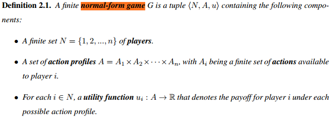
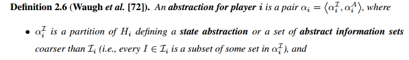
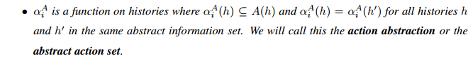
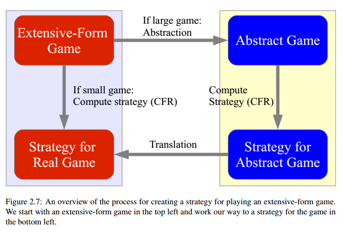
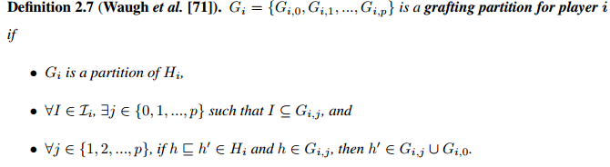
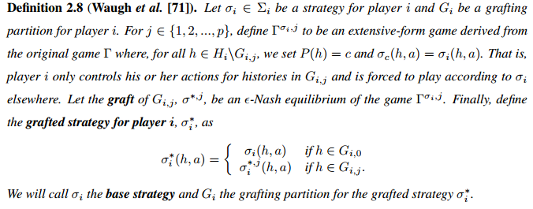
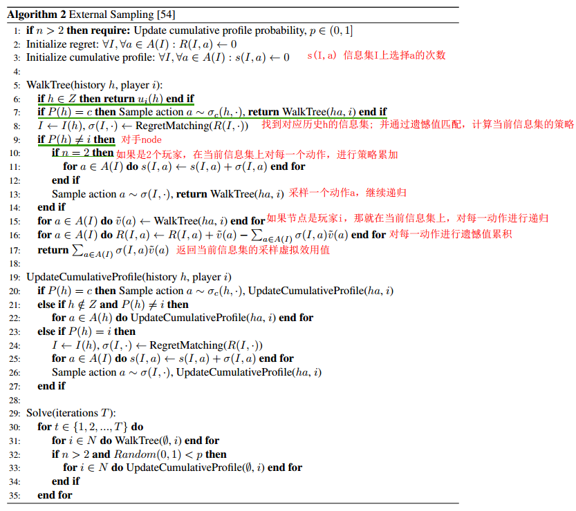
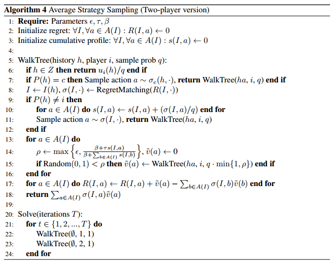

Poker Algorithm developer history

论文阅读《Regret minimization in games and the development of champion multiplayer computer poker playing agents》(游戏中的遗憾最小化与多人计算机扑克游戏冠军的发展)

<!-- more -->

## Definition

### Definition 2.1 normal-form game

Definition 2.1. A finite normal-form game G is a tuple <N, A, u> containing the following components:

- A finite set N = {1, 2, ..., n} of players.
- A set of action profiles A = A1×A2×· · ·×An, with Ai being a finite set of actions available to player i.
- For each i 2 N, a utility function ui : A ! R that denotes the payoff for player i under each possible action profile 

### Definition 2.2 Extensive-form game

### Definition 2.3 perfect reall & imperfect recall

### Definition 2.4 纳什均衡

### Definition 2.5 Weakly/strictly  dominated stregy

​	在三人博弈中，纳什均衡的计算是属于PPAD-complete的[Computing Nash Equilibrium](http://www.jijitang.com/article/540faac420296a4535b9314a/ji-suan-yi-ge-na-shi-jun-heng-di-fu-za-xing-The-Complexity-of-Computing-a-Nash-Equilibrium) (二人博弈也属于此)

Nash Equilibrium 两个推广

- PDF_correlated  equilibria()
  - no player has an incentive to unilaterally deviate from any recommendation 

- [PDF_coarse correlated equilibria ](http://www.cs.cornell.edu/courses/cs6840/2012sp/Feb17Notes.pdf)
  - 

### Definition 2.6 abstraction for player

### Definition2.7 Grafting partition for player i

### Definition2.8 grafted strategy for player i

## Theorem

### Theorem2.1 2e-Nash equilibrium

### Theorem2.2 regret & step

当使用regret matching时，玩家regret与step的平方根成正比

### Theorem2.3 regert max

### Theorem2.4 平均regret bounded

## Algorithm Method

### Regret Matching

accumulated regret: 衡量玩家i有多少次，宁愿选择a，而不跟随σ

$$
R_i^T (a) = \sum_{t=1}^{T} (u_i(a, σ_{-i}^t) - u_i(σ_i^t, σ_{-i}^t)
$$

Successive strategies：
$$
\sigma_i^{T+1}(a) = \frac{R_i^{T,+}(a)}{\sum_{b \in A_i}R_i^{T, +}(b)}
$$

### Counterfactual Regret Minimization(CFR)

counterfactual value (player i)
$$
u(i, \sigma) = \sum_{z\in Z_I} u_i(z)\pi_{-1}^\sigma (z[I])\pi^{\sigma}(z[I], z)
$$

counterfactual regret (at iteration t)
$$
r_i^t(I,a ) = v(I, \sigma_{I \to a} ^ t) - u_i(I, \sigma^t)
$$
​	σ(I->a) is the profile σ except at I, action a is always taken. 

​	the regret $r_i^t(i; a) $ measures how much player i would rather play action a at i than follow σt i at i, assuming player i plays to reach i.

​	后悔 $r_i^t(i; a) $ 衡量的是，我宁愿在I上玩动作a，也不愿在I上跟随σ_i^t，假设Player玩到I。

cumulative counterfactual regret
$$
R_i^T (I, a) =\sum_{t=1}^{T}r_i^t(I, a)
$$

current strategy profile  

$$
\sigma_i^{T+1}(I, a) = \frac{R_i^{T,+}(I, a)}{\sum_{b \in A(I)}R_i^{T, +}(I, b)}
$$

### MCCFR

Chance Sampling(CS)

​	sampled counterfactual value 
$$
\widetilde{u}_i(I, \sigma) = \sum_{z\in Z_I \cap Q_j} u_i(z)\pi_{-i}^{\sigma}(z[I]) \pi^{\sigma} (z[I], z)/q(z)
$$
​	sampled counterfactual regret 
$$
\widetilde{r}_i^t(I, a) = \widetilde{v}_i(I, \sigma_{I \to a}^t) - \widetilde{v}_i(I, \sigma^t)
$$

​	sampled cumulative counterfactual regret  
$$
\widetilde{R}_i^T = \sum _{t=1}^{T}\widetilde{r}_i^t(I, a)
$$

External Sampling(ES)

ES takes CS one step further by considering only a single action for not only chance, but also for the opponents, where opponent actions are sampled according to the current profile $σ_{-i}^t $

Outcome Sampling(OS)

最极端的mccfr版本,

samples a single action at every history, walking just a single trajectory through the tree on each traversal ($Q_j = \{z\}$). 在每一段历史记录中对单个动作进行采样，每次遍历时只遍历一条轨迹($Q_j = \{z\}$)。

### CS-MCTS

### ES-MCTS Pesudocode

### 

#### WalkTree (recursive function)

four case:

​	-1 reached teminal node : 返回效用值；(line 6)

​	-2 at a chance node : 根据策略采样一个动作，并续递归；(line 7)

​	-3 at opponent’s chance node : 采样个动作，并继续递归.(line 9-14)

​	-4 update the cumulative profile (in two player game;)

ES:递归方法WakeTree

#### UpdateCumulativeProfile 

after walkTree

### 

### Probing + MCCFR

#### Pesudocode

对比ES算法，多了一个action set sampling distribution Q(I),  对于已经

0：walk tree(h, i, q):

1、h是terminal节点，返回u

2、P(h)是chanceNode，sample action $a \sim \sigma_c(h,·)$, goto_0(ha)

3、P(h)是 opponent’s Node,

3.1、对所有的$a \in A(I)$更新$s(I,a) = s(I, a) + (\sigma(I, a)/q)$

3.2、sample action $a \sim \sigma(I, ·)$， goto_0(ha)

采样信息集$Q(I) \sim Q(I)$

**4、遍历玩家i在当前信息集I上的所有可能action**

- 如果 a 属于Q(I): 更新q’并且goto_0(ha)
- 否则：Probe(ba)

5、便利i的信息I下所有可能action，更新R(I, a)

6、返回信息集上累计采样虚拟效用值$\sum_{a \in A(I)} \sigma(I, a) \widetilde{u}(a)$

### AS-MCTS(Average Strategy Sampling)

AS can be seen as a sampling scheme between OS and ES  (可看作OS, ES之间的折中方案)

AS_select:

​	AS对每个信息集上玩家的action子集采样。而不像OS采样一个action，也不像ES采样所有action

cumulative profile $s^T_i(I, ·) $on iteration T , an exploration parameter $\epsilon \in (0, 1]$,a threshold parameter $τ \in  [1, 1)$, and a bonus parameter $β \in [0, 1)$,  each of player i’s actions $a \in A(I)$ are sampled independently with probability :
$$
ρ(I; a) = max \{\epsilon,   \frac{β + \tau s_i^T(I, a)} {\beta + \sum_{b \in A(I)} s^T_i(I, b)} \}
$$

[GO](#Regret Matching)

## Reference

《Regret minimization in games and the development of champion multiplayer computer poker playing agents》(游戏中的遗憾最小化与多人计算机扑克游戏冠军的发展)