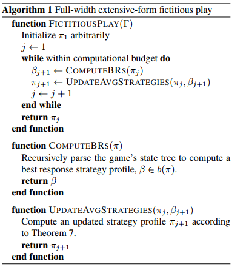
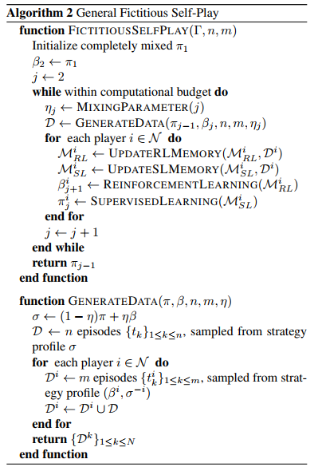
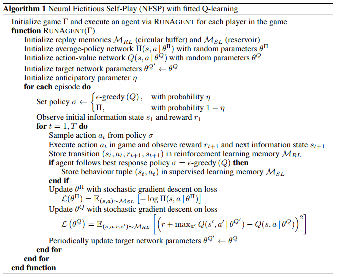
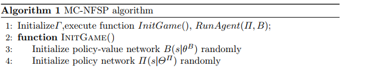
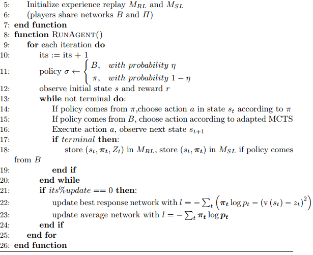

Papers:

2015 [SFP](http://proceedings.mlr.press/v37/heinrich15.pdf)《Fictitious self-play in extensive-form games》 Heinrich et al. (2015)   UCL&&DeepMind

2016 [NFSP]《Deep Reinforcement Learning from Self-Play in Imperfect-Information Games 》 UCL: Johannes Heinrich 

2019 [MC-NFSP]《Monte Carlo Neural Fictitious Self-Play: Approach to Approximate Nash Equilibrium of Imperfect-Information Games? 》 ZJU: Li Zhang 

Background：

Extensive-form Game:

​	扩展形式游戏是一种涉及多个代理的顺序交互模型

[博弈论](https://zh.wikipedia.org/wiki/博弈论)中，与[正则形式](https://zh.wikipedia.org/wiki/正則形式的博弈)相应，**扩展形式**（英语：Extensive-form game）通过[树](https://zh.wikipedia.org/wiki/树_(图论))来描述博弈。每个[节点](https://zh.wikipedia.org/wiki/顶点_(图论))（称作**决策节点**）表示博弈进行中的每一个可能的状态。博弈从唯一的**初始节点**开始，通过由参与者决定的路径到达**终端节点**，此时[博弈结束](https://zh.wikipedia.org/w/index.php?title=结果_(博弈论)&action=edit&redlink=1)，参与者得到相应的收益。每个非终端节点只属于一个参与者；参与者在该节点选择其可能的行动，每个可能的行动通过[边](https://zh.wikipedia.org/wiki/边_(图论))从该节点到达另一个节点。[wiki](https://zh.wikipedia.org/wiki/扩展形式的博弈)

Normal-form Game

在[博弈论](https://zh.wikipedia.org/wiki/博弈论)中，**正则形式**（Normal-form game）是描述博弈的一种方式。与[延展形式](https://zh.wikipedia.org/wiki/扩展形式的博弈)不同，正则形式不用图形来描述博弈，而是用[矩阵](https://zh.wikipedia.org/wiki/矩阵)来陈述博弈。与延展形式的表述方式相比，这种方式在识别出[严格优势策略](https://zh.wikipedia.org/w/index.php?title=严格优势策略&action=edit&redlink=1)和[纳什均衡](https://zh.wikipedia.org/wiki/纳什均衡)上更有用，但会丢失某些信息。博弈的正则形式的表述方式包括如下部分：每个参与者所有显然的和可能的[策略](https://zh.wikipedia.org/w/index.php?title=策略(博弈论)&action=edit&redlink=1)，以及和与其相对应的收益。

XFP： **通过Theorem7更新Behavioural Strategy，可以收敛到纳什均衡。**

1、计算best Respose

2、更新策略，使用[theorem 7](http://proceedings.mlr.press/v37/heinrich15.pdf)

repeat

FSP(Fictitious Self-Play):

- 使用强化学习计算BestResponse
- 使用监督学习更新策略

NFSP:

- 引入Neural Network 替代传统算法：强化学习和监督学习都使用神经网络拟合。
- Policy Network Π
- Action-Value Network Q

MC-NFSP:

- Policy Network Π
- Policy -Value Network B
- 采用MCTS，使用B，选择策略

引申：

[腾讯云-解读](https://cloud.tencent.com/developer/article/1150412)

[从Fictitious Play 到 NFSP](https://gyh75520.github.io/2017/07/27/从Fictitious Play 到 NFSP/)