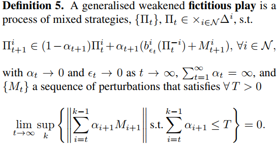

# Papers:

2015 [SFP](http://proceedings.mlr.press/v37/heinrich15.pdf)《Fictitious self-play in extensive-form games》 Heinrich et al. (2015)   UCL&&DeepMind

2016 [NFSP]《Deep Reinforcement Learning from Self-Play in Imperfect-Information Games 》 UCL: Johannes Heinrich 

2019 [MC-NFSP]《Monte Carlo Neural Fictitious Self-Play: Approach to Approximate Nash Equilibrium of Imperfect-Information Games? 》 ZJU: Li Zhang 

## Background：

Extensive-form Game:

​	扩展形式游戏是一种涉及多个代理的顺序交互模型

[博弈论](https://zh.wikipedia.org/wiki/博弈论)中，与[正则形式](https://zh.wikipedia.org/wiki/正則形式的博弈)相应，**扩展形式**（英语：Extensive-form game）通过[树](https://zh.wikipedia.org/wiki/树_(图论))来描述博弈。每个[节点](https://zh.wikipedia.org/wiki/顶点_(图论))（称作**决策节点**）表示博弈进行中的每一个可能的状态。博弈从唯一的**初始节点**开始，通过由参与者决定的路径到达**终端节点**，此时[博弈结束](https://zh.wikipedia.org/w/index.php?title=结果_(博弈论)&action=edit&redlink=1)，参与者得到相应的收益。每个非终端节点只属于一个参与者；参与者在该节点选择其可能的行动，每个可能的行动通过[边](https://zh.wikipedia.org/wiki/边_(图论))从该节点到达另一个节点。[wiki](https://zh.wikipedia.org/wiki/扩展形式的博弈)

Normal-form Game

在[博弈论](https://zh.wikipedia.org/wiki/博弈论)中，**正则形式**（Normal-form game）是描述博弈的一种方式。与[延展形式](https://zh.wikipedia.org/wiki/扩展形式的博弈)不同，正则形式不用图形来描述博弈，而是用[矩阵](https://zh.wikipedia.org/wiki/矩阵)来陈述博弈。与延展形式的表述方式相比，这种方式在识别出[严格优势策略](https://zh.wikipedia.org/w/index.php?title=严格优势策略&action=edit&redlink=1)和[纳什均衡](https://zh.wikipedia.org/wiki/纳什均衡)上更有用，但会丢失某些信息。博弈的正则形式的表述方式包括如下部分：每个参与者所有显然的和可能的[策略](https://zh.wikipedia.org/w/index.php?title=策略(博弈论)&action=edit&redlink=1)，以及和与其相对应的收益。

FP (Fictitious play )

​	双玩家零和和潜在游戏

## RL-分类

**on-policy**: An agent is learning on-policy if it gathers these transition tuples by following its own policy.（从自己的策略中学习）

**off-policy**: In the off-policy setting an agent is learning from experience of another agent or another policy. (从其它agent的经验中学习)

​	eg: Q-learning

### 3. Extensive-Form Fictitious Play 

In this section, we derive a process in behavioural strategies that is realization equivalent to normal-form fictitious play （我们推导出行为策略的一个过程，即实现等同于正常形式的虚拟游戏）

下面的引理(Theorem6)显示了如何通过一个加权组合的实现等价的行为策略来实现标准形式策略的混合。

## RL-算法pseudo-code

### XFP 

( full-width extensive-form fictitious play) ： **通过Theorem7更新Behavioural Strategy，可以收敛到纳什均衡。**

1、计算best Respose

2、更新策略，使用[theorem 7](http://proceedings.mlr.press/v37/heinrich15.pdf)

repeat

### FSP(Fictitious Self-Play):

- 使用强化学习计算BestResponse
- 使用监督学习更新策略

### NFSP:

- 引入Neural Network近似； 替代传统算法：强化学习和监督学习都使用神经网络拟合。
- Policy Network Π
- Action-Value Network Q

### MC-NFSP:

训练时，采用 $\eta$-greed 的概率进行policy的选择

- 1-$\eta$  时，Policy Network $\Pi$ 
- $\eta$ 时，Policy-Value Network B 结合MCTS，选择最佳策略

## 引申：

[Neural Fictitious Self Play——从博弈论到深度强化学习 腾讯云](https://cloud.tencent.com/developer/article/1150412)

[从Fictitious Play 到 NFSP](https://gyh75520.github.io/2017/07/27/从Fictitious Play 到 NFSP/)

