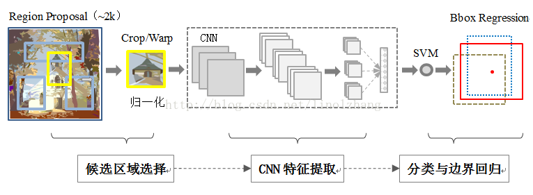
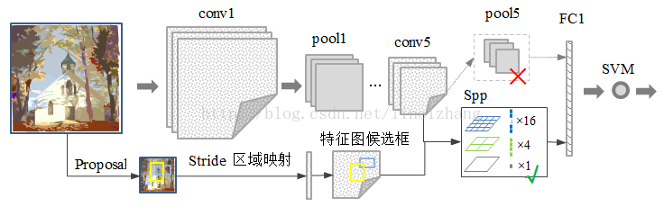
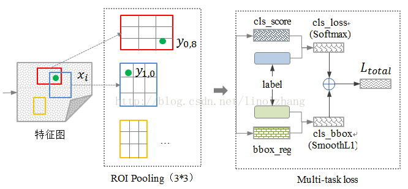
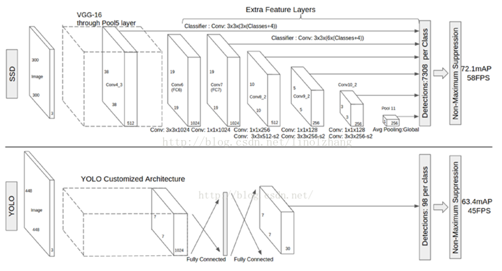

<!-- more -->

## RCNN

RCNN（Regions with CNN features）是将CNN方法应用到目标检测问题上的一个里程碑

## SPP-Net

[Paper](https://www.semanticscholar.org/paper/Spatial-Pyramid-Pooling-in-Deep-Convolutional-for-He-Zhang/cbb19236820a96038d000dc629225d36e0b6294a)

[keras-spp](https://github.com/yhenon/keras-spp)

[tf-spp](https://github.com/chengjunwen/spp_net)

[pytorch_spp](http://www.erogol.com/spp-network-pytorch/)

SPP-Net在RCNN的基础上做了实质性的改进：

> 1）取消了crop/warp图像归一化过程，解决图像变形导致的信息丢失以及存储问题；
>
> 2）采用**空间金字塔池化**（SpatialPyramid Pooling ）替换了 全连接层之前的最后一个池化层（上图top），翠平说这是一个新词，我们先认识一下它。

## Fast-RCNN

## YOLO

## SDD

# Reference

[RCNN介绍](https://blog.csdn.net/xyfengbo/article/details/70227173)

[一文读懂目标检测：R-CNN、Fast R-CNN、Faster R-CNN、YOLO、SSD](https://blog.csdn.net/v_july_v/article/details/80170182)

[空间金字塔池化阅读笔记Spatial Pyramid Pooling in Deep Convolutional Networks for Visual Recognition](https://blog.csdn.net/liyaohhh/article/details/50614380)