tf-API:
```
cosine_decay
cosine_decay_restarts
exponential_decay
inverse_time_decay
linear_cosine_decay
natural_exp_decay
noisy_linear_cosine_decay
piecewise_constant
polynomial_decay
```
### 学习率的变化，设计思路：

- 固定学习率
- 根据训练Step变化而改变
- 根据训练time耗时(耗时其实也就是step)
- 根据当前损失值（这方面缺少成果）

  

<!-- more -->

### **exponential_decay**

exponential_decay(learning_rate, global_step, decay_steps, decay_rate, staircase=False, name=None)

指数型 lr 衰减法是最常用的衰减方法，在大量模型中都广泛使用。

learning_rate 传入初始 lr 值，global_step 用于逐步计算衰减指数，decay_steps 用于决定衰减周期，decay_rate 是每次衰减的倍率，staircase 若为 False 则是标准的指数型衰减，True 时则是阶梯式的衰减方法，目的是为了在一段时间内（往往是相同的 epoch 内）保持相同的 learning rate。


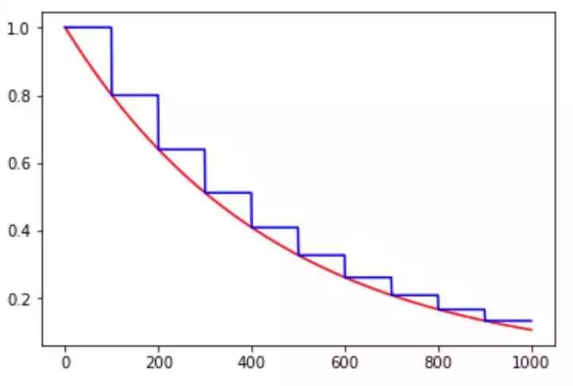

图 1. exponential_decay 示例，其中红色线条是 staircase=False，即指数型下降曲线，蓝色线条是 staircase=True，即阶梯式下降曲线


### piecewise_constant

piecewise_constant(x, boundaries, values, name=None)

分段常数下降法类似于 exponential_decay 中的阶梯式下降法，不过各阶段的值是自己设定的。

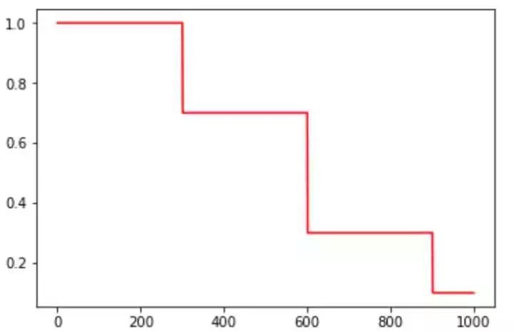

### **polynomial_decay**

polynomial_decay(learning_rate, global_step, decay_steps, end_learning_rate=0.0001, power=1.0, cycle=False, name=None)

polynomial_decay 是以多项式的方式衰减学习率的。
其下降公式也在函数注释中阐释了：

global_step = min(global_step, decay_steps)
decayed_learning_rate = (learning_rate - end_learning_rate) * (1 - global_step / decay_steps) ^ (power) + end_learning_rate

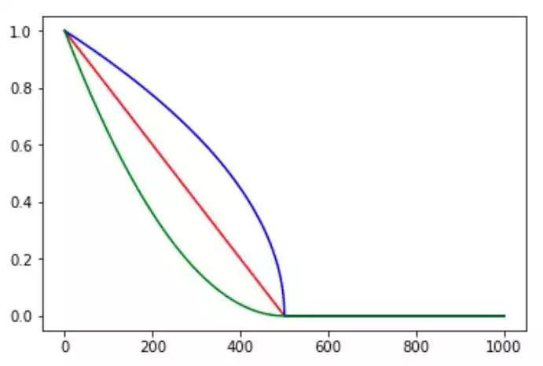
图 3. polynomial_decay 示例，cycle=False，其中红色线为 power=1，即线性下降；蓝色线为 power=0.5，即开方下降；绿色线为 power=2，即二次下降

cycle 参数是决定 lr 是否在下降后重新上升的过程。**cycle 参数的初衷是为了防止网络后期 lr 十分小导致一直在某个局部最小值中振荡，突然调大 lr 可以跳出注定不会继续增长的区域探索其他区域**。
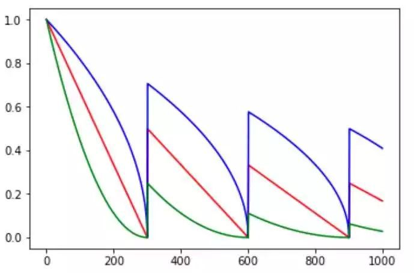

### **natural_exp_decay**

natural_exp_decay(learning_rate, global_step, decay_steps, decay_rate, staircase=False, name=None)

natural_exp_decay 和 exponential_decay 形式差不多，只不过自然指数下降的底数是型。

```
exponential_decay：

decayed_learning_rate = learning_rate * decay_rate ^ (global_step / decay_steps)

natural_exp_decay：

decayed_learning_rate = learning_rate * exp(-decay_rate * global_step / decay_steps)
```

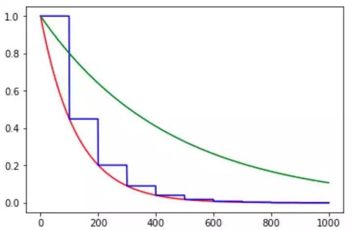

图 5. natural_exp_decay 与 exponential_decay 对比图，其中红色线为 natural_exp_decay，蓝色线为 natural_exp_decay 的阶梯形曲线，绿线为 exponential_decay

由图可知，自然数指数下降比 exponential_decay 要快许多，适用于较快收敛，容易训练的网络。

### **inverse_time_decay**

inverse_time_decay(learning_rate, global_step, decay_steps, decay_rate, staircase=False, name=None)

inverse_time_decay 为倒数衰减，衰减公式如下所示：

decayed_learning_rate = learning_rate / (1 + decay_rate * global_step / decay_step)

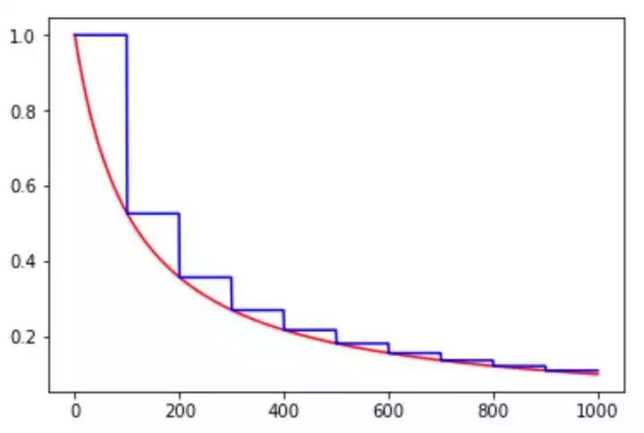

以上几种衰减方式相差不大，主要都是基于指数型的衰减。个人理解其问题在于一开始 lr 就快速下降，**在复杂问题中可能会导致快速收敛于局部最小值而没有较好地探索一定范围内的参数空间**。

### **cosine_decay**

cosine_decay(learning_rate, global_step, decay_steps, alpha=0.0, name=None)

cosine_decay 是近一年才提出的一种 lr 衰减策略，基本形状是余弦函数。其方法是基于论文实现的：SGDR: Stochastic Gradient Descent with Warm Restarts（https://arxiv.org/abs/1608.03983 ）

计算步骤：

```
global_step = min(global_step, decay_steps)

cosine_decay = 0.5 * (1 + cos(pi * global_step / decay_steps))

decayed = (1 - alpha) * cosine_decay + alpha

decayed_learning_rate = learning_rate * decayed
```

alpha 的作用可以看作是 baseline，保证 lr 不会低于某个值。不同 alpha 的影响如下：

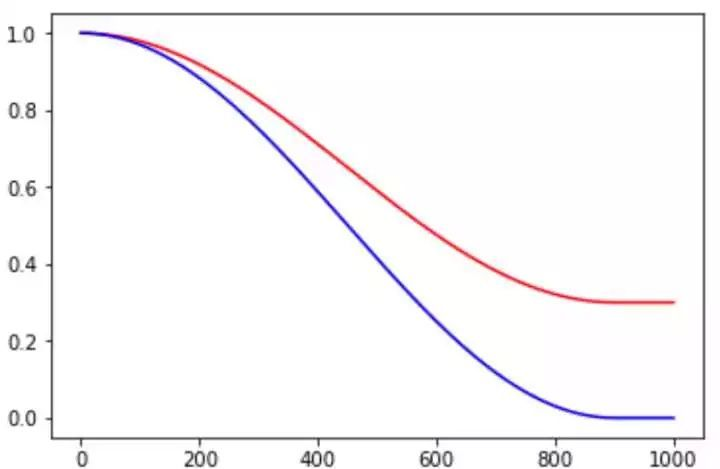

图 7. cosine_decay 示例，其中红色线的 alpha=0.3，蓝色线的 alpha=0.0

### **cosine_decay_restarts**

cosine_decay_restarts(learning_rate, global_step, first_decay_steps,

t_mul=2.0, m_mul=1.0, alpha=0.0, name=None)

cosine_decay_restarts 是 cosine_decay 的 cycle 版本。first_decay_steps 是指第一次完全下降的 step 数，t_mul 是指每一次循环的步数都将乘以 t_mul 倍，m_mul 指每一次循环重新开始时的初始 lr 是上一次循环初始值的 m_mul 倍。

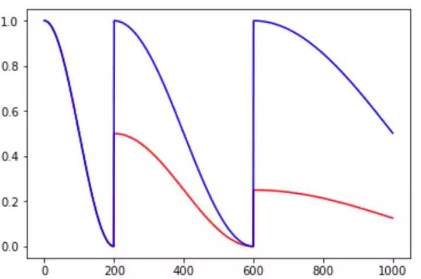

图 8. cosine_decay_restarts 示例，红色线条 t_mul=2.0，m_mul=0.5，蓝色线条 t_mul=2.0，m_mul=1.0

**余弦函数式的下降模拟了大 lr 找潜力区域然后小 lr 快速收敛的过程，加之 restart 带来的 cycle 效果，有涨 1-2 个点的可能。**


### **linear_cosine_decay**

linear_cosine_decay(learning_rate, global_step, decay_steps, num_periods=0.5, alpha=0.0, beta=0.001, name=None)

linear_cosine_decay 的参考文献是 Neural Optimizer Search with RL（https://arxiv.org/abs/1709.07417 ），主要应用领域是增强学习领域，本人未尝试过。可以看出，该方法也是基于余弦函数的衰减策略。

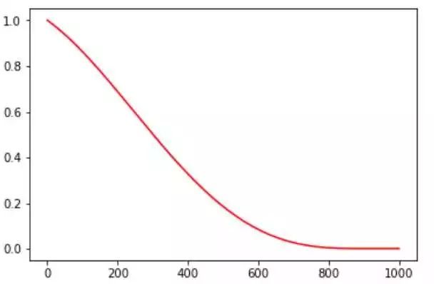

图 9. linear_cosine_decay 示例

### **noisy_linear_cosine_decay**

noisy_linear_cosine_decay(learning_rate, global_step, decay_steps, initial_variance=1.0, variance_decay=0.55, num_periods=0.5, alpha=0.0, beta=0.001, name=None)

参考文献同上。该方法在衰减过程中加入了噪声，**某种程度上增加了 lr 寻找最优值的随机性和可能性。**

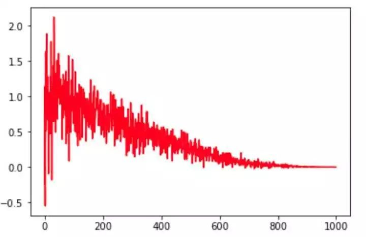

### **auto_learning_rate_decay**

当然大家还可以自定义学习率衰减策略，如设置检测器监控 valid 的 loss 或 accuracy 值，若一定时间内 loss 持续有效下降／acc 持续有效上升则保持 lr，否则下降；loss 上升／acc 下降地越厉害，lr 下降的速度就越快等等自适性方案。

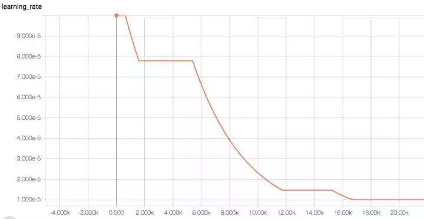

图 11. auto_learning_rate_decay 效果示例