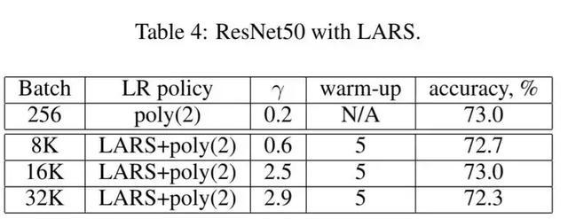

Facebook，Google和Berkeley多个组都发表了论文对这一问题进行了理论和实验的讨论，首先我们对这些论文的结果做一个简要的总结。三篇论文研究类似，但是每一篇相对于前一篇都有改进。

## Facebook：1小时内培训Imagenet

贡献：

提出了**线性缩放规则**，当批量变为K倍时，学习速度需要乘以K就能够达到同样的训练结果。看似简单的定律，Facebook的论文给出了不完整的理论解释和坚实的实验证明。除此之外，论文还讨论了如何处理批量标准化如何实现分布式SGD。通过线性缩放规则，Facebook成功的在一小时内训练了批量大小为8192的Resnet 50。

缺陷：

当批量超过8000时观测到了模型训练结果会严重变差。

<!-- more -->

## 伯克利：卷积网络的大批量训练

Berkeley的组发现Facebook提出的线性缩放规则当批量过度大时训练不稳定，容易发散。并且当当Batch Size超过8000时，结果会严重退化。作者提出Layer Layer Wise Adaptive Rate Scaling（LARS）定律，从而能够在批量为32000的情况下高效的训练ResNet 50网络.SGD的权值更新等于梯度乘以学习率，论文中作者提出了全球学习率和本地学习率决定，全球学习率所有层共享，本地学习率由梯度的变化速率决定，这一想法是受ADAM等自适应学习率SGD的方法的影响。下表格为LARS的训练结果：

## 谷歌：不要降低学习率，增加批量

LSR和LARS大大提高了模型的并行性，但是不能够提高模型的结果.Google组的研究发现，通过增大Batch Size保持学习速率不变的办法可以得到与学习速度降低类似的学习曲线，并且将批量进一步扩大到了65536，整个模型的训练过程只需要2500次参数更新。

### **主要事件**

| 年份 | 事件                                                         | 相关论文/Reference                                           |
| ---- | ------------------------------------------------------------ | ------------------------------------------------------------ |
| 2016 | Loshchilov＆Hutter 提出预热重启（Warm Restarts）随机梯度下降 | Loshchilov, I. & Hutter, F. (2016). SGDR: STOCHASTIC GRADIENT DESCENT WITH RESTARTS. arXiv:1608.03983v2. |
| 2017 | Leslie Smith在发表的论文中提出周期性学习率表                 | Smith, L. N. (2017). Cyclical Learning Rates for Training Neural Networks. IEEE Winter Conference on Applications of Computer Vision (WACV). pp. 464-472. |
| 2017 | 来自facebook的Priya Goyal和Kaiming He等人提出了 Linear Scaling Rule | Goyal, P. et al. (2017). Accurate, Large Minibatch SGD: Training ImageNet in 1 Hour. arXiv:1706.02677. |
| 2017 | Yang You, Igor Gitman, Boris Ginsburg提出了 Layer Wise Adaptive Rate Scaling（LARS）定律 | You, Y.; Gitman, I.; Ginsburg, B. (2017). Large Batch Training of Convolutional Networks. arXiv:1708.03888. |
| 2018 | Sashank等人提出了Adam算法的新变体AMSGrad                     | Sashank J. R.; Satyen K.;  Sanjiv K.(2018). On the Convergence of Adam and Beyond. Proceedings of ICLR 2018. |

